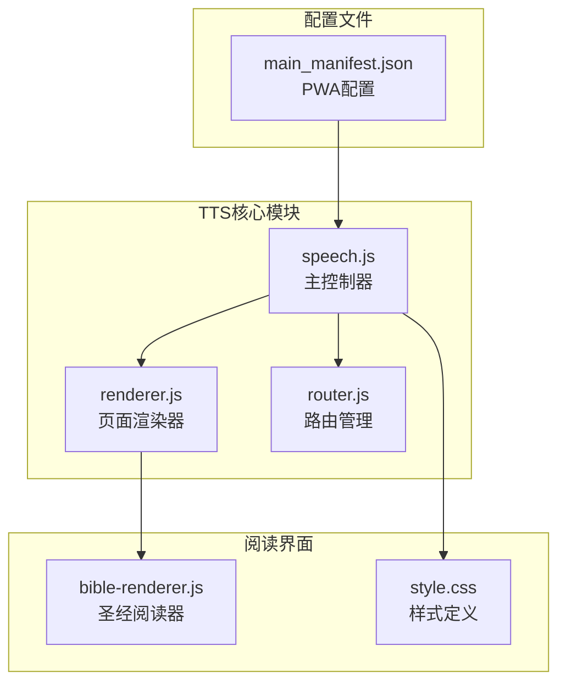
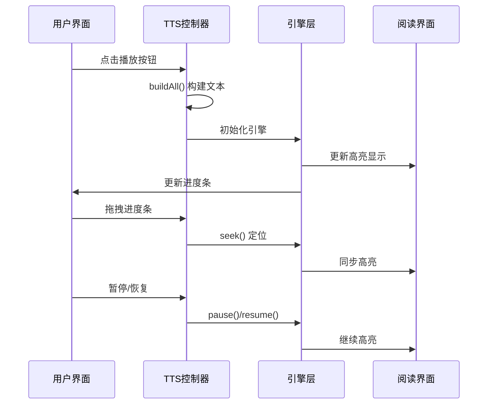
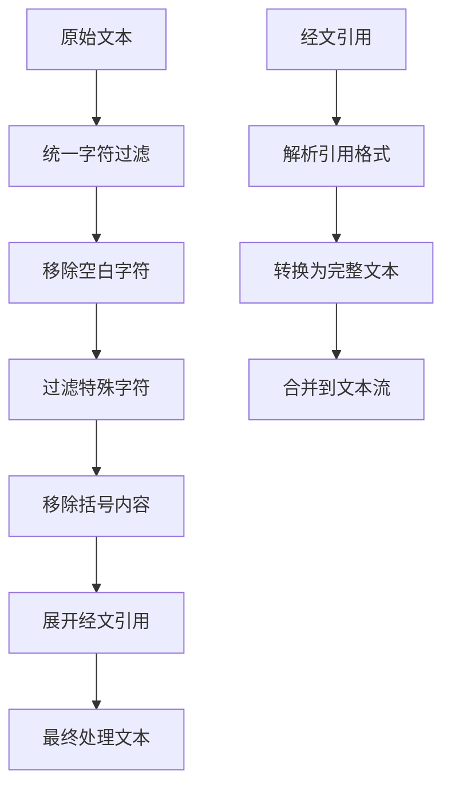
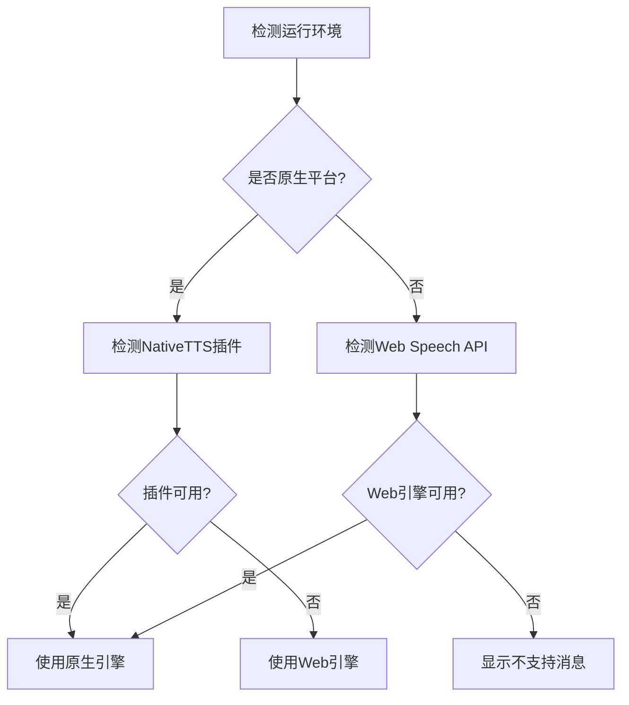
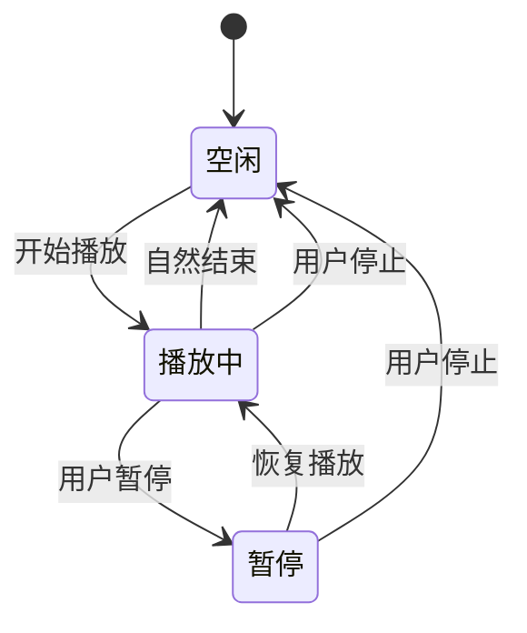
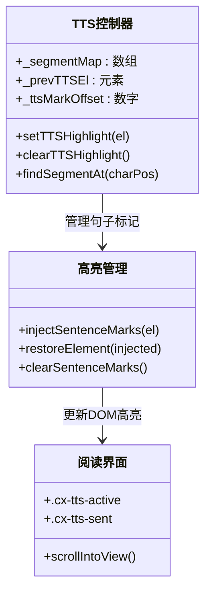
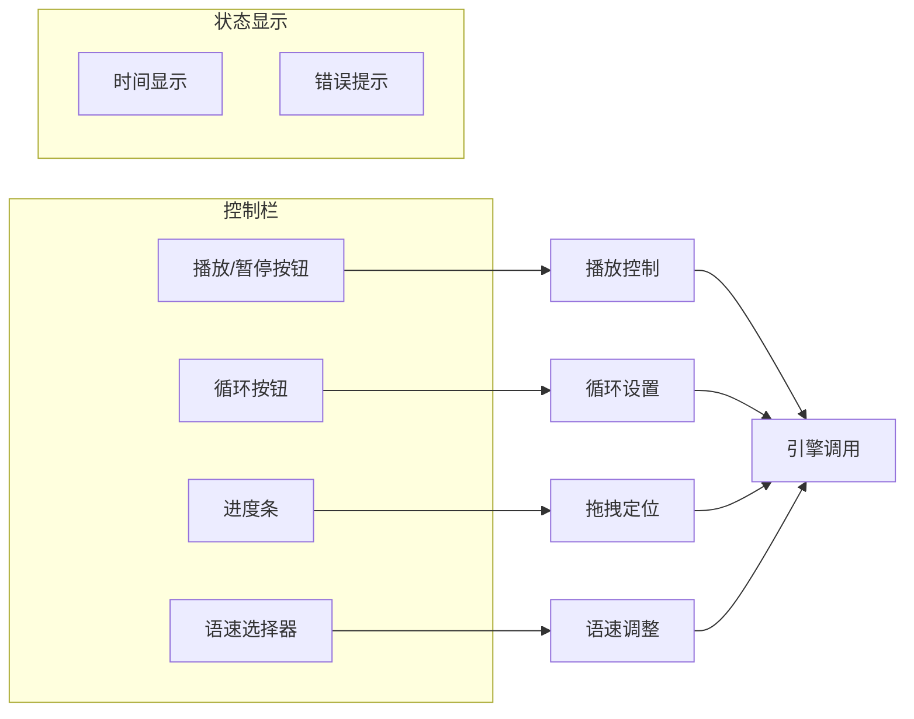
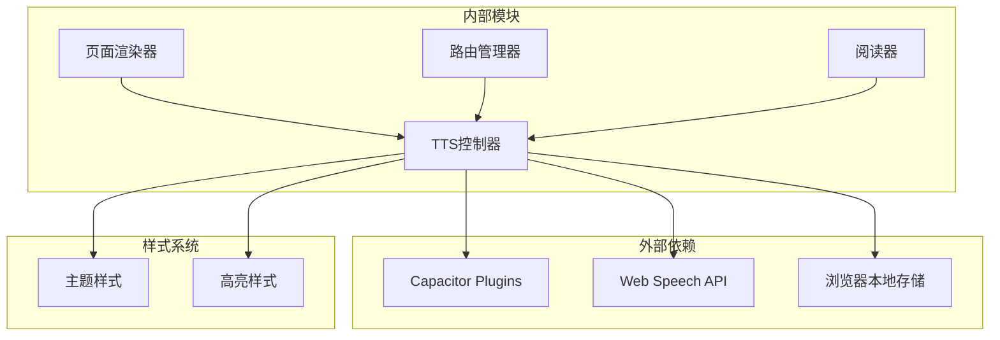

# 文字转语音(TTS)

<cite>
**本文档引用的文件**
- [speech.js](file://src/static/js/speech.js)
- [renderer.js](file://src/static/js/renderer.js)
- [router.js](file://src/static/js/router.js)
- [bible-renderer.js](file://src/static/js/bible-renderer.js)
- [style.css](file://src/static/css/style.css)
- [main_manifest.json](file://src/templates/main_manifest.json)
</cite>

## 目录
1. [简介](#简介)
2. [项目结构](#项目结构)
3. [核心组件](#核心组件)
4. [架构概览](#架构概览)
5. [详细组件分析](#详细组件分析)
6. [依赖关系分析](#依赖关系分析)
7. [性能考虑](#性能考虑)
8. [故障排除指南](#故障排除指南)
9. [结论](#结论)

## 简介

本文档详细介绍了Bible项目中的文字转语音(TTS)功能实现。该项目提供了完整的TTS解决方案，支持Web Speech API和原生Android TTS引擎两种模式，具备丰富的语音控制功能和与阅读界面的深度集成。

TTS功能的核心特性包括：
- 双引擎支持：Web Speech API（浏览器/PWA）和原生Android TTS
- 智能文本处理：统一字符过滤、括号移除、经文引用展开
- 精确进度控制：支持拖拽定位、循环播放、暂停恢复
- 句子级高亮：与阅读界面同步的实时高亮显示
- 电池优化：原生引擎的后台播放支持
- 多语言支持：基于浏览器和系统语音引擎的语言选择

## 项目结构

TTS功能主要分布在以下文件中：

**图表来源**
- [speech.js:1-1134](file://src/static/js/speech.js#L1-L1134)
- [renderer.js:1-1471](file://src/static/js/renderer.js#L1-L1471)
- [router.js:1-287](file://src/static/js/router.js#L1-L287)

**章节来源**
- [speech.js:1-1134](file://src/static/js/speech.js#L1-L1134)
- [renderer.js:1-1471](file://src/static/js/renderer.js#L1-L1471)

## 核心组件

### TTS主控制器 (speech.js)

TTS主控制器是整个功能的核心，负责：
- 引擎检测和选择（Web Speech API vs 原生TTS）
- 文本预处理和引用展开
- 播放状态管理和进度跟踪
- 句子级高亮同步
- 用户界面交互处理

### 页面渲染器 (renderer.js)

负责生成带有TTS控制栏的页面结构：
- 底部控制栏的动态创建
- 进度条、播放/暂停按钮、语速选择器的构建
- 页面导航和视图切换

### 路由管理 (router.js)

管理SPA页面间的导航，确保TTS状态在页面切换时正确处理：
- hashchange事件监听
- 页面切换时的TTS停止
- 历史记录管理

**章节来源**
- [speech.js:147-1134](file://src/static/js/speech.js#L147-L1134)
- [renderer.js:179-202](file://src/static/js/renderer.js#L179-L202)
- [router.js:84-142](file://src/static/js/router.js#L84-L142)

## 架构概览

TTS系统的整体架构采用模块化设计，各组件职责清晰：

**图表来源**
- [speech.js:983-1052](file://src/static/js/speech.js#L983-L1052)
- [renderer.js:179-202](file://src/static/js/renderer.js#L179-L202)

系统采用双引擎架构：
- **原生引擎**：Android平台的NativeTTS，支持后台播放和电池优化
- **Web引擎**：浏览器的Web Speech API，适用于PWA和桌面环境

**章节来源**
- [speech.js:314-364](file://src/static/js/speech.js#L314-L364)

## 详细组件分析

### 文本处理管道

TTS系统实现了完整的文本预处理流程：

**图表来源**
- [speech.js:19-29](file://src/static/js/speech.js#L19-L29)
- [speech.js:94-119](file://src/static/js/speech.js#L94-L119)

文本处理的关键特性：
- 支持中文标点符号的智能处理
- 经文引用的自动展开和格式化
- 括号内容的条件移除（纲目中的括号前缀不读）

### 引擎检测和选择

系统根据运行环境自动选择最优的TTS引擎：

**图表来源**
- [speech.js:320-332](file://src/static/js/speech.js#L320-L332)

### 播放状态管理

TTS控制器维护复杂的播放状态：

**图表来源**
- [speech.js:401-410](file://src/static/js/speech.js#L401-L410)

状态管理包括：
- 播放/暂停/停止的完整生命周期
- 暂停位置的记忆和恢复
- 循环播放的特殊处理
- 页面切换时的状态清理

### 句子级高亮系统

TTS与阅读界面的高亮同步是系统的重要特性：

**图表来源**
- [speech.js:428-562](file://src/static/js/speech.js#L428-L562)

高亮系统的特点：
- 基于句子边界的精确高亮
- 支持跨元素的句子标记
- 自动滚动到当前高亮元素
- 高亮样式的主题适配

### 用户界面交互

TTS控制界面提供了直观的操作体验：

**图表来源**
- [renderer.js:179-202](file://src/static/js/renderer.js#L179-L202)
- [style.css:475-518](file://src/static/css/style.css#L475-L518)

**章节来源**
- [speech.js:952-1120](file://src/static/js/speech.js#L952-L1120)
- [renderer.js:179-202](file://src/static/js/renderer.js#L179-L202)
- [style.css:351-357](file://src/static/css/style.css#L351-L357)

## 依赖关系分析

TTS功能与其他模块的依赖关系如下：

**图表来源**
- [speech.js:134-143](file://src/static/js/speech.js#L134-L143)
- [renderer.js:1-50](file://src/static/js/renderer.js#L1-L50)

**章节来源**
- [speech.js:134-143](file://src/static/js/speech.js#L134-L143)
- [router.js:1-25](file://src/static/js/router.js#L1-L25)

## 性能考虑

TTS系统在性能方面采用了多项优化策略：

### 文本处理优化
- 使用正则表达式进行高效的字符过滤
- 智能的文本缓冲和增量处理
- 避免重复DOM操作的批处理机制

### 播放性能优化
- 原生引擎的后台播放支持
- 智能的进度更新频率控制
- 内存友好的状态管理

### 界面响应性
- 非阻塞的异步操作
- 智能的事件处理和防抖
- 优化的DOM操作策略

## 故障排除指南

### 常见问题及解决方案

**问题1：TTS不工作**
- 检查浏览器兼容性
- 确认Web Speech API权限
- 验证原生插件安装状态

**问题2：高亮不同步**
- 确认文本预处理的一致性
- 检查DOM结构的完整性
- 验证坐标映射的准确性

**问题3：播放异常中断**
- 检查电池优化设置
- 验证页面可见性状态
- 确认引擎状态同步

**章节来源**
- [speech.js:334-344](file://src/static/js/speech.js#L334-L344)
- [speech.js:1111-1120](file://src/static/js/speech.js#L1111-L1120)

## 结论

Bible项目的TTS功能实现了完整的文字转语音解决方案，具有以下特点：

**技术优势**
- 双引擎架构确保了跨平台兼容性
- 智能的文本处理提高了语音质量
- 精确的进度控制提升了用户体验
- 深度的界面集成增强了实用性

**扩展潜力**
- 支持更多语言的语音引擎
- 集成云端TTS服务的可能性
- 离线语音包的下载和管理
- 高级语音定制功能

该系统为用户提供了一个强大、可靠且易于使用的TTS解决方案，充分体现了现代Web应用的技术水平和用户体验设计理念。