# 核心功能

<cite>
**本文档引用的文件**
- [bible-renderer.js](file://src/static/js/bible-renderer.js)
- [search.js](file://src/static/js/search.js)
- [speech.js](file://src/static/js/speech.js)
- [theme-toggle.js](file://src/static/js/theme-toggle.js)
- [font-control.js](file://src/static/js/font-control.js)
- [router.js](file://src/static/js/router.js)
- [nav-stack.js](file://src/static/js/nav-stack.js)
- [resource-pack.js](file://src/static/js/resource-pack.js)
- [toc-redirect.js](file://src/static/js/toc-redirect.js)
- [highlight.js](file://src/static/js/highlight.js)
</cite>

## 目录
1. [简介](#简介)
2. [项目结构](#项目结构)
3. [核心组件](#核心组件)
4. [架构总览](#架构总览)
5. [详细组件分析](#详细组件分析)
6. [依赖分析](#依赖分析)
7. [性能考虑](#性能考虑)
8. [故障排查指南](#故障排查指南)
9. [结论](#结论)
10. [附录](#附录)

## 简介
本文件面向“圣经阅读器”的核心功能，围绕以下主题进行系统化说明：
- 圣经阅读引擎：书卷导航、章节浏览、经文渲染、注解与串珠展示
- 搜索功能：全文搜索算法、索引构建、搜索结果处理与高亮定位
- 主题切换、字体控制、个性化设置：阅读体验优化
- 文字转语音（TTS）：引擎选择、文本处理、进度与高亮联动
- 划线与笔记：数据模型、存储与跨页面同步
- 资源包管理：历史训练资源包下载、缓存与清理
- 路由与返回栈：SPA 路由、返回键行为、浮动导航与朗读栏

## 项目结构
项目采用前端单页应用（SPA）架构，核心逻辑集中在 src/static/js 目录下的模块化脚本中，配合路由与主题控制模块协同工作。

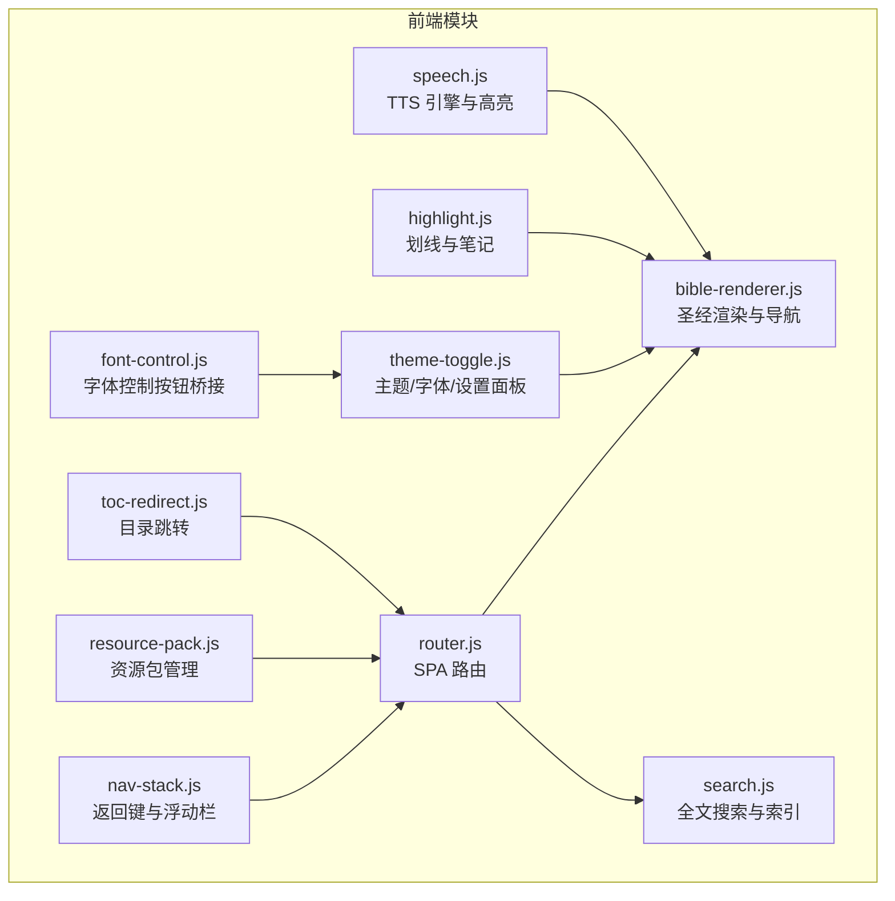

**图表来源**
- [router.js:16-153](file://src/static/js/router.js#L16-L153)
- [bible-renderer.js:1-880](file://src/static/js/bible-renderer.js#L1-L880)
- [search.js:1-1086](file://src/static/js/search.js#L1-L1086)
- [speech.js:1-1134](file://src/static/js/speech.js#L1-L1134)
- [theme-toggle.js:1-1353](file://src/static/js/theme-toggle.js#L1-L1353)
- [font-control.js:1-34](file://src/static/js/font-control.js#L1-L34)
- [nav-stack.js:1-455](file://src/static/js/nav-stack.js#L1-L455)
- [resource-pack.js:1-993](file://src/static/js/resource-pack.js#L1-L993)
- [highlight.js:1-1335](file://src/static/js/highlight.js#L1-L1335)
- [toc-redirect.js:1-21](file://src/static/js/toc-redirect.js#L1-L21)

**章节来源**
- [router.js:16-153](file://src/static/js/router.js#L16-L153)
- [bible-renderer.js:1-880](file://src/static/js/bible-renderer.js#L1-L880)
- [search.js:1-1086](file://src/static/js/search.js#L1-L1086)
- [speech.js:1-1134](file://src/static/js/speech.js#L1-L1134)
- [theme-toggle.js:1-1353](file://src/static/js/theme-toggle.js#L1-L1353)
- [font-control.js:1-34](file://src/static/js/font-control.js#L1-L34)
- [nav-stack.js:1-455](file://src/static/js/nav-stack.js#L1-L455)
- [resource-pack.js:1-993](file://src/static/js/resource-pack.js#L1-L993)
- [toc-redirect.js:1-21](file://src/static/js/toc-redirect.js#L1-L21)
- [highlight.js:1-1335](file://src/static/js/highlight.js#L1-L1335)

## 核心组件
- 圣经阅读渲染器：负责书卷/章节导航、经文渲染、注解/串珠弹层、设置面板与内容开关
- 搜索模块：构建/缓存搜索索引、多关键词 AND 子串匹配、结果分组与高亮定位
- 主题与字体：主题切换、字号滑块、内容开关持久化、设置面板
- TTS 引擎：NativeTTS 与 Web Speech API 双引擎、句子级高亮、进度与循环播放
- 划线与笔记：IndexedDB/LocalStorage 存储、TextQuoteSelector 自愈、跨页面同步
- 资源包管理：历史训练资源包下载、缓存与清理、来源追踪
- 路由与返回栈：SPA hash 路由、返回键统一处理、浮动导航与朗读栏

**章节来源**
- [bible-renderer.js:140-772](file://src/static/js/bible-renderer.js#L140-L772)
- [search.js:18-512](file://src/static/js/search.js#L18-L512)
- [theme-toggle.js:285-800](file://src/static/js/theme-toggle.js#L285-L800)
- [speech.js:10-1134](file://src/static/js/speech.js#L10-L1134)
- [highlight.js:1-1335](file://src/static/js/highlight.js#L1-L1335)
- [resource-pack.js:1-993](file://src/static/js/resource-pack.js#L1-L993)
- [router.js:16-286](file://src/static/js/router.js#L16-L286)
- [nav-stack.js:1-455](file://src/static/js/nav-stack.js#L1-L455)

## 架构总览
系统采用模块化设计，通过 window.CXRouter 统一路由，各模块通过全局对象暴露能力（如 CXBible、CXSearch、CXSpeech 等）。主题与字体控制模块同时与阅读渲染器共享状态，确保设置面板与阅读界面一致。

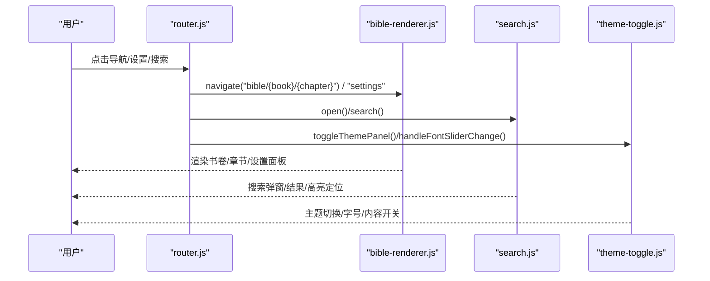

**图表来源**
- [router.js:95-151](file://src/static/js/router.js#L95-L151)
- [bible-renderer.js:663-772](file://src/static/js/bible-renderer.js#L663-L772)
- [search.js:736-800](file://src/static/js/search.js#L736-L800)
- [theme-toggle.js:420-510](file://src/static/js/theme-toggle.js#L420-L510)

## 详细组件分析

### 圣经阅读引擎（书卷导航、章节浏览、经文渲染）
- 书卷导航
  - 双栏布局：左侧书卷列表、右侧章节列表
  - 标签页：书卷/收藏/历史
  - 旧约/新约切换与缓存
  - 点击书卷后动态更新章节列表
- 章节浏览
  - 路由跳转到 #/bible/{book}/{chapter}
  - 加载书卷元数据与章节数据，渲染标题、经文、注解与串珠
  - 历史记录持久化与上限控制
- 经文渲染
  - {N} 注解标记与 [a] 串珠标记解析
  - 注解/串珠内联显示与弹层展示
  - 经节分割线与内容开关（主题摘要、纲目、注解、串珠、分隔线）
- 事件绑定
  - 注解/串珠上标点击 → 弹层详情
  - 返回按钮与滚动到顶部

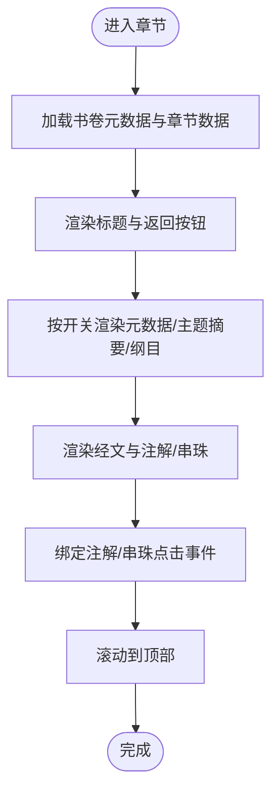

**图表来源**
- [bible-renderer.js:324-399](file://src/static/js/bible-renderer.js#L324-L399)
- [bible-renderer.js:420-474](file://src/static/js/bible-renderer.js#L420-L474)
- [bible-renderer.js:497-526](file://src/static/js/bible-renderer.js#L497-L526)

**章节来源**
- [bible-renderer.js:140-399](file://src/static/js/bible-renderer.js#L140-L399)
- [bible-renderer.js:420-658](file://src/static/js/bible-renderer.js#L420-L658)
- [router.js:34-81](file://src/static/js/router.js#L34-L81)

### 搜索功能（全文搜索、索引构建、结果处理）
- 索引构建
  - 从 training.json 提取多类型内容（听抄、纲目、晨读、职事摘录等）
  - 生成段落级 entries，支持本地 forage 缓存与 SW 缓存
  - 按训练路径与版本号过滤已缓存训练
- 搜索算法
  - 多关键词 AND 子串匹配
  - 结果按训练分组，当前训练优先，本篇条目优先
  - 每组限制最大显示数，支持“查看更多”
- 结果高亮与定位
  - 通过 sessionStorage 桥接目标位置
  - SPA 与非 SPA 分别处理高亮与滚动定位
  - 支持晨读 day-page 横滑场景的定位

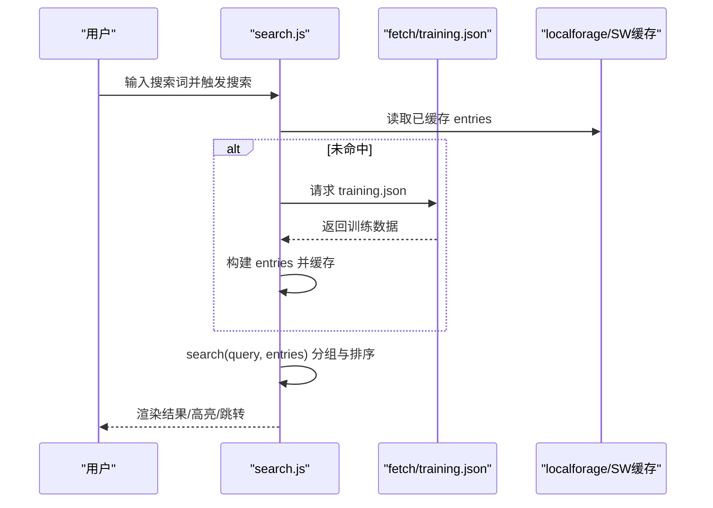

**图表来源**
- [search.js:180-186](file://src/static/js/search.js#L180-L186)
- [search.js:311-358](file://src/static/js/search.js#L311-L358)
- [search.js:380-461](file://src/static/js/search.js#L380-L461)
- [search.js:485-512](file://src/static/js/search.js#L485-L512)
- [search.js:514-734](file://src/static/js/search.js#L514-L734)

**章节来源**
- [search.js:46-186](file://src/static/js/search.js#L46-L186)
- [search.js:188-280](file://src/static/js/search.js#L188-L280)
- [search.js:282-358](file://src/static/js/search.js#L282-L358)
- [search.js:360-461](file://src/static/js/search.js#L360-L461)
- [search.js:485-734](file://src/static/js/search.js#L485-L734)

### 注解与串珠系统（数据结构与显示逻辑）
- 数据结构
  - 经文注解：数组，包含 seq 与 note
  - 串珠：数组，包含 seq 与 bead
- 渲染与交互
  - {N} 与 [a] 标记解析为上标
  - 点击上标弹出详情卡片，支持复制
- 显示开关
  - 通过内容开关控制注解与串珠的内联显示

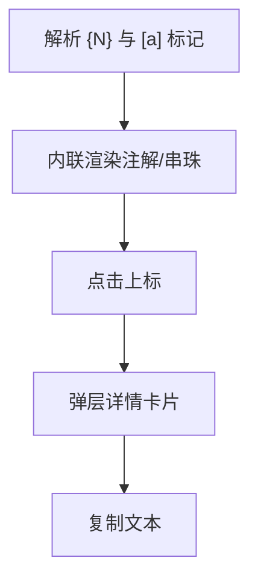

**图表来源**
- [bible-renderer.js:121-138](file://src/static/js/bible-renderer.js#L121-L138)
- [bible-renderer.js:476-495](file://src/static/js/bible-renderer.js#L476-L495)
- [bible-renderer.js:528-601](file://src/static/js/bible-renderer.js#L528-L601)

**章节来源**
- [bible-renderer.js:121-138](file://src/static/js/bible-renderer.js#L121-L138)
- [bible-renderer.js:476-601](file://src/static/js/bible-renderer.js#L476-L601)

### 主题切换、字体控制与个性化设置
- 主题切换
  - 5 种主题色卡，支持跟随系统深浅色
  - meta theme-color 同步与 StatusBar 颜色设置
- 字体控制
  - 全局字号滑块与字体大小映射
  - 与阅读渲染器字号联动
- 内容开关
  - 主题摘要、简介、纲目、注解、串珠、经节分割线
  - 与阅读渲染器共享 localStorage
- 设置面板
  - 集成主题、字体、内容开关与应用操作区

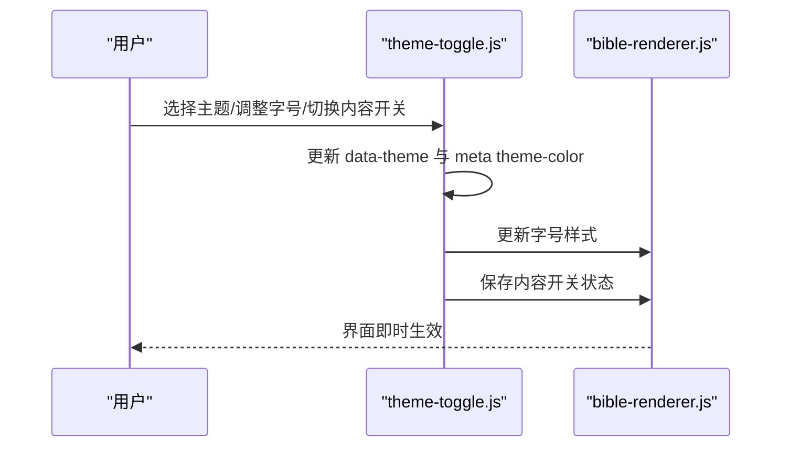

**图表来源**
- [theme-toggle.js:285-510](file://src/static/js/theme-toggle.js#L285-L510)
- [theme-toggle.js:512-625](file://src/static/js/theme-toggle.js#L512-L625)
- [bible-renderer.js:663-772](file://src/static/js/bible-renderer.js#L663-L772)

**章节来源**
- [theme-toggle.js:285-510](file://src/static/js/theme-toggle.js#L285-L510)
- [theme-toggle.js:512-625](file://src/static/js/theme-toggle.js#L512-L625)
- [bible-renderer.js:663-772](file://src/static/js/bible-renderer.js#L663-L772)
- [font-control.js:1-34](file://src/static/js/font-control.js#L1-L34)

### 文字转语音（TTS）功能
- 引擎选择
  - NativeTTS（Android 前台服务，支持后台）
  - Web Speech API（浏览器/PWA 回退）
- 文本处理
  - 统一字符过滤与括号移除
  - 经文引用展开（如“太7:22”→“马太福音第七章第二十二节”）
- 句子级高亮
  - 注入 mark 标记，按句子推进高亮
  - NativeTTS 使用 ttsPosition/ttsProgress 事件驱动高亮
- 进度与循环
  - 进度条与时间显示
  - 循环播放与自然结束处理

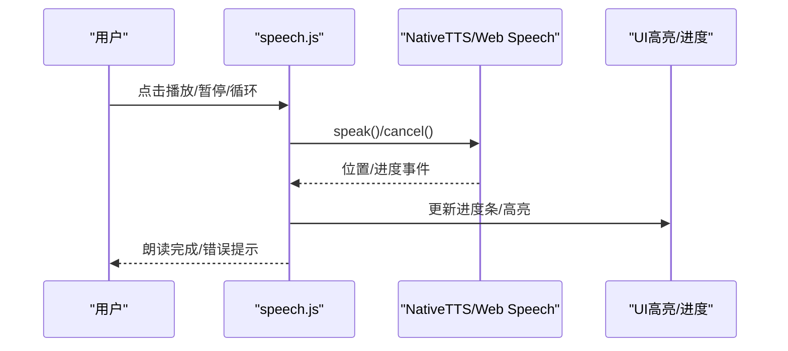

**图表来源**
- [speech.js:147-362](file://src/static/js/speech.js#L147-L362)
- [speech.js:366-790](file://src/static/js/speech.js#L366-L790)
- [speech.js:791-1134](file://src/static/js/speech.js#L791-L1134)

**章节来源**
- [speech.js:10-1134](file://src/static/js/speech.js#L10-L1134)

### 划线与笔记（数据模型、存储与同步）
- 数据模型
  - {id, start, end, text, color, underline, note, timestamp}
  - 新增 underline/note 字段，旧数据自动补默认值
- 存储后端
  - localForage（IndexedDB）优先，不可用时降级到 localStorage
  - 首次运行迁移旧数据，写入迁移标志
- 跨页面同步
  - cv 与 cx 配对页共享划线，通过 TextQuoteSelector 定位
  - 仅纲目区域划线参与同步
- 恢复与自愈
  - DOM 重建后重算偏移，使用 prefix/suffix 评分自愈
  - normalize 合并文本节点，保证偏移一致性

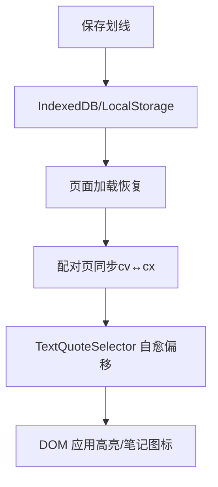

**图表来源**
- [highlight.js:12-139](file://src/static/js/highlight.js#L12-L139)
- [highlight.js:175-181](file://src/static/js/highlight.js#L175-L181)
- [highlight.js:209-248](file://src/static/js/highlight.js#L209-L248)
- [highlight.js:462-603](file://src/static/js/highlight.js#L462-L603)

**章节来源**
- [highlight.js:1-1335](file://src/static/js/highlight.js#L1-L1335)

### 资源包管理（历史训练下载与缓存）
- 清单与下载
  - 并发竞速下载资源包 ZIP，使用 JSZip 解压并写入 Cache Storage
  - 支持多镜像源与顺序回退
- 缓存与来源追踪
  - 命名缓存 cx-YYYY-NN 与主缓存 cx-main
  - 记录训练来源，支持删除与恢复
- 管理界面
  - 三标签：默认/历史/导入
  - 支持批量删除与重新安装

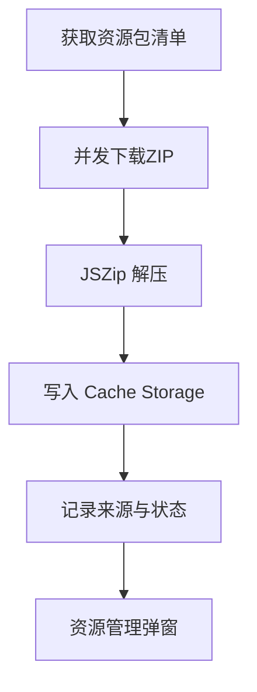

**图表来源**
- [resource-pack.js:47-87](file://src/static/js/resource-pack.js#L47-L87)
- [resource-pack.js:215-327](file://src/static/js/resource-pack.js#L215-L327)
- [resource-pack.js:343-501](file://src/static/js/resource-pack.js#L343-L501)

**章节来源**
- [resource-pack.js:1-993](file://src/static/js/resource-pack.js#L1-L993)

### 路由与返回栈（SPA 路由、返回键、浮动导航）
- SPA 路由
  - hash 路由：#/、#/bible/{book}/{chapter}、#/settings 等
  - 同书卷章节切换使用 replaceState，避免历史膨胀
- 返回键
  - Capacitor 与 PWA 分支统一处理，忽略启动时虚假 popstate
  - backStack 统一调度，支持弹框/面板关闭
- 浮动导航与朗读栏
  - 内容页滚动隐藏，空白处点击显示
  - 克隆 tab 栏与底部朗读栏，双向事件转发

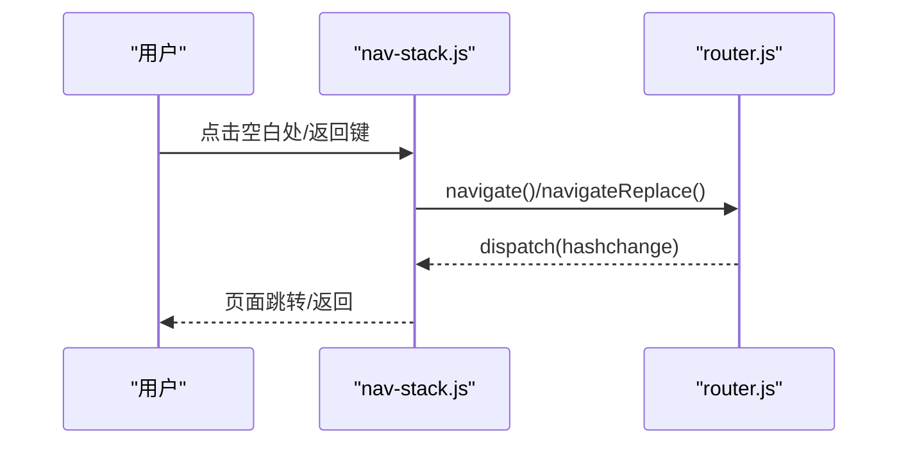

**图表来源**
- [nav-stack.js:30-55](file://src/static/js/nav-stack.js#L30-L55)
- [nav-stack.js:76-135](file://src/static/js/nav-stack.js#L76-L135)
- [router.js:104-142](file://src/static/js/router.js#L104-L142)

**章节来源**
- [router.js:16-286](file://src/static/js/router.js#L16-L286)
- [nav-stack.js:1-455](file://src/static/js/nav-stack.js#L1-L455)

## 依赖分析
- 模块耦合
  - router.js 与 bible-renderer.js 强耦合（路由驱动渲染）
  - theme-toggle.js 与 bible-renderer.js 共享内容开关与字号状态
  - search.js 与 router.js 协作（搜索结果跳转）
  - speech.js 与 nav-stack.js 协作（朗读栏与返回键）
- 外部依赖
  - localforage（IndexedDB）、Cache API（SW 缓存）、Capacitor 插件（NativeTTS/StatusBar/App）

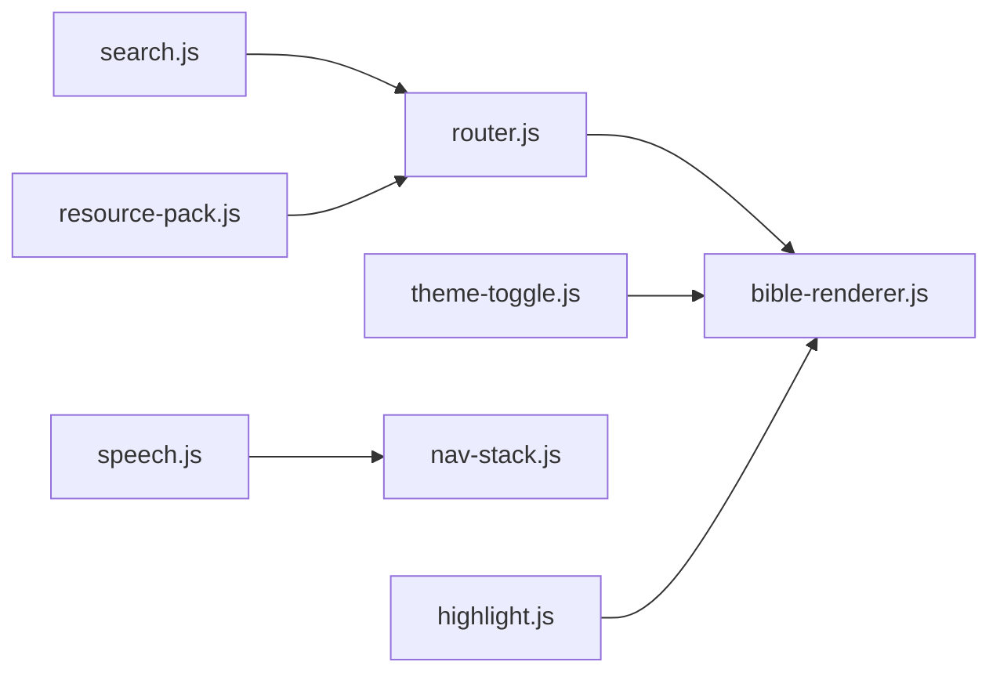

**图表来源**
- [router.js:16-153](file://src/static/js/router.js#L16-L153)
- [bible-renderer.js:1-880](file://src/static/js/bible-renderer.js#L1-L880)
- [search.js:1-1086](file://src/static/js/search.js#L1-L1086)
- [theme-toggle.js:1-1353](file://src/static/js/theme-toggle.js#L1-L1353)
- [speech.js:1-1134](file://src/static/js/speech.js#L1-L1134)
- [nav-stack.js:1-455](file://src/static/js/nav-stack.js#L1-L455)
- [highlight.js:1-1335](file://src/static/js/highlight.js#L1-L1335)
- [resource-pack.js:1-993](file://src/static/js/resource-pack.js#L1-L993)

**章节来源**
- [router.js:16-153](file://src/static/js/router.js#L16-L153)
- [bible-renderer.js:1-880](file://src/static/js/bible-renderer.js#L1-L880)
- [search.js:1-1086](file://src/static/js/search.js#L1-L1086)
- [theme-toggle.js:1-1353](file://src/static/js/theme-toggle.js#L1-L1353)
- [speech.js:1-1134](file://src/static/js/speech.js#L1-L1134)
- [nav-stack.js:1-455](file://src/static/js/nav-stack.js#L1-L455)
- [highlight.js:1-1335](file://src/static/js/highlight.js#L1-L1335)
- [resource-pack.js:1-993](file://src/static/js/resource-pack.js#L1-L993)

## 性能考虑
- 懒加载与缓存
  - 圣经书卷数据按需加载，章节数据缓存
  - 搜索索引按训练路径懒加载，支持本地 forage 与 SW 缓存
- 渲染优化
  - 经文渲染按节分隔，减少 DOM 重排
  - 划线恢复使用代数计数器防抖，避免重复渲染
- TTS 性能
  - NativeTTS 使用高频位置事件驱动高亮，降低 UI 线程压力
  - Web Speech 以句子为单位推进，避免长文本一次性处理

[本节为通用指导，不直接分析具体文件]

## 故障排查指南
- 搜索无结果
  - 确认 trainings.json 已加载且搜索队列包含已缓存训练
  - 检查本地 forage 与 SW 缓存是否存在对应训练
- TTS 无声音或高亮异常
  - 检查 NativeTTS 插件是否可用，或回退到 Web Speech
  - 确认 ttsPosition/ttsProgress 事件是否持续推送
- 划线丢失或偏移错误
  - 使用 TextQuoteSelector 自愈，查看 prefix/suffix 评分
  - 页面 DOM 重建后调用 redoHighlights 重算偏移
- 返回键行为异常
  - 检查 backStack 是否正确 push/pop
  - 避免启动时虚假 popstate，使用 grace period 过滤

**章节来源**
- [search.js:188-244](file://src/static/js/search.js#L188-L244)
- [search.js:514-734](file://src/static/js/search.js#L514-L734)
- [speech.js:314-362](file://src/static/js/speech.js#L314-L362)
- [speech.js:676-790](file://src/static/js/speech.js#L676-L790)
- [highlight.js:508-547](file://src/static/js/highlight.js#L508-L547)
- [highlight.js:175-181](file://src/static/js/highlight.js#L175-L181)
- [nav-stack.js:4-14](file://src/static/js/nav-stack.js#L4-L14)
- [nav-stack.js:101-135](file://src/static/js/nav-stack.js#L101-L135)

## 结论
本项目通过模块化设计实现了完整的圣经阅读体验：从书卷导航与经文渲染，到全文搜索与 TTS 朗读；从主题与字体控制，到划线笔记与资源包管理。路由与返回栈保障了良好的交互一致性，缓存与懒加载提升了性能与离线可用性。建议在扩展新功能时遵循现有模块边界与数据流，确保一致的用户体验与可维护性。

[本节为总结性内容，不直接分析具体文件]

## 附录
- 使用示例
  - 书卷导航：点击书卷 → 自动更新章节列表 → 点击章节跳转
  - 设置面板：点击齿轮图标 → 切换主题/调整字号/控制内容显示
  - 搜索：点击搜索框 → 输入关键词 → 查看分组结果与高亮
  - TTS：点击播放 → 句子级高亮 → 循环播放与进度控制
  - 划线：选中文本 → 选择颜色/下划线 → 添加笔记 → 跨页面同步
  - 资源包：打开资源管理 → 下载历史包 → 清理缓存
- 配置选项
  - 主题：灰白/浅黄/米黄/深灰/黑夜
  - 字号：12–24px（滑块）
  - 内容开关：主题摘要/简介/纲目/注解/串珠/经节分割线
  - TTS 速率：50–200%（滑块）
- 扩展方法
  - 新增主题：在主题面板增加色卡与 meta 颜色映射
  - 新增搜索类型：在索引构建中扩展 entries 生成逻辑
  - 新增 TTS 引擎：实现 speak/cancel 接口并接入高亮逻辑
  - 新增内容开关：在渲染器中扩展开关项与 UI

[本节为概览性内容，不直接分析具体文件]