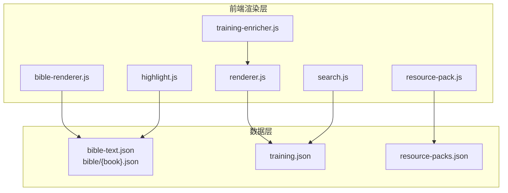
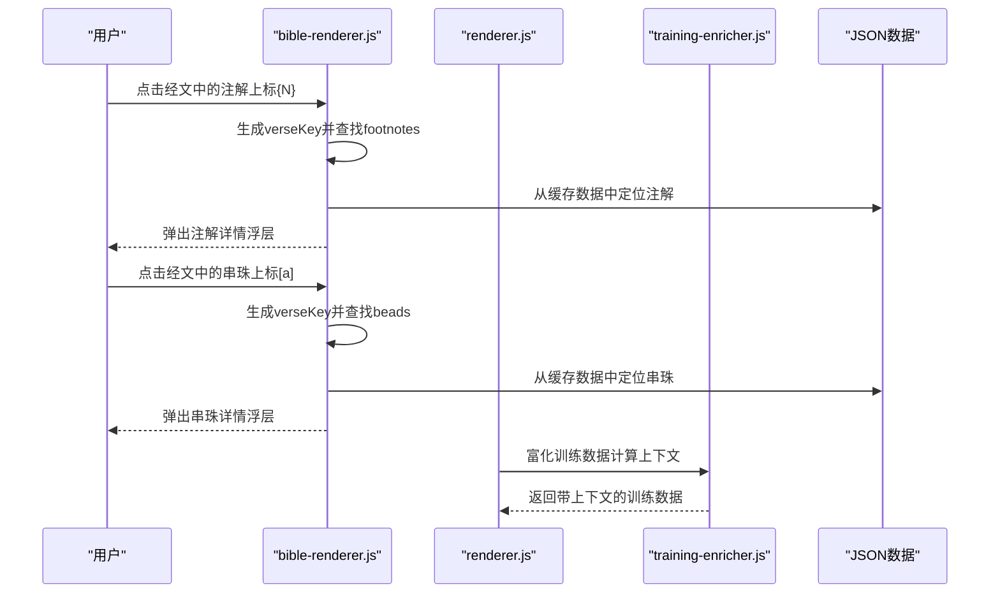
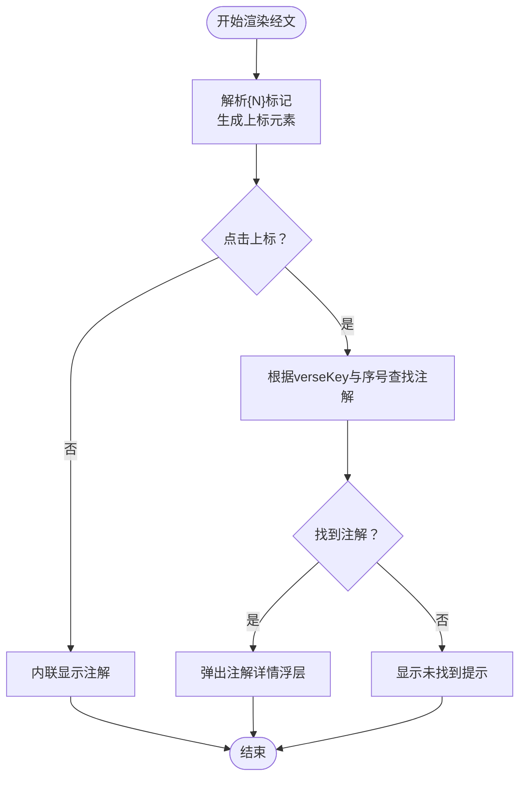
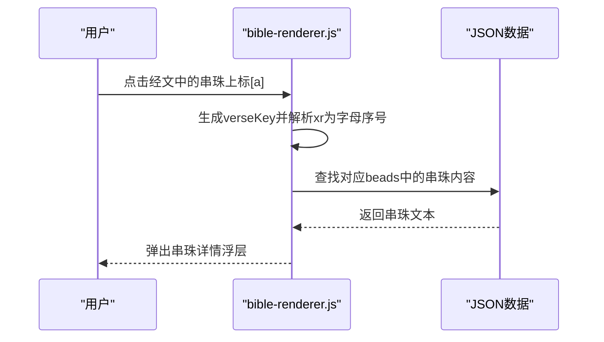
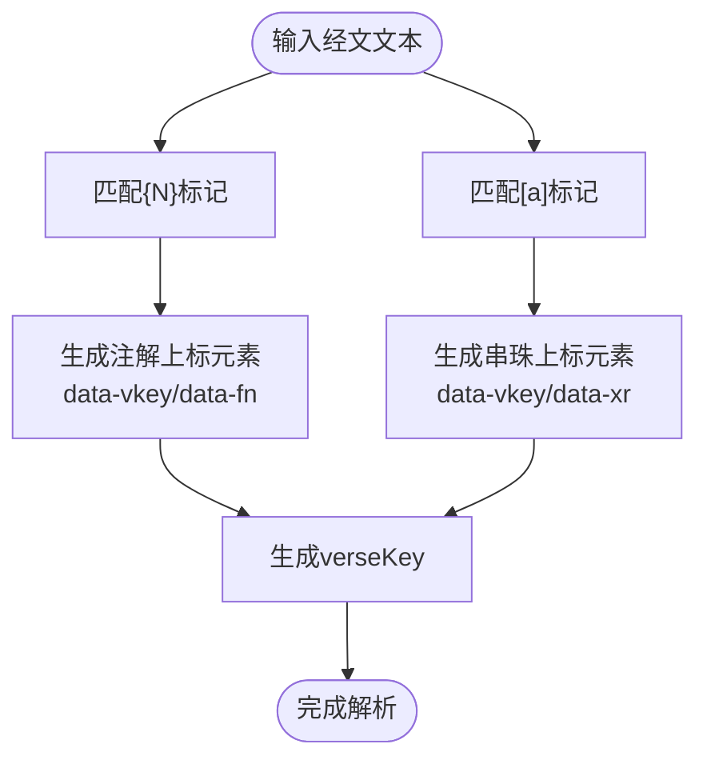
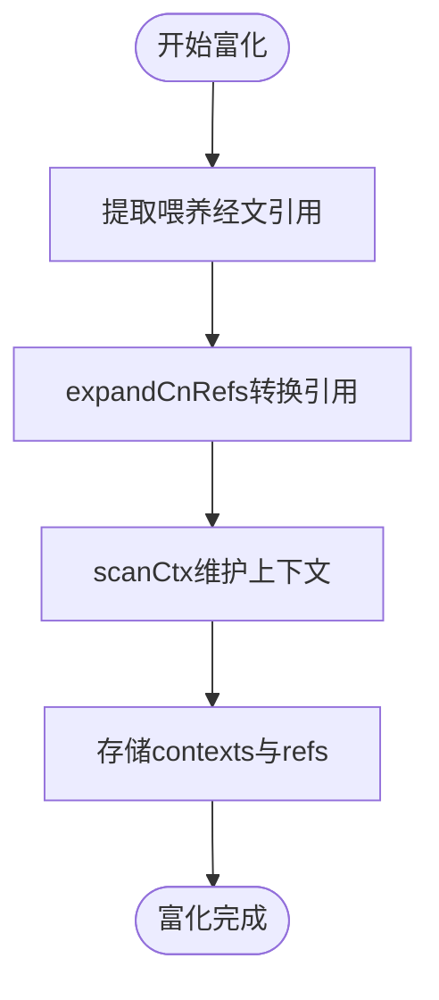
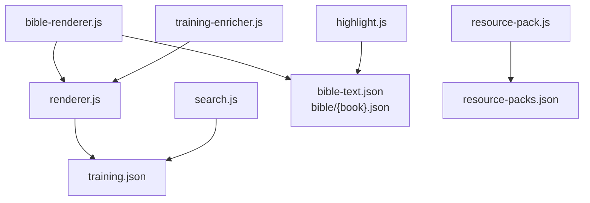

# 注解和串珠系统

<cite>
**本文档引用的文件**
- [bible-renderer.js](file://src/static/js/bible-renderer.js)
- [renderer.js](file://src/static/js/renderer.js)
- [training-enricher.js](file://src/static/js/training-enricher.js)
- [txt-importer.js](file://src/static/js/txt-importer.js)
- [highlight.js](file://src/static/js/highlight.js)
- [search.js](file://src/static/js/search.js)
- [resource-pack.js](file://src/static/js/resource-pack.js)
- [app_config.json](file://app_config.json)
</cite>

## 目录
1. [简介](#简介)
2. [项目结构](#项目结构)
3. [核心组件](#核心组件)
4. [架构概览](#架构概览)
5. [详细组件分析](#详细组件分析)
6. [依赖关系分析](#依赖关系分析)
7. [性能考虑](#性能考虑)
8. [故障排除指南](#故障排除指南)
9. [结论](#结论)
10. [附录](#附录)

## 简介
本文件针对圣经阅读器中的注解与串珠系统进行深入的技术文档说明。重点涵盖以下方面：
- 注解数据结构设计：footnotes 数组的组织方式、注解序号分配规则
- 串珠交叉引用系统：beads 数组的数据格式、引用字母编码方案
- 注解与串珠的显示逻辑：内联显示、浮层弹窗、点击交互
- 标记解析算法：{N} 与 [a] 标记的正则表达式匹配、verseKey 的生成规则
- 注解与串珠的增删改查操作指南及数据导入导出最佳实践

## 项目结构
该项目采用前端单页应用（SPA）架构，核心渲染逻辑集中在浏览器端 JavaScript 模块中。注解与串珠系统主要分布在以下文件：
- 经文渲染与注解/串珠显示：bible-renderer.js
- 训练内容渲染与引用解析：renderer.js
- 数据富化（串珠上下文推导）：training-enricher.js
- 本地TXT导入与内联经文提取：txt-importer.js
- 划线与笔记（与注解/串珠相关的文本标记能力）：highlight.js
- 全文搜索（与注解/串珠相关的文本检索）：search.js
- 资源包管理（训练数据缓存与导入）：resource-pack.js
- 应用配置：app_config.json

**图表来源**
- [bible-renderer.js:1-880](file://src/static/js/bible-renderer.js#L1-L880)
- [renderer.js:1-1471](file://src/static/js/renderer.js#L1-L1471)
- [training-enricher.js:1-84](file://src/static/js/training-enricher.js#L1-L84)
- [txt-importer.js:1-1849](file://src/static/js/txt-importer.js#L1-L1849)
- [highlight.js:1-1335](file://src/static/js/highlight.js#L1-L1335)
- [search.js:1-1086](file://src/static/js/search.js#L1-L1086)
- [resource-pack.js:1-993](file://src/static/js/resource-pack.js#L1-L993)

**章节来源**
- [bible-renderer.js:1-880](file://src/static/js/bible-renderer.js#L1-L880)
- [renderer.js:1-1471](file://src/static/js/renderer.js#L1-L1471)
- [app_config.json:1-6](file://app_config.json#L1-L6)

## 核心组件
本节概述注解与串珠系统的关键组件及其职责。

- 经文渲染与注解/串珠显示
  - 负责将经文文本中的 {N} 与 [a] 标记转换为可点击的上标元素，并根据 verseKey 查找对应的注解或串珠内容，通过浮层弹窗展示。
  - 支持内联显示注解与串珠，以及通过点击事件触发详情弹窗。
  - 控制显示开关：主题摘要、纲目、注解、串珠、经节分割线等。

- 训练内容渲染与引用解析
  - 提供通用的引用解析与包装能力，支持将中文经文引用转换为可点击的 scripture-ref 元素。
  - 提供提取引用的工具函数，用于从文本中抽取引用列表。

- 数据富化（串珠上下文推导）
  - 为晨兴喂养与信息选读段落计算 feeding_refs、morning_feeding_contexts、message_reading_contexts，为串珠系统提供上下文支持。

- 本地TXT导入与内联经文提取
  - 从TXT文件中提取内联经文，构建 verseKey 映射，辅助注解与串珠的定位与显示。

- 划线与笔记
  - 提供文本划线、添加笔记、保存与恢复的能力，支持与注解/串珠相关的文本标记与交互。

- 全文搜索
  - 提供跨训练的全文搜索，支持定位到包含注解/串珠内容的段落。

- 资源包管理
  - 管理历史训练资源包的下载、缓存与删除，确保训练数据的可用性。

**章节来源**
- [bible-renderer.js:121-138](file://src/static/js/bible-renderer.js#L121-L138)
- [bible-renderer.js:420-474](file://src/static/js/bible-renderer.js#L420-L474)
- [bible-renderer.js:497-601](file://src/static/js/bible-renderer.js#L497-L601)
- [renderer.js:22-39](file://src/static/js/renderer.js#L22-L39)
- [renderer.js:105-116](file://src/static/js/renderer.js#L105-L116)
- [training-enricher.js:20-69](file://src/static/js/training-enricher.js#L20-L69)
- [txt-importer.js:30-51](file://src/static/js/txt-importer.js#L30-L51)
- [highlight.js:141-173](file://src/static/js/highlight.js#L141-L173)
- [search.js:48-176](file://src/static/js/search.js#L48-L176)
- [resource-pack.js:49-87](file://src/static/js/resource-pack.js#L49-L87)

## 架构概览
注解与串珠系统的核心工作流如下：

**图表来源**
- [bible-renderer.js:121-138](file://src/static/js/bible-renderer.js#L121-L138)
- [bible-renderer.js:497-601](file://src/static/js/bible-renderer.js#L497-L601)
- [renderer.js:22-39](file://src/static/js/renderer.js#L22-L39)
- [training-enricher.js:20-69](file://src/static/js/training-enricher.js#L20-L69)

## 详细组件分析

### 注解数据结构与显示逻辑
- footnotes 数组组织
  - 每个经节（verse）包含一个 footnotes 数组，数组元素为注解对象，包含序号 seq 与注释文本 note。
  - 渲染时按序号顺序内联显示注解，支持截取与展开。

- 注解上标标记与解析
  - 经文文本中的 {N} 标记会被解析为带有 data-vkey 与 data-fn 的上标元素，其中 N 为注解序号。
  - 上标点击事件触发注解详情弹窗，弹窗标题包含 verseKey 与“注”标识。

- verseKey 生成规则
  - 由书卷简称、章节数与节号组成，例如“创1:1”。
  - 对于带上下半节标记的经文，会在末尾附加“上”、“下”、“中”。

- 显示控制
  - 通过内容开关控制是否显示注解（showFootnotes）。
  - 注解内联显示时，支持截取前若干字符并提供展开按钮。

**图表来源**
- [bible-renderer.js:121-138](file://src/static/js/bible-renderer.js#L121-L138)
- [bible-renderer.js:497-564](file://src/static/js/bible-renderer.js#L497-L564)

**章节来源**
- [bible-renderer.js:121-138](file://src/static/js/bible-renderer.js#L121-L138)
- [bible-renderer.js:420-474](file://src/static/js/bible-renderer.js#L420-L474)
- [bible-renderer.js:497-564](file://src/static/js/bible-renderer.js#L497-L564)

### 串珠交叉引用系统
- beads 数组数据格式
  - 每个经节包含一个 beads 数组，数组元素为串珠对象，包含序列号 seq（单个小写字母）与串珠内容 bead。
  - 渲染时以内联形式显示，字母作为序号标识。

- 串珠上标标记与解析
  - 经文文本中的 [a] 标记会被解析为带有 data-vkey 与 data-xr 的上标元素，xr 为串珠序列号（如 a）。
  - 上标点击事件触发串珠详情弹窗，弹窗标题包含 verseKey 与“串”标识。

- 引用字母编码方案
  - 串珠序号使用小写字母 a, b, c, ... 进行编码，按出现顺序分配。
  - 与注解的数字序号形成互补，便于区分不同类型的内容。

- 串珠文本处理
  - 串珠文本支持将中文经文引用转换为可点击链接，提升交叉引用体验。

**图表来源**
- [bible-renderer.js:134-136](file://src/static/js/bible-renderer.js#L134-L136)
- [bible-renderer.js:567-601](file://src/static/js/bible-renderer.js#L567-L601)

**章节来源**
- [bible-renderer.js:134-136](file://src/static/js/bible-renderer.js#L134-L136)
- [bible-renderer.js:461-468](file://src/static/js/bible-renderer.js#L461-L468)
- [bible-renderer.js:567-601](file://src/static/js/bible-renderer.js#L567-L601)

### 标记解析算法与 verseKey 生成
- {N} 标记解析
  - 正则表达式匹配形如 {数字} 的注解标记，提取数字作为序号 N。
  - 生成上标元素并绑定 data-vkey 与 data-fn 属性。

- [a] 标记解析
  - 正则表达式匹配形如 [小写字母] 的串珠标记，提取字母作为序号。
  - 生成上标元素并绑定 data-vkey 与 data-xr 属性。

- verseKey 生成规则
  - 基础格式：书卷简称 + 章节 + ":" + 节号。
  - 对于带上下半节标记的经文，附加“上/下/中”后缀。
  - 用于唯一标识经文位置，便于注解与串珠的定位与显示。

**图表来源**
- [bible-renderer.js:121-138](file://src/static/js/bible-renderer.js#L121-L138)

**章节来源**
- [bible-renderer.js:121-138](file://src/static/js/bible-renderer.js#L121-L138)

### 数据富化与上下文推导
- feeding_refs 计算
  - 基于晨兴喂养的经文引用，计算每个喂养段落的引用键集合，用于富化训练数据。
  - 通过 expandCnRefs 将中文引用转换为标准引用格式。

- 上下文扫描
  - 使用 scanCtx 逐步扫描段落，维护上下文字符串，确保引用解析的准确性。
  - morning_feeding_contexts 与 message_reading_contexts 分别记录两类段落的上下文。

**图表来源**
- [training-enricher.js:20-69](file://src/static/js/training-enricher.js#L20-L69)

**章节来源**
- [training-enricher.js:20-69](file://src/static/js/training-enricher.js#L20-L69)

### 本地TXT导入与内联经文提取
- 内联经文提取
  - 使用 VERSE_KEY_RE 正则匹配独占一行的经文引用键，构建 key → verseText 映射。
  - 用于辅助注解与串珠的定位与显示。

- 格式支持
  - 支持独立训练文件与历史大合辑文件两种格式。
  - 提供存储与索引管理，确保导入后数据可被搜索与渲染。

**章节来源**
- [txt-importer.js:30-51](file://src/static/js/txt-importer.js#L30-L51)

### 划线与笔记（与注解/串珠相关的文本标记能力）
- 文本划线与笔记
  - 支持文本选中后划线、添加笔记、保存到本地存储。
  - 数据模型包含 id、start、end、text、color、underline、note、timestamp 等字段。
  - 支持配对页同步（纲目↔晨读），确保跨视图的一致性。

- 存储与恢复
  - 使用 localForage（IndexedDB）作为存储后端，兼容 localStorage 降级。
  - 提供自愈机制，当偏移失效时通过 TextQuoteSelector 进行最佳匹配恢复。

**章节来源**
- [highlight.js:141-173](file://src/static/js/highlight.js#L141-L173)
- [highlight.js:354-422](file://src/static/js/highlight.js#L354-L422)
- [highlight.js:618-638](file://src/static/js/highlight.js#L618-L638)

### 全文搜索（与注解/串珠相关的文本检索）
- 搜索索引构建
  - 从 training.json 中提取章节、纲目、晨读、职事摘录等内容，构建搜索条目。
  - 支持懒加载与缓存，确保搜索性能。

- 结果定位
  - 支持在目标页面高亮关键词，并滚动到匹配位置。
  - 提供 SPA 与传统页面两种定位方式。

**章节来源**
- [search.js:48-176](file://src/static/js/search.js#L48-L176)
- [search.js:380-461](file://src/static/js/search.js#L380-L461)
- [search.js:514-734](file://src/static/js/search.js#L514-L734)

### 资源包管理（训练数据缓存与导入）
- 资源包下载与缓存
  - 支持从多个镜像并发竞速下载资源包，使用 JSZip 解压并写入 Cache API。
  - 提供下载进度反馈与错误重试机制。

- 缓存管理
  - 支持整包删除与单训练删除，维护来源追踪，确保删除操作的可恢复性。
  - 提供“重新安装”功能，恢复已删除的初始训练。

**章节来源**
- [resource-pack.js:217-327](file://src/static/js/resource-pack.js#L217-L327)
- [resource-pack.js:144-193](file://src/static/js/resource-pack.js#L144-L193)
- [resource-pack.js:345-797](file://src/static/js/resource-pack.js#L345-L797)

## 依赖关系分析
注解与串珠系统的关键依赖关系如下：

**图表来源**
- [bible-renderer.js:1-880](file://src/static/js/bible-renderer.js#L1-L880)
- [renderer.js:1-1471](file://src/static/js/renderer.js#L1-L1471)
- [training-enricher.js:1-84](file://src/static/js/training-enricher.js#L1-L84)
- [highlight.js:1-1335](file://src/static/js/highlight.js#L1-L1335)
- [search.js:1-1086](file://src/static/js/search.js#L1-L1086)
- [resource-pack.js:1-993](file://src/static/js/resource-pack.js#L1-L993)

**章节来源**
- [bible-renderer.js:1-880](file://src/static/js/bible-renderer.js#L1-L880)
- [renderer.js:1-1471](file://src/static/js/renderer.js#L1-L1471)

## 性能考虑
- 懒加载与缓存
  - 经文数据与训练数据采用懒加载策略，结合本地缓存减少重复请求。
  - 资源包使用 Cache API 缓存，支持离线访问。

- 搜索优化
  - 搜索索引按批次加载，避免一次性加载过多数据。
  - 使用本地存储缓存搜索结果，提升二次搜索性能。

- DOM 操作优化
  - 划线与笔记采用最小化 DOM 操作，避免频繁重排。
  - 浮层弹窗使用 CSS 动画，确保流畅体验。

## 故障排除指南
- 注解/串珠未显示
  - 检查内容开关是否开启（showFootnotes/showBeads）。
  - 确认 verseKey 与数据结构一致，核对 bookAcronym、chapter、section 的组合。

- 点击无反应
  - 确认事件绑定是否生效，检查 data-vkey 与 data-fn/data-xr 属性是否存在。
  - 验证 _bindVerseEvents 是否正确执行。

- 浮层内容为空
  - 检查 _showDetailOverlay 的调用参数，确认 verseKey 与序号匹配。
  - 核对数据缓存中是否存在对应注解/串珠内容。

- 划线丢失或偏移错误
  - 使用 TextQuoteSelector 进行自愈，检查 prefix/suffix 字段是否正确。
  - 确认存储后端（IndexedDB/localStorage）可用性。

**章节来源**
- [bible-renderer.js:497-658](file://src/static/js/bible-renderer.js#L497-L658)
- [highlight.js:424-545](file://src/static/js/highlight.js#L424-L545)

## 结论
注解与串珠系统通过清晰的数据结构与高效的渲染机制，实现了经文内容的增强与交叉引用。系统支持灵活的标记解析、丰富的显示控制、可靠的浮层交互，并提供了完善的富化、导入与缓存管理能力。未来可在以下方面进一步优化：
- 增强注解与串珠的批量编辑与导出功能
- 优化大规模数据下的渲染性能
- 扩展跨语言与跨版本的兼容性

## 附录
- 应用配置
  - 应用名称、ID 与版本信息可通过 app_config.json 进行配置与管理。

**章节来源**
- [app_config.json:1-6](file://app_config.json#L1-L6)