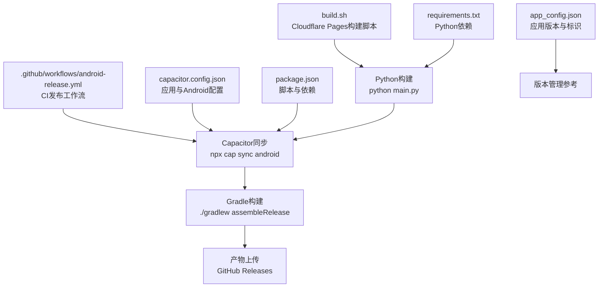
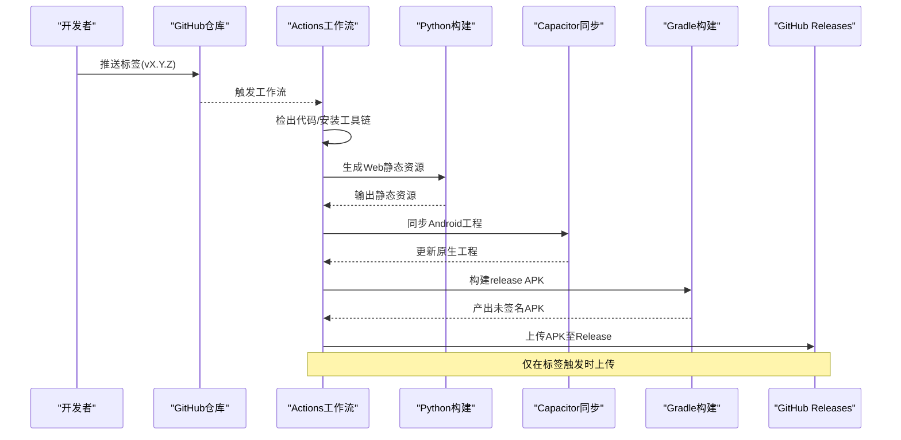
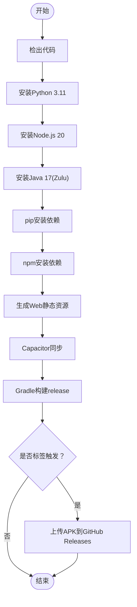
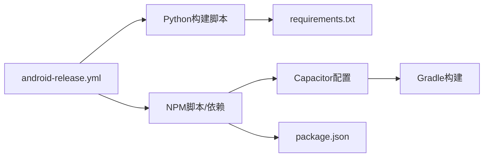

# Android发布

<cite>
**本文引用的文件**
- [.github/workflows/android-release.yml](file://.github/workflows/android-release.yml)
- [capacitor.config.json](file://capacitor.config.json)
- [package.json](file://package.json)
- [build.sh](file://build.sh)
- [requirements.txt](file://requirements.txt)
- [app_config.json](file://app_config.json)
- [android/README.md](file://android/README.md)
</cite>

## 目录
1. [引言](#引言)
2. [项目结构](#项目结构)
3. [核心组件](#核心组件)
4. [架构总览](#架构总览)
5. [详细组件分析](#详细组件分析)
6. [依赖关系分析](#依赖关系分析)
7. [性能考虑](#性能考虑)
8. [故障排查指南](#故障排查指南)
9. [结论](#结论)
10. [附录](#附录)

## 引言
本文件面向“圣经阅读器”Android应用的发布流程，系统性说明GitHub Actions中的Android发布工作流配置与执行路径，涵盖APK构建、签名与版本管理、构建变体、Capacitor对Android打包的影响、发布渠道（调试版/发布版）差异、发布前测试与质量检查清单，以及发布后的更新推送与版本回退策略。内容基于仓库中实际配置文件进行梳理与总结，帮助开发者在CI/CD环境下稳定地交付高质量的Android应用。

## 项目结构
该仓库采用前端PWA与Capacitor桥接Android原生工程的混合架构。发布相关的关键位置如下：
- GitHub Actions工作流：位于“.github/workflows/android-release.yml”，定义了触发条件、环境准备、构建步骤与产物上传。
- Capacitor配置：位于“capacitor.config.json”，定义应用ID、应用名、Web资源输出目录及Android特定选项。
- 构建脚本与依赖：根目录包含Python构建脚本、Node/NPM脚本与依赖声明；Android子目录提供Capacitor Android项目说明。
- 版本与标识：通过“app_config.json”与“package.json”中的版本字段共同体现。

图表来源
- [.github/workflows/android-release.yml:1-54](file://.github/workflows/android-release.yml#L1-L54)
- [capacitor.config.json:1-10](file://capacitor.config.json#L1-L10)
- [package.json:1-24](file://package.json#L1-L24)
- [build.sh:1-16](file://build.sh#L1-L16)
- [requirements.txt:1-2](file://requirements.txt#L1-L2)
- [app_config.json:1-6](file://app_config.json#L1-L6)

章节来源
- [.github/workflows/android-release.yml:1-54](file://.github/workflows/android-release.yml#L1-L54)
- [capacitor.config.json:1-10](file://capacitor.config.json#L1-L10)
- [package.json:1-24](file://package.json#L1-L24)
- [build.sh:1-16](file://build.sh#L1-L16)
- [requirements.txt:1-2](file://requirements.txt#L1-L2)
- [app_config.json:1-6](file://app_config.json#L1-L6)
- [android/README.md:1-13](file://android/README.md#L1-L13)

## 核心组件
- GitHub Actions发布工作流
  - 触发方式：推送标签（以“v”开头）或手动触发。
  - 步骤：检出代码、安装Python与Node.js、安装依赖、生成Web静态资源、执行Capacitor同步、构建APK、上传到GitHub Releases（仅当存在标签时）。
- Capacitor配置
  - 应用标识与名称、Web资源输出目录、Android允许混合内容、调试开关等。
- 构建脚本与依赖
  - Python构建脚本负责生成静态资源；NPM脚本封装Capacitor同步与Gradle构建；requirements.txt声明Python依赖。
- 版本与标识
  - package.json与app_config.json分别提供应用版本信息，用于构建与发布识别。

章节来源
- [.github/workflows/android-release.yml:1-54](file://.github/workflows/android-release.yml#L1-L54)
- [capacitor.config.json:1-10](file://capacitor.config.json#L1-L10)
- [package.json:1-24](file://package.json#L1-L24)
- [build.sh:1-16](file://build.sh#L1-L16)
- [requirements.txt:1-2](file://requirements.txt#L1-L2)
- [app_config.json:1-6](file://app_config.json#L1-L6)

## 架构总览
下图展示从代码提交到APK发布的端到端流程，强调各组件之间的调用关系与数据流向。

图表来源
- [.github/workflows/android-release.yml:1-54](file://.github/workflows/android-release.yml#L1-L54)
- [capacitor.config.json:1-10](file://capacitor.config.json#L1-L10)
- [package.json:1-24](file://package.json#L1-L24)
- [build.sh:1-16](file://build.sh#L1-L16)

## 详细组件分析

### GitHub Actions发布工作流
- 触发条件
  - 推送以“v”开头的标签，或手动触发。
- 关键步骤
  - 环境准备：安装Python 3.11、Node.js 20、Java 17（Zulu发行版）。
  - 依赖安装：pip安装requirements.txt；npm安装Node依赖。
  - 资源构建：执行Python主构建脚本生成静态资源。
  - Capacitor同步：执行Capacitor同步命令，将Web资源注入Android工程。
  - Gradle构建：在android目录下赋予可执行权限并执行release构建任务。
  - 产物上传：若当前分支为标签，则上传未签名APK到GitHub Releases。
- 变体与签名
  - 当前工作流使用默认release构建，产物为未签名APK。签名与加固需在本地或CI安全变量中补充密钥库配置后扩展工作流。

图表来源
- [.github/workflows/android-release.yml:1-54](file://.github/workflows/android-release.yml#L1-L54)

章节来源
- [.github/workflows/android-release.yml:1-54](file://.github/workflows/android-release.yml#L1-L54)

### Capacitor配置对Android打包的影响
- 应用标识与名称
  - appId与appName决定Android包名与应用显示名，影响安装包与发布渠道区分。
- Web资源目录
  - webDir指向输出目录，Capacitor将该目录作为WebView加载的静态资源根目录。
- Android特性
  - 允许混合内容与关闭WebContents调试，影响网络请求与调试能力。
- 对构建的影响
  - Capacitor同步会根据配置更新原生工程，确保Web资源与原生层一致。

章节来源
- [capacitor.config.json:1-10](file://capacitor.config.json#L1-L10)

### 构建脚本与依赖
- Python构建脚本
  - 安装依赖、生成静态文件，供Capacitor同步使用。
- NPM脚本
  - 提供一键构建、同步与打开Android工程的便捷命令。
- 依赖声明
  - package.json列出运行时与开发时依赖，包括Capacitor核心与Android平台CLI。
- requirements.txt
  - 指定Python依赖版本范围，保证构建环境一致性。

章节来源
- [build.sh:1-16](file://build.sh#L1-L16)
- [package.json:1-24](file://package.json#L1-L24)
- [requirements.txt:1-2](file://requirements.txt#L1-L2)

### 版本管理与标识
- package.json中的version字段
  - 作为应用版本号的来源之一，可用于构建元数据或发布说明。
- app_config.json中的version字段
  - 明确应用版本信息，便于发布与更新校验。
- 建议
  - 在CI中读取上述版本信息，统一写入构建产物或发布说明，避免多处不一致。

章节来源
- [package.json:1-24](file://package.json#L1-L24)
- [app_config.json:1-6](file://app_config.json#L1-L6)

### 发布渠道：调试版与发布版
- 调试版
  - 通常使用debug变体，具备调试能力与较低的安全限制，适合开发与内测。
- 发布版
  - 使用release变体，需完成签名与混淆加固，提升安全性与性能。
- 本仓库现状
  - 工作流默认构建release变体，但当前产物为未签名APK。如需正式发布，应在CI中配置签名参数或在本地完成签名。

章节来源
- [.github/workflows/android-release.yml:43-47](file://.github/workflows/android-release.yml#L43-L47)

## 依赖关系分析
- 工作流对工具链的依赖
  - Python 3.11、Node.js 20、Java 17（Zulu），确保构建环境稳定。
- 构建链路依赖
  - Python构建脚本依赖requirements.txt；Capacitor同步依赖package.json中的脚本与依赖；Gradle构建依赖Capacitor生成的Android工程。
- 配置依赖
  - Capacitor配置决定Web资源目录与Android特性，直接影响构建产物与运行行为。

图表来源
- [.github/workflows/android-release.yml:1-54](file://.github/workflows/android-release.yml#L1-L54)
- [capacitor.config.json:1-10](file://capacitor.config.json#L1-L10)
- [package.json:1-24](file://package.json#L1-L24)
- [build.sh:1-16](file://build.sh#L1-L16)
- [requirements.txt:1-2](file://requirements.txt#L1-L2)

章节来源
- [.github/workflows/android-release.yml:1-54](file://.github/workflows/android-release.yml#L1-L54)
- [capacitor.config.json:1-10](file://capacitor.config.json#L1-L10)
- [package.json:1-24](file://package.json#L1-L24)
- [build.sh:1-16](file://build.sh#L1-L16)
- [requirements.txt:1-2](file://requirements.txt#L1-L2)

## 性能考虑
- 构建时间优化
  - 缓存依赖安装结果（pip与npm缓存）、复用容器环境、并行化可选步骤。
- 产物体积控制
  - 清理无用资源、启用压缩与按需加载、减少第三方依赖体积。
- 签名与混淆
  - 发布版建议启用混淆与多APK分架构，结合签名提升安全性与启动性能。

## 故障排查指南
- 构建失败
  - 确认Python与Node版本满足工作流要求；检查requirements.txt与package.json依赖完整性。
- Capacitor同步异常
  - 确保Capacitor CLI已安装且版本匹配；检查capacitor.config.json配置项是否正确。
- Gradle构建失败
  - 检查Android SDK/NDK与构建工具版本；确认已授予gradlew执行权限。
- 上传失败
  - 仅在标签触发时上传产物；确认当前分支为有效标签。

章节来源
- [.github/workflows/android-release.yml:1-54](file://.github/workflows/android-release.yml#L1-L54)
- [capacitor.config.json:1-10](file://capacitor.config.json#L1-L10)
- [package.json:1-24](file://package.json#L1-L24)
- [build.sh:1-16](file://build.sh#L1-L16)
- [requirements.txt:1-2](file://requirements.txt#L1-L2)

## 结论
本仓库通过GitHub Actions实现了从代码到APK的自动化流水线，结合Capacitor将Web资源无缝集成到Android工程。当前工作流默认构建release变体并产出未签名APK，建议在CI中补充签名配置以支持正式发布。配合严格的测试与质量检查，可实现稳定、可追溯的应用交付。

## 附录

### 发布前测试流程与质量检查清单
- 功能测试
  - 核心功能验证（导航、搜索、阅读、语音等）。
- 兼容性测试
  - 多机型、多系统版本验证。
- 安全检查
  - 网络与资源访问策略、证书固定与网络安全配置。
- 性能测试
  - 冷启动、内存占用、渲染性能。
- 质量门禁
  - 代码规范、单元测试覆盖率、构建日志审查。

### 发布后的更新推送与版本回退策略
- 更新推送
  - 通过发布说明与渠道公告通知用户；必要时提供强制更新提示。
- 版本回退
  - 若新版本出现严重问题，保留上一稳定版本并回滚；确保用户数据与配置不受影响。
- 记录与追踪
  - 维护变更日志与发布记录，便于问题定位与审计。