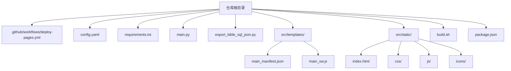
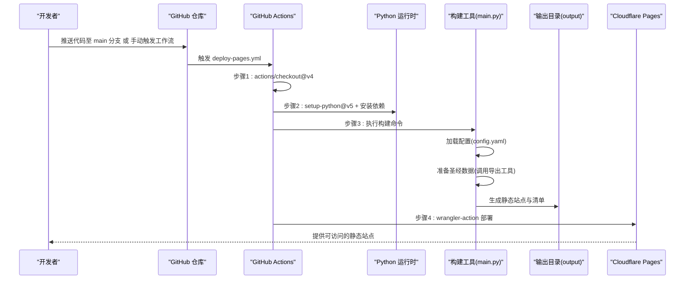
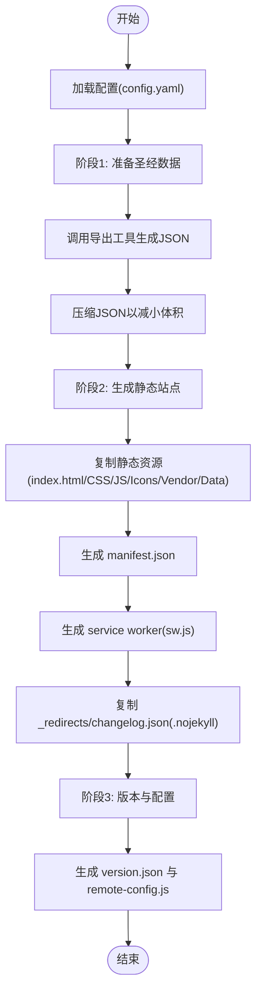
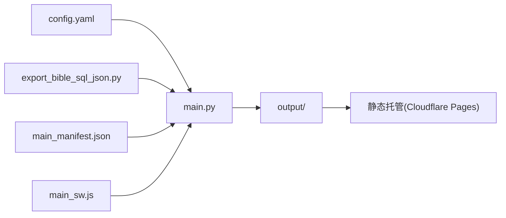

# Web部署

<cite>
**本文档引用的文件**
- [.github/workflows/deploy-pages.yml](file://.github/workflows/deploy-pages.yml)
- [build.sh](file://build.sh)
- [package.json](file://package.json)
- [config.yaml](file://config.yaml)
- [main.py](file://main.py)
- [export_bible_sql_json.py](file://export_bible_sql_json.py)
- [src/templates/main_manifest.json](file://src/templates/main_manifest.json)
- [src/templates/main_sw.js](file://src/templates/main_sw.js)
- [src/static/index.html](file://src/static/index.html)
- [requirements.txt](file://requirements.txt)
- [app_config.json](file://app_config.json)
</cite>

## 目录
1. [简介](#简介)
2. [项目结构](#项目结构)
3. [核心组件](#核心组件)
4. [架构总览](#架构总览)
5. [详细组件分析](#详细组件分析)
6. [依赖关系分析](#依赖关系分析)
7. [性能考虑](#性能考虑)
8. [故障排除指南](#故障排除指南)
9. [结论](#结论)
10. [附录](#附录)

## 简介
本文件面向圣经阅读器的Web部署，重点覆盖以下内容：
- GitHub Pages与Cloudflare Pages的部署配置与差异
- GitHub Actions工作流的触发条件、执行流程与步骤解析
- 构建过程：从代码检出到静态资源生成的完整链路
- 自动化与手动部署两种方式的操作指南
- 环境变量与安全密钥管理
- 部署验证与常见问题排查

## 项目结构
该项目采用“Python构建 + 静态站点输出”的模式，核心产物为可直接部署到静态托管平台（如Cloudflare Pages）的output目录。关键目录与文件如下：
- 配置与构建：config.yaml、requirements.txt、main.py、export_bible_sql_json.py
- 静态模板：src/templates/main_manifest.json、src/templates/main_sw.js
- 前端入口与资源：src/static/index.html、src/static/css、src/static/js、src/static/icons
- CI/CD：.github/workflows/deploy-pages.yml
- 构建脚本：build.sh、package.json

图表来源
- [config.yaml:1-12](file://config.yaml#L1-L12)
- [main.py:1-200](file://main.py#L1-L200)
- [export_bible_sql_json.py:1-200](file://export_bible_sql_json.py#L1-L200)
- [src/templates/main_manifest.json:1-26](file://src/templates/main_manifest.json#L1-L26)
- [src/templates/main_sw.js:1-270](file://src/templates/main_sw.js#L1-L270)
- [src/static/index.html:1-200](file://src/static/index.html#L1-L200)
- [.github/workflows/deploy-pages.yml:1-32](file://.github/workflows/deploy-pages.yml#L1-L32)
- [build.sh:1-16](file://build.sh#L1-L16)
- [package.json:1-24](file://package.json#L1-L24)

章节来源
- [config.yaml:1-12](file://config.yaml#L1-L12)
- [main.py:1-200](file://main.py#L1-L200)
- [export_bible_sql_json.py:1-200](file://export_bible_sql_json.py#L1-L200)
- [src/templates/main_manifest.json:1-26](file://src/templates/main_manifest.json#L1-L26)
- [src/templates/main_sw.js:1-270](file://src/templates/main_sw.js#L1-L270)
- [src/static/index.html:1-200](file://src/static/index.html#L1-L200)
- [.github/workflows/deploy-pages.yml:1-32](file://.github/workflows/deploy-pages.yml#L1-L32)
- [build.sh:1-16](file://build.sh#L1-L16)
- [package.json:1-24](file://package.json#L1-L24)

## 核心组件
- 构建入口与流程控制：main.py负责加载配置、准备圣经数据、生成静态站点、注入版本与远程配置
- 数据导出工具：export_bible_sql_json.py从SQLite数据库导出JSON数据，包含经文、注解、串珠、书卷映射等
- 静态模板：main_manifest.json用于PWA清单；main_sw.js用于离线缓存与网络回退策略
- 前端入口：index.html作为SPA入口，按需加载JS模块与资源
- CI/CD：deploy-pages.yml定义在推送到main分支或手动触发时的部署作业
- 构建脚本：build.sh与package.json中的脚本统一调用main.py进行构建

章节来源
- [main.py:36-76](file://main.py#L36-L76)
- [export_bible_sql_json.py:1-200](file://export_bible_sql_json.py#L1-L200)
- [src/templates/main_manifest.json:1-26](file://src/templates/main_manifest.json#L1-L26)
- [src/templates/main_sw.js:1-270](file://src/templates/main_sw.js#L1-L270)
- [src/static/index.html:1-200](file://src/static/index.html#L1-L200)
- [.github/workflows/deploy-pages.yml:1-32](file://.github/workflows/deploy-pages.yml#L1-L32)
- [build.sh:1-16](file://build.sh#L1-L16)
- [package.json:5-11](file://package.json#L5-L11)

## 架构总览
下图展示了从代码检出到静态资源生成再到部署的完整流程。

图表来源
- [.github/workflows/deploy-pages.yml:1-32](file://.github/workflows/deploy-pages.yml#L1-L32)
- [main.py:36-76](file://main.py#L36-L76)
- [config.yaml:1-12](file://config.yaml#L1-L12)

## 详细组件分析

### GitHub Actions 工作流（deploy-pages.yml）
- 触发条件
  - 推送至 main 分支
  - 手动触发（workflow_dispatch）
- 运行环境
  - Ubuntu 最新 runners
- 关键步骤
  - 代码检出
  - 设置 Python 3.11
  - 安装依赖（requirements.txt）
  - 执行构建（调用 main.py）
  - 使用 wrangler-action 部署至 Cloudflare Pages（需要设置 CLOUDFLARE_API_TOKEN 与 CLOUDFLARE_ACCOUNT_ID）

章节来源
- [.github/workflows/deploy-pages.yml:1-32](file://.github/workflows/deploy-pages.yml#L1-L32)

### 构建脚本与命令（build.sh 与 package.json）
- build.sh
  - 安装依赖
  - 调用 Python 主程序生成静态资源
- package.json
  - scripts.build 指向 python main.py
  - 提供 Capacitor 相关脚本（与Web部署无直接关系）

章节来源
- [build.sh:1-16](file://build.sh#L1-L16)
- [package.json:5-11](file://package.json#L5-L11)

### 构建主程序（main.py）
- 配置加载：读取 config.yaml，确定输出目录、静态资源目录、数据库与读经计划等
- 阶段一：准备圣经数据
  - 导入导出工具模块并执行导出
  - 对生成的 JSON 进行压缩以减小体积
- 阶段二：生成静态站点
  - 复制 index.html、CSS、JS（排除训练相关文件）、icons、vendor、静态 data
  - 生成 manifest.json（基于模板替换名称）
  - 生成 sw.js（基于模板）
  - 复制 _redirects 与 changelog.json（如存在）
  - 在输出目录创建 .nojekyll
- 阶段三：版本与配置
  - 生成 version.json 与 remote-config.js（用于更新检查与服务器地址）

图表来源
- [main.py:36-76](file://main.py#L36-L76)
- [main.py:87-161](file://main.py#L87-L161)
- [main.py:121-161](file://main.py#L121-L161)
- [config.yaml:1-12](file://config.yaml#L1-L12)

章节来源
- [main.py:36-76](file://main.py#L36-L76)
- [main.py:87-161](file://main.py#L87-L161)
- [main.py:121-161](file://main.py#L121-L161)
- [config.yaml:1-12](file://config.yaml#L1-L12)

### 数据导出工具（export_bible_sql_json.py）
- 从 SQLite 数据库导出多种JSON文件，包括经文、注解、串珠、书卷映射以及按书卷分片的数据
- 支持命令行参数指定数据库与输出目录
- 与构建主程序配合，为静态站点提供数据基础

章节来源
- [export_bible_sql_json.py:1-200](file://export_bible_sql_json.py#L1-L200)

### 静态模板（main_manifest.json 与 main_sw.js）
- main_manifest.json
  - 定义 PWA 名称、图标、启动URL、作用域等
- main_sw.js
  - 预缓存核心URL
  - 缓存策略：圣经数据 cache-first，版本文件 network-first，其他 cache-first + network fallback
  - 支持离线提示、缓存查询与清理、批量缓存66卷数据等

章节来源
- [src/templates/main_manifest.json:1-26](file://src/templates/main_manifest.json#L1-L26)
- [src/templates/main_sw.js:1-270](file://src/templates/main_sw.js#L1-L270)

### 前端入口（index.html）
- PWA清单链接、图标、主题色、移动端适配
- 按需加载国际化、路由、渲染器、语音、高亮等模块
- 与 Service Worker 协同实现离线体验

章节来源
- [src/static/index.html:1-200](file://src/static/index.html#L1-L200)

### 配置与依赖
- config.yaml
  - 输出目录、静态资源目录、数据库路径、读经计划列表、远程服务器配置
- requirements.txt
  - Python 依赖（如 PyYAML）
- app_config.json
  - 应用名称、ID、版本（与Web部署无直接关系）

章节来源
- [config.yaml:1-12](file://config.yaml#L1-L12)
- [requirements.txt:1-2](file://requirements.txt#L1-L2)
- [app_config.json:1-6](file://app_config.json#L1-L6)

## 依赖关系分析
- 构建主程序依赖配置文件与导出工具
- 导出工具依赖 SQLite 数据库与读经计划JSON
- 静态模板用于生成 PWA 清单与 Service Worker
- 前端入口依赖生成的静态资源与清单
- CI/CD 依赖 Cloudflare Pages 的部署动作与安全凭据

图表来源
- [config.yaml:1-12](file://config.yaml#L1-L12)
- [main.py:36-76](file://main.py#L36-L76)
- [export_bible_sql_json.py:1-200](file://export_bible_sql_json.py#L1-L200)
- [src/templates/main_manifest.json:1-26](file://src/templates/main_manifest.json#L1-L26)
- [src/templates/main_sw.js:1-270](file://src/templates/main_sw.js#L1-L270)

章节来源
- [config.yaml:1-12](file://config.yaml#L1-L12)
- [main.py:36-76](file://main.py#L36-L76)
- [export_bible_sql_json.py:1-200](file://export_bible_sql_json.py#L1-L200)
- [src/templates/main_manifest.json:1-26](file://src/templates/main_manifest.json#L1-L26)
- [src/templates/main_sw.js:1-270](file://src/templates/main_sw.js#L1-L270)

## 性能考虑
- 构建阶段对生成的JSON进行压缩，降低传输体积
- Service Worker 采用分层缓存策略，优先缓存不变的圣经数据，提升离线可用性
- 预缓存核心URL，缩短首屏加载时间
- 输出目录包含 .nojekyll，避免GitHub Pages对Jekyll的额外处理开销

章节来源
- [main.py:107-116](file://main.py#L107-L116)
- [src/templates/main_sw.js:1-270](file://src/templates/main_sw.js#L1-L270)
- [main.py:159-161](file://main.py#L159-L161)

## 故障排除指南
- 构建失败（找不到数据库或依赖）
  - 确认 config.yaml 中的数据库路径正确
  - 确认 requirements.txt 已安装
- 静态资源缺失
  - 检查 main.py 是否正确复制了 CSS/JS/Icons/Vendor/Data
  - 确认生成了 manifest.json、sw.js、_redirects、.nojekyll
- CI/CD 部署失败
  - 检查 CLOUDFLARE_API_TOKEN 与 CLOUDFLARE_ACCOUNT_ID 是否在仓库 Secrets 中配置
  - 确认工作流触发条件（推送至 main 或手动触发）
- 离线与缓存问题
  - 检查 Service Worker 的预缓存与缓存策略
  - 使用浏览器开发者工具查看 Application/Cache Storage 面板

章节来源
- [.github/workflows/deploy-pages.yml:26-31](file://.github/workflows/deploy-pages.yml#L26-L31)
- [main.py:121-161](file://main.py#L121-L161)
- [src/templates/main_sw.js:1-270](file://src/templates/main_sw.js#L1-L270)

## 结论
本项目通过明确的构建流程与CI/CD配置，实现了从代码到静态站点的自动化交付。Cloudflare Pages提供了稳定的托管能力，结合Service Worker与PWA清单，能够为用户提供良好的离线与加载体验。建议在生产环境中严格管理安全密钥，定期验证构建产物与部署状态。

## 附录

### 自动部署（GitHub Actions）
- 触发方式
  - 推送至 main 分支
  - 在 Actions 页面手动触发 workflow_dispatch
- 关键步骤
  - actions/checkout@v4
  - actions/setup-python@v5 + pip install -r requirements.txt
  - python main.py
  - cloudflare/wrangler-action@v3 部署至 Pages（需配置 CLOUDFLARE_API_TOKEN 与 CLOUDFLARE_ACCOUNT_ID）

章节来源
- [.github/workflows/deploy-pages.yml:1-32](file://.github/workflows/deploy-pages.yml#L1-L32)

### 手动部署
- 本地构建
  - 安装依赖：pip install -r requirements.txt
  - 执行构建：python main.py
  - 产物位于 output/ 目录
- 上传至托管
  - 将 output/ 目录内容上传至 Cloudflare Pages 项目
  - 或使用 Pages CLI 进行部署（参考工作流中的命令）

章节来源
- [build.sh:7-15](file://build.sh#L7-L15)
- [package.json:5-11](file://package.json#L5-L11)
- [.github/workflows/deploy-pages.yml:26-31](file://.github/workflows/deploy-pages.yml#L26-L31)

### 环境变量与安全密钥
- 必需密钥（Secrets）
  - CLOUDFLARE_API_TOKEN
  - CLOUDFLARE_ACCOUNT_ID
- 其他配置
  - config.yaml 中的输出目录、静态资源目录、数据库路径、读经计划列表、远程服务器地址

章节来源
- [.github/workflows/deploy-pages.yml:28-31](file://.github/workflows/deploy-pages.yml#L28-L31)
- [config.yaml:1-12](file://config.yaml#L1-L12)