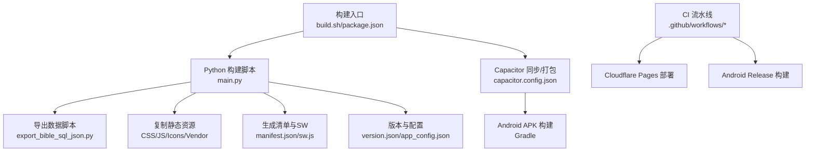
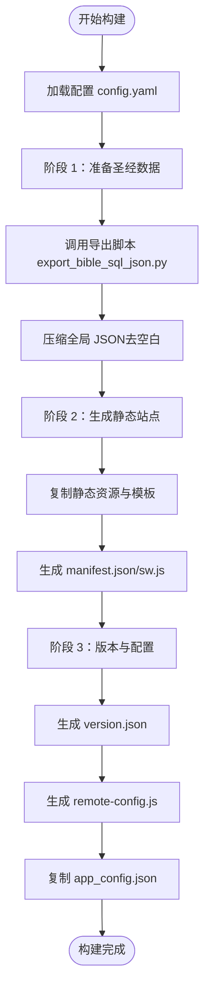
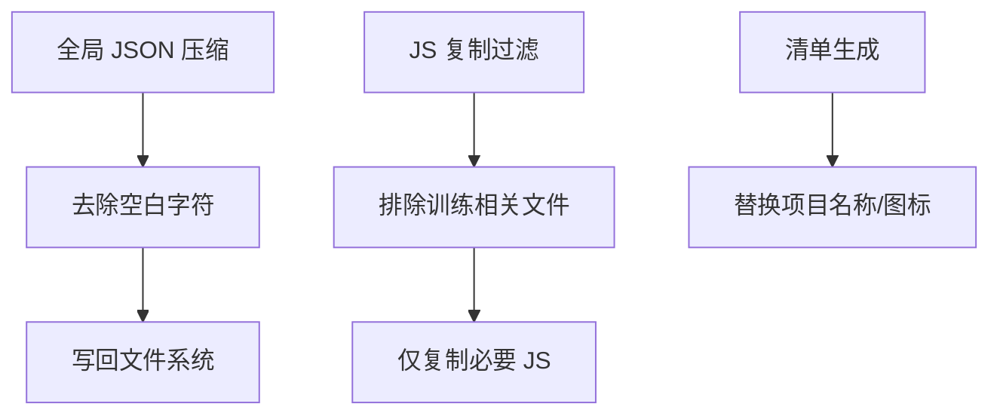
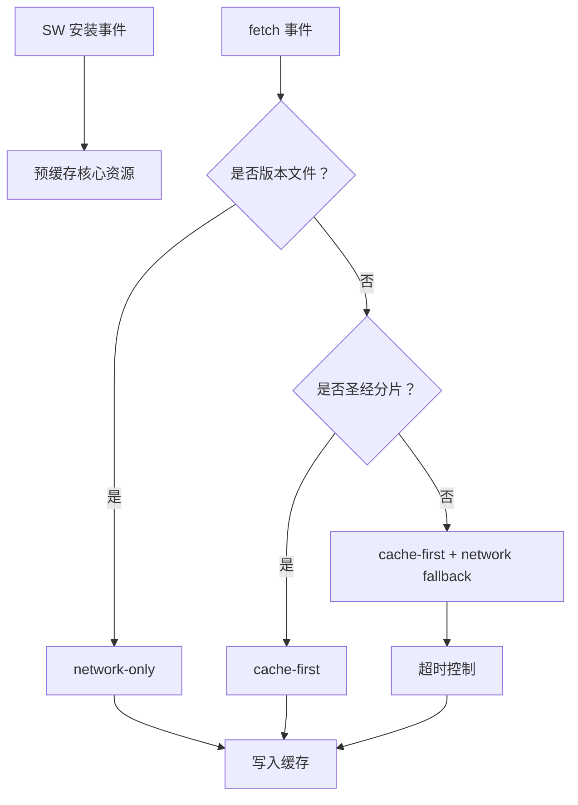
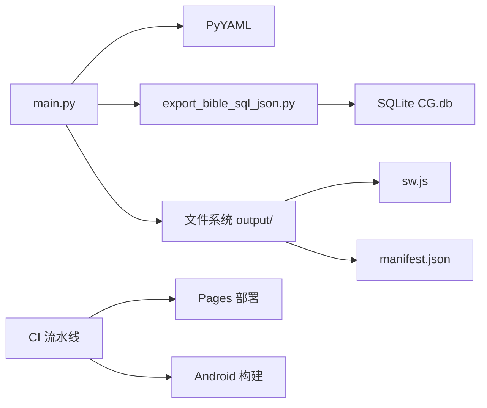

# 构建优化

<cite>
**本文档引用的文件**
- [build.sh](file://build.sh)
- [package.json](file://package.json)
- [capacitor.config.json](file://capacitor.config.json)
- [app_config.json](file://app_config.json)
- [config.yaml](file://config.yaml)
- [main.py](file://main.py)
- [export_bible_sql_json.py](file://export_bible_sql_json.py)
- [.github/workflows/deploy-pages.yml](file://.github/workflows/deploy-pages.yml)
- [.github/workflows/android-release.yml](file://.github/workflows/android-release.yml)
- [src/templates/main_manifest.json](file://src/templates/main_manifest.json)
- [src/templates/main_sw.js](file://src/templates/main_sw.js)
- [src/static/index.html](file://src/static/index.html)
</cite>

## 目录
1. [简介](#简介)
2. [项目结构](#项目结构)
3. [核心组件](#核心组件)
4. [架构总览](#架构总览)
5. [详细组件分析](#详细组件分析)
6. [依赖分析](#依赖分析)
7. [性能考虑](#性能考虑)
8. [故障排查指南](#故障排查指南)
9. [结论](#结论)
10. [附录](#附录)

## 简介
本文件面向“圣经阅读器”的构建系统，系统性阐述构建脚本的工作原理与优化策略，覆盖以下方面：
- 构建脚本与流程：阶段划分、执行顺序、关键步骤
- 代码压缩与资源优化：JSON 压缩、静态资源复制策略
- 缓存配置：Service Worker 缓存策略、预缓存清单、离线体验
- 构建时间优化：并行化、增量构建思路、依赖安装优化
- 多环境配置：开发、测试、生产环境差异与最佳实践
- 性能监控与分析：构建耗时统计、缓存命中率、离线可用性
- 构建产物验证与质量检查：产物完整性、缓存一致性、版本对齐

## 项目结构
该项目采用“Python 构建 + Capacitor 打包 + GitHub Actions 自动化”的混合方案：
- 构建主逻辑由 Python 脚本负责，生成静态 PWA 资产与 APK 包
- 配置文件集中于 YAML/JSON，便于跨平台与 CI 环境读取
- GitHub Actions 负责云端部署与 APK 构建流水线
- Service Worker 提供离线缓存与版本控制



图表来源
- [build.sh:1-16](file://build.sh#L1-L16)
- [package.json:5-11](file://package.json#L5-L11)
- [main.py:36-76](file://main.py#L36-L76)
- [export_bible_sql_json.py:743-800](file://export_bible_sql_json.py#L743-L800)
- [capacitor.config.json:1-10](file://capacitor.config.json#L1-L10)
- [.github/workflows/deploy-pages.yml:1-32](file://.github/workflows/deploy-pages.yml#L1-L32)
- [.github/workflows/android-release.yml:1-54](file://.github/workflows/android-release.yml#L1-L54)

章节来源
- [build.sh:1-16](file://build.sh#L1-L16)
- [package.json:1-24](file://package.json#L1-L24)
- [capacitor.config.json:1-10](file://capacitor.config.json#L1-L10)
- [config.yaml:1-12](file://config.yaml#L1-L12)

## 核心组件
- 构建入口与脚本
  - Shell 脚本：用于 Cloudflare Pages 环境的自动化构建
  - NPM 脚本：统一构建命令、Capacitor 同步与 APK 构建
- Python 构建主程序
  - 三阶段构建：数据准备、静态站点生成、版本与配置
  - JSON 压缩：去除多余空白字符，降低体积
  - 资源复制：按需复制，排除训练相关脚本
- 导出脚本
  - 从 SQLite 数据库导出多类 JSON 数据，包含全局 JSON、书卷映射、分片 JSON、读经计划等
  - 串珠归一化、注解标记插入、分片组织
- 配置文件
  - YAML：输出目录、静态资源目录、数据库路径、读经计划与远程服务器
  - JSON：应用配置、Manifest、Service Worker 模板
- CI/CD
  - Pages 部署：Python 依赖安装、构建、部署到 Cloudflare Pages
  - Android Release：Python/Capacitor/Java/Node 环境准备、构建 APK 并上传发布

章节来源
- [build.sh:1-16](file://build.sh#L1-L16)
- [package.json:5-11](file://package.json#L5-L11)
- [main.py:36-76](file://main.py#L36-L76)
- [export_bible_sql_json.py:743-800](file://export_bible_sql_json.py#L743-L800)
- [config.yaml:1-12](file://config.yaml#L1-L12)
- [src/templates/main_manifest.json:1-26](file://src/templates/main_manifest.json#L1-L26)
- [src/templates/main_sw.js:1-270](file://src/templates/main_sw.js#L1-L270)
- [.github/workflows/deploy-pages.yml:1-32](file://.github/workflows/deploy-pages.yml#L1-L32)
- [.github/workflows/android-release.yml:1-54](file://.github/workflows/android-release.yml#L1-L54)

## 架构总览
构建系统围绕“数据导出 + 静态站点生成 + 缓存策略 + 多环境部署”展开，核心流程如下：

```mermaid
sequenceDiagram
participant Dev as "开发者/CI"
participant Sh as "Shell/NPM 脚本"
participant Py as "main.py"
participant Exp as "export_bible_sql_json.py"
participant FS as "文件系统"
participant CF as "Cloudflare Pages"
participant CAP as "Capacitor"
participant AND as "Android Gradle"
Dev->>Sh : 触发构建
Sh->>Py : 执行构建命令
Py->>Exp : 导出圣经数据
Exp-->>FS : 写入 data/*.json
Py->>FS : 复制/生成静态资源与清单
Py-->>Sh : 输出 output/
Sh->>CF : 部署 output/ 至 Pages
Dev->>CAP : Capacitor 同步
CAP->>AND : 构建 APK
AND-->>Dev : 产出 APK
```

图表来源
- [build.sh:7-15](file://build.sh#L7-L15)
- [package.json:5-11](file://package.json#L5-L11)
- [main.py:87-116](file://main.py#L87-L116)
- [export_bible_sql_json.py:743-800](file://export_bible_sql_json.py#L743-L800)
- [.github/workflows/deploy-pages.yml:20-31](file://.github/workflows/deploy-pages.yml#L20-L31)
- [.github/workflows/android-release.yml:37-47](file://.github/workflows/android-release.yml#L37-L47)

## 详细组件分析

### 构建脚本与流程
- 阶段划分
  - 阶段 1：圣经数据准备
    - 调用导出脚本，将 SQLite 数据转换为多份 JSON
    - 对全局 JSON 进行压缩（去除空白）
  - 阶段 2：静态站点生成
    - 复制 index.html、CSS、JS（排除训练相关）、icons、vendor、静态 data
    - 生成 manifest.json、sw.js、_redirects、.nojekyll
  - 阶段 3：版本与配置
    - 生成 version.json（含版本号与构建时间）
    - 生成 remote-config.js（URL base64 编码）
    - 复制 app_config.json



图表来源
- [main.py:36-76](file://main.py#L36-L76)
- [main.py:87-116](file://main.py#L87-L116)
- [main.py:121-161](file://main.py#L121-L161)
- [main.py:288-321](file://main.py#L288-L321)
- [export_bible_sql_json.py:743-800](file://export_bible_sql_json.py#L743-L800)

章节来源
- [main.py:36-76](file://main.py#L36-L76)
- [main.py:87-116](file://main.py#L87-L116)
- [main.py:121-161](file://main.py#L121-L161)
- [main.py:288-321](file://main.py#L288-L321)

### 代码压缩与资源优化
- JSON 压缩
  - 在阶段 1 结束后，遍历全局 JSON 文件，以紧凑格式写回，去除多余空白，显著降低体积
- 资源复制策略
  - 排除训练相关 JS 文件，避免不必要的资源进入构建产物
  - 仅复制必要的 icons、vendor 第三方库与静态 data 文件
- 清单与模板
  - 从模板生成 manifest.json，替换名称与图标
  - 复制 sw.js 模板作为 Service Worker



图表来源
- [main.py:107-116](file://main.py#L107-L116)
- [main.py:186-204](file://main.py#L186-L204)
- [main.py:248-276](file://main.py#L248-L276)

章节来源
- [main.py:107-116](file://main.py#L107-L116)
- [main.py:186-204](file://main.py#L186-L204)
- [main.py:248-276](file://main.py#L248-L276)

### 缓存配置与离线策略
- Service Worker 缓存策略
  - 预缓存：安装阶段缓存首页、manifest、version、书卷映射
  - 版本文件：network-only，确保版本检测实时
  - 圣经分片数据：cache-first，优先使用缓存，离线可用
  - 其他资源：cache-first + network fallback，超时控制
- 缓存管理
  - 支持清理全部缓存、仅清理训练缓存、批量缓存所有 66 卷分片
  - 提供缓存状态查询与离线提示
- Manifest 与 PWA 行为
  - standalone 显示模式、主题色、图标集合
  - 首页视图与 SPA 视图切换、安装提示与更新机制



图表来源
- [src/templates/main_sw.js:25-40](file://src/templates/main_sw.js#L25-L40)
- [src/templates/main_sw.js:88-166](file://src/templates/main_sw.js#L88-L166)
- [src/templates/main_sw.js:215-238](file://src/templates/main_sw.js#L215-L238)
- [src/templates/main_manifest.json:1-26](file://src/templates/main_manifest.json#L1-L26)
- [src/static/index.html:200-270](file://src/static/index.html#L200-L270)

章节来源
- [src/templates/main_sw.js:1-270](file://src/templates/main_sw.js#L1-L270)
- [src/templates/main_manifest.json:1-26](file://src/templates/main_manifest.json#L1-L26)
- [src/static/index.html:200-270](file://src/static/index.html#L200-L270)

### 构建时间优化
- 并行化建议
  - 导出阶段可并行处理多个 JSON 文件（当前逐个导出，可考虑并发写入）
  - 资源复制阶段可并行处理不同目录（CSS/JS/Icons/Vendor）
- 增量构建思路
  - 基于文件修改时间判断是否需要重新导出或复制
  - 对于大型 JSON，可按书卷分片进行增量更新
- 依赖安装优化
  - 使用缓存的 Python/Node/Java 环境，减少重复安装时间
  - 在 CI 中启用依赖缓存（例如 GitHub Actions 的缓存 action）

章节来源
- [export_bible_sql_json.py:743-800](file://export_bible_sql_json.py#L743-L800)
- [main.py:121-161](file://main.py#L121-L161)
- [.github/workflows/deploy-pages.yml:15-21](file://.github/workflows/deploy-pages.yml#L15-L21)
- [.github/workflows/android-release.yml:20-35](file://.github/workflows/android-release.yml#L20-L35)

### 不同构建环境的配置差异
- 开发环境
  - 使用本地 Python/Capacitor 环境，NPM 脚本提供快速同步与打开
  - 可开启开发者模式，便于调试
- 测试环境
  - CI 中安装依赖并执行构建，验证产物完整性
  - 可在 CI 中增加缓存命中率与版本校验步骤
- 生产环境
  - Pages 部署：构建完成后直接部署
  - Android Release：在 CI 中构建 APK 并上传发布

章节来源
- [package.json:5-11](file://package.json#L5-L11)
- [.github/workflows/deploy-pages.yml:1-32](file://.github/workflows/deploy-pages.yml#L1-L32)
- [.github/workflows/android-release.yml:1-54](file://.github/workflows/android-release.yml#L1-L54)

### 构建性能监控与分析
- 构建耗时统计
  - 构建主程序记录开始/结束时间，输出总耗时
- 缓存命中与离线可用性
  - 通过 SW 提供的缓存状态查询接口，统计已缓存书卷数量与覆盖率
  - 提供离线横幅与重试机制
- 版本对齐与更新
  - 通过 version.json 与 remote-config.js 实现版本检测与更新提示

章节来源
- [main.py:46-75](file://main.py#L46-L75)
- [src/templates/main_sw.js:240-269](file://src/templates/main_sw.js#L240-L269)
- [src/static/index.html:522-543](file://src/static/index.html#L522-L543)

### 构建产物验证与质量检查
- 产物完整性
  - 校验 output/ 是否包含必需文件（index.html、manifest.json、sw.js、data/*.json）
  - 校验版本文件与配置文件是否存在且内容有效
- 缓存一致性
  - 使用核心 URL 列表与 SW 的缓存状态查询，确保核心资源已缓存
- 版本一致性
  - 比对 app_config.json 与 version.json 的版本号，确保一致

章节来源
- [main.py:121-161](file://main.py#L121-L161)
- [main.py:288-321](file://main.py#L288-L321)
- [src/static/index.html:200-219](file://src/static/index.html#L200-L219)

## 依赖分析
- Python 构建脚本依赖
  - PyYAML：解析 config.yaml
  - SQLite 数据库：CG.db
  - 导出脚本：SQLite 连接、正则表达式、JSON 写入
- 前端与缓存
  - Service Worker：缓存策略、消息通信、离线提示
  - Manifest：PWA 行为与图标配置
- CI/CD
  - Pages：Python 环境、依赖安装、部署命令
  - Android：Python、Node、Java、Capacitor、Gradle



图表来源
- [main.py:21](file://main.py#L21)
- [export_bible_sql_json.py:22](file://export_bible_sql_json.py#L22)
- [.github/workflows/deploy-pages.yml:15-31](file://.github/workflows/deploy-pages.yml#L15-L31)
- [.github/workflows/android-release.yml:20-47](file://.github/workflows/android-release.yml#L20-L47)

章节来源
- [main.py:21](file://main.py#L21)
- [export_bible_sql_json.py:22](file://export_bible_sql_json.py#L22)
- [.github/workflows/deploy-pages.yml:15-31](file://.github/workflows/deploy-pages.yml#L15-L31)
- [.github/workflows/android-release.yml:20-47](file://.github/workflows/android-release.yml#L20-L47)

## 性能考虑
- 数据导出性能
  - 当前逐个导出 JSON，可考虑并发写入或分块处理
  - 串珠归一化与注解标记插入为 O(n) 操作，注意内存占用
- 资源复制与压缩
  - 复制阶段可并行处理不同目录
  - JSON 压缩为 I/O 密集型，建议在磁盘空间充足时进行
- 缓存策略
  - 圣经分片采用 cache-first，离线可用性高
  - 版本文件 network-only，确保更新及时
- CI 性能
  - 使用缓存的依赖镜像与工具链，减少安装时间
  - 并行执行多个任务（如 Pages 部署与 APK 构建）

## 故障排查指南
- 构建失败
  - 检查 requirements.txt 是否满足（PyYAML）
  - 确认 config.yaml 中路径与文件存在
  - 查看构建日志中的错误信息与退出码
- 数据导出异常
  - 确认 CG.db 存在且可读
  - 检查导出脚本的数据库连接与 SQL 查询
- 缓存问题
  - 使用 SW 提供的消息接口查询缓存状态
  - 清理缓存后重新安装，确保核心资源已缓存
- 版本不一致
  - 比对 app_config.json 与 version.json 的版本号
  - 检查 remote-config.js 的 URL 是否正确

章节来源
- [build.sh:7-15](file://build.sh#L7-L15)
- [config.yaml:1-12](file://config.yaml#L1-L12)
- [export_bible_sql_json.py:749-751](file://export_bible_sql_json.py#L749-L751)
- [src/templates/main_sw.js:187-213](file://src/templates/main_sw.js#L187-L213)

## 结论
本构建系统以 Python 为核心，结合导出脚本、静态资源复制与 Service Worker 缓存策略，实现了高效、可维护的 PWA 与 APK 构建流程。通过 JSON 压缩、按需复制与合理的缓存策略，显著降低了产物体积与加载时间。配合 CI/CD 流水线，可在不同环境中稳定交付高质量产物。未来可在数据导出与资源复制阶段引入并行化与增量构建，进一步提升构建效率。

## 附录
- 关键配置项
  - config.yaml：输出目录、静态目录、数据库路径、读经计划、远程服务器
  - app_config.json：应用名称、ID、版本
  - capacitor.config.json：Capacitor 应用 ID、名称、Web 目录、Android 配置
- 常用命令
  - 构建：npm run build 或 python main.py
  - Capacitor 同步：npm run cap:sync
  - 打开 Android：npm run cap:open
  - 构建 APK：npm run android:build
  - 开发模式：npm run android:dev

章节来源
- [config.yaml:1-12](file://config.yaml#L1-L12)
- [app_config.json:1-6](file://app_config.json#L1-L6)
- [capacitor.config.json:1-10](file://capacitor.config.json#L1-L10)
- [package.json:5-11](file://package.json#L5-L11)