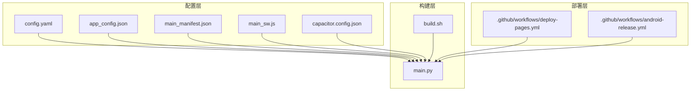
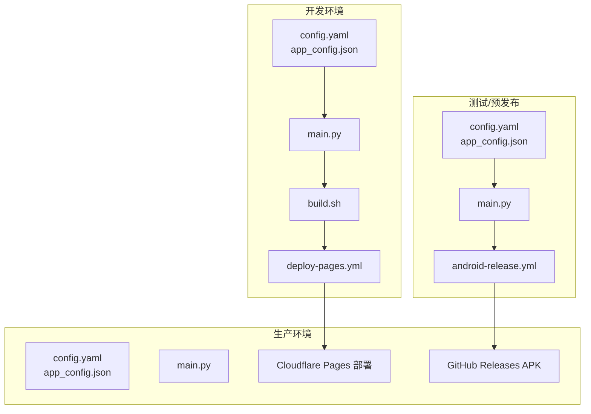
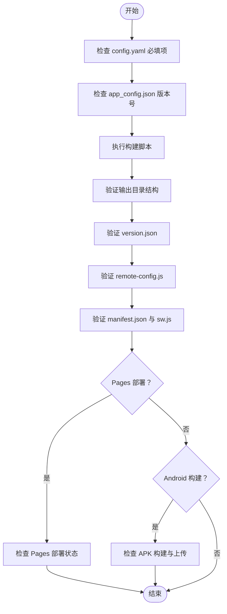
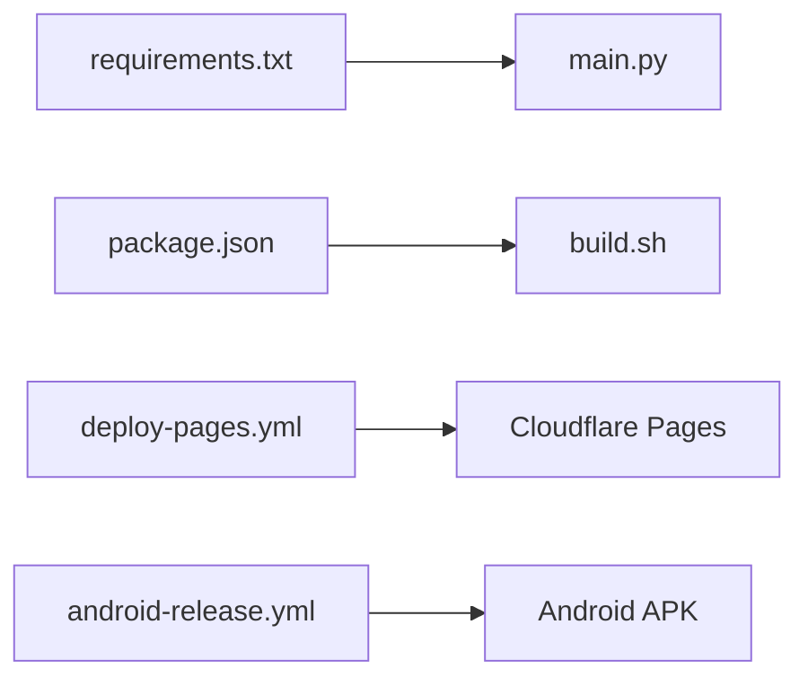

# 环境管理

<cite>
**本文引用的文件**
- [app_config.json](file://app_config.json)
- [config.yaml](file://config.yaml)
- [capacitor.config.json](file://capacitor.config.json)
- [package.json](file://package.json)
- [main.py](file://main.py)
- [build.sh](file://build.sh)
- [changelog.json](file://changelog.json)
- [.github/workflows/deploy-pages.yml](file://.github/workflows/deploy-pages.yml)
- [.github/workflows/android-release.yml](file://.github/workflows/android-release.yml)
- [src/templates/main_manifest.json](file://src/templates/main_manifest.json)
- [src/templates/main_sw.js](file://src/templates/main_sw.js)
</cite>

## 目录
1. [简介](#简介)
2. [项目结构](#项目结构)
3. [核心组件](#核心组件)
4. [架构总览](#架构总览)
5. [详细组件分析](#详细组件分析)
6. [依赖分析](#依赖分析)
7. [性能考虑](#性能考虑)
8. [故障排查指南](#故障排查指南)
9. [结论](#结论)
10. [附录](#附录)

## 简介
本文件面向“圣经阅读器”项目的多环境管理，系统性阐述开发、测试、预发布、生产等环境的配置方法与差异，说明环境变量的配置与管理策略，解释配置文件的组织与继承关系，给出环境切换方法与注意事项，并提供环境一致性检查与验证流程，最后总结环境迁移与升级的最佳实践。

## 项目结构
该项目采用“配置驱动 + 构建脚本 + CI/CD”的多环境管理方式：
- 配置层：通过 YAML 配置文件集中管理构建参数与资源路径，通过 JSON 配置文件承载应用元数据与版本信息。
- 构建层：Python 主脚本负责三阶段构建（数据准备、静态站点生成、版本与配置），Shell 脚本用于云平台一键构建。
- 部署层：GitHub Actions 工作流分别负责 Cloudflare Pages 静态托管与 Android APK 构建与发布。
- 容器与框架层：Capacitor 配置用于将 Web 输出物打包为原生应用，模板文件用于生成 PWA 清单与 Service Worker。

图表来源
- [config.yaml:1-12](file://config.yaml#L1-L12)
- [app_config.json:1-6](file://app_config.json#L1-L6)
- [main.py:78-83](file://main.py#L78-L83)
- [build.sh:1-16](file://build.sh#L1-L16)
- [.github/workflows/deploy-pages.yml:1-32](file://.github/workflows/deploy-pages.yml#L1-L32)
- [.github/workflows/android-release.yml:1-54](file://.github/workflows/android-release.yml#L1-L54)

章节来源
- [config.yaml:1-12](file://config.yaml#L1-L12)
- [app_config.json:1-6](file://app_config.json#L1-L6)
- [capacitor.config.json:1-10](file://capacitor.config.json#L1-L10)
- [package.json:1-24](file://package.json#L1-L24)
- [main.py:78-83](file://main.py#L78-L83)
- [build.sh:1-16](file://build.sh#L1-L16)
- [.github/workflows/deploy-pages.yml:1-32](file://.github/workflows/deploy-pages.yml#L1-L32)
- [.github/workflows/android-release.yml:1-54](file://.github/workflows/android-release.yml#L1-L54)

## 核心组件
- 配置中心
  - config.yaml：集中定义输出目录、静态资源目录、数据库路径、阅读计划资源列表、远程服务器地址等。
  - app_config.json：承载应用名称、ID、版本号等元数据。
  - capacitor.config.json：定义 Capacitor 打包参数（应用 ID、名称、Web 输出目录、Android 权限等）。
  - src/templates/*：PWA 清单与 Service Worker 模板，用于生成最终清单与离线缓存策略。
- 构建引擎
  - main.py：三阶段构建（数据导出、静态站点生成、版本与配置），并生成 remote-config.js 与 version.json。
  - build.sh：Cloudflare Pages 一键构建脚本，安装依赖并执行构建。
- 部署流水线
  - deploy-pages.yml：触发 Python 构建并在 Cloudflare Pages 部署。
  - android-release.yml：触发 Android APK 构建、Capacitor 同步与 Gradle 打包，并上传发布。

章节来源
- [config.yaml:1-12](file://config.yaml#L1-L12)
- [app_config.json:1-6](file://app_config.json#L1-L6)
- [capacitor.config.json:1-10](file://capacitor.config.json#L1-L10)
- [src/templates/main_manifest.json:1-26](file://src/templates/main_manifest.json#L1-L26)
- [src/templates/main_sw.js:1-270](file://src/templates/main_sw.js#L1-L270)
- [main.py:36-76](file://main.py#L36-L76)
- [build.sh:1-16](file://build.sh#L1-L16)
- [.github/workflows/deploy-pages.yml:1-32](file://.github/workflows/deploy-pages.yml#L1-L32)
- [.github/workflows/android-release.yml:1-54](file://.github/workflows/android-release.yml#L1-L54)

## 架构总览
多环境管理围绕“配置文件 + 构建脚本 + CI/CD”展开，形成“配置驱动构建、流水线驱动部署”的闭环。

图表来源
- [config.yaml:1-12](file://config.yaml#L1-L12)
- [app_config.json:1-6](file://app_config.json#L1-L6)
- [main.py:36-76](file://main.py#L36-L76)
- [build.sh:1-16](file://build.sh#L1-L16)
- [.github/workflows/deploy-pages.yml:1-32](file://.github/workflows/deploy-pages.yml#L1-L32)
- [.github/workflows/android-release.yml:1-54](file://.github/workflows/android-release.yml#L1-L54)

## 详细组件分析

### 配置文件组织与继承关系
- 层次化组织
  - config.yaml：顶层构建配置，决定输出目录、静态资源目录、数据库与资源路径、远程服务器地址等。
  - app_config.json：应用元数据与版本号，被构建脚本读取生成 version.json。
  - capacitor.config.json：跨平台打包配置，影响 Web 输出目录与 Android 权限。
  - src/templates/*：PWA 清单与 Service Worker 模板，构建时生成最终清单与缓存策略。
- 继承与覆盖
  - 构建脚本按配置文件键值进行路径解析与资源复制，未显式声明的键值采用默认行为（例如输出目录、静态目录、数据库路径等）。
  - 运行时远程服务器配置通过 config.yaml 的 remote_servers 字段注入，构建时生成 remote-config.js，运行时以 base64 存储、atob 解码的方式注入。

章节来源
- [config.yaml:1-12](file://config.yaml#L1-L12)
- [app_config.json:1-6](file://app_config.json#L1-L6)
- [capacitor.config.json:1-10](file://capacitor.config.json#L1-L10)
- [src/templates/main_manifest.json:1-26](file://src/templates/main_manifest.json#L1-L26)
- [src/templates/main_sw.js:1-270](file://src/templates/main_sw.js#L1-L270)
- [main.py:288-321](file://main.py#L288-L321)
- [main.py:323-356](file://main.py#L323-L356)

### 环境变量配置与管理策略
- 当前仓库未发现通用的 .env 或 Docker 环境变量注入脚本。
- 运行时远程服务器地址通过 config.yaml 的 remote_servers 注入，构建时生成 remote-config.js，避免在源码中硬编码。
- 建议策略（基于现有实现扩展）：
  - 为不同环境维护独立的 config.yaml 分支或分支合并策略，确保关键路径与服务器地址隔离。
  - 在 CI/CD 中通过密钥管理（如 GitHub Secrets）注入敏感信息，避免明文存储。
  - 对于 Capacitor 打包参数（如 Android 权限），通过本地 Capacitor 配置文件区分不同构建场景。

章节来源
- [config.yaml:10-12](file://config.yaml#L10-L12)
- [main.py:323-356](file://main.py#L323-L356)
- [.github/workflows/deploy-pages.yml:28-31](file://.github/workflows/deploy-pages.yml#L28-L31)

### 环境切换方法与注意事项
- 环境切换步骤
  - 切换 config.yaml：根据目标环境调整输出目录、静态目录、数据库路径、资源列表与远程服务器地址。
  - 切换 app_config.json：更新版本号与应用元数据，确保 version.json 与 app_config.json 一致。
  - 切换 Capacitor 配置：针对 Android 权限与调试开关进行差异化配置。
  - 执行构建：本地运行 Python 构建脚本或通过 CI/CD 触发流水线。
- 注意事项
  - 数据库路径与资源路径变更需同步校验，避免构建失败。
  - remote-config.js 由构建脚本生成，确保 remote_servers 键值齐全。
  - Android 打包前务必执行 Capacitor 同步，避免资源缺失。

章节来源
- [config.yaml:1-12](file://config.yaml#L1-L12)
- [app_config.json:1-6](file://app_config.json#L1-L6)
- [capacitor.config.json:5-8](file://capacitor.config.json#L5-L8)
- [main.py:36-76](file://main.py#L36-L76)

### 环境一致性检查与验证流程
- 构建前检查
  - 校验 config.yaml 必填项（输出目录、静态目录、数据库路径、资源列表、远程服务器地址）。
  - 校验 app_config.json 版本号与时间戳生成逻辑。
- 构建后验证
  - 校验输出目录结构（index.html、manifest.json、sw.js、data、css、js、icons、vendor 等）。
  - 校验 version.json 生成内容（版本号、构建时间、APK 版本）。
  - 校验 remote-config.js 注入的远程服务器地址是否正确。
  - 校验 PWA 清单与 Service Worker 是否生成并符合预期。
- CI/CD 验证
  - Pages 部署：确认 Cloudflare Pages 成功拉取构建产物并部署。
  - Android 发布：确认 APK 构建成功并上传至 GitHub Releases。

图表来源
- [config.yaml:1-12](file://config.yaml#L1-L12)
- [app_config.json:292-320](file://app_config.json#L292-L320)
- [main.py:36-76](file://main.py#L36-L76)
- [main.py:288-321](file://main.py#L288-L321)
- [main.py:323-356](file://main.py#L323-L356)
- [.github/workflows/deploy-pages.yml:26-31](file://.github/workflows/deploy-pages.yml#L26-L31)
- [.github/workflows/android-release.yml:49-54](file://.github/workflows/android-release.yml#L49-L54)

章节来源
- [config.yaml:1-12](file://config.yaml#L1-L12)
- [app_config.json:292-320](file://app_config.json#L292-L320)
- [main.py:36-76](file://main.py#L36-L76)
- [main.py:288-321](file://main.py#L288-L321)
- [main.py:323-356](file://main.py#L323-L356)
- [.github/workflows/deploy-pages.yml:26-31](file://.github/workflows/deploy-pages.yml#L26-L31)
- [.github/workflows/android-release.yml:49-54](file://.github/workflows/android-release.yml#L49-L54)

### 环境迁移与升级最佳实践
- 迁移策略
  - 以 config.yaml 为中心，将环境差异抽象为配置项，避免在代码中硬编码。
  - 通过 CI/CD 的分支与标签策略区分不同环境（如 main 分支用于 Pages，tag 用于 APK）。
  - 对远程服务器地址进行分层管理，避免在多个文件中重复维护。
- 升级流程
  - 版本号统一由 app_config.json 管理，构建时生成 version.json，确保前后端一致。
  - 更新 changelog.json 记录版本变更，便于回溯与审计。
  - Android 升级时同步更新 Capacitor 配置与 Gradle 构建脚本。

章节来源
- [config.yaml:1-12](file://config.yaml#L1-L12)
- [app_config.json:1-6](file://app_config.json#L1-L6)
- [changelog.json:1-10](file://changelog.json#L1-L10)
- [capacitor.config.json:1-10](file://capacitor.config.json#L1-L10)
- [package.json:9-10](file://package.json#L9-L10)

## 依赖分析
- 构建脚本依赖
  - main.py 依赖 PyYAML 读取 config.yaml，依赖 JSON 生成 version.json 与 remote-config.js。
  - build.sh 依赖 requirements.txt 安装 Python 依赖并执行构建。
- CI/CD 依赖
  - deploy-pages.yml 依赖 Cloudflare Pages 部署动作与 GitHub Secrets。
  - android-release.yml 依赖 Node.js、Java、Gradle 与 GitHub Releases 上传。

图表来源
- [requirements.txt:1-2](file://requirements.txt#L1-L2)
- [package.json:5-11](file://package.json#L5-L11)
- [build.sh:8-13](file://build.sh#L8-L13)
- [.github/workflows/deploy-pages.yml:26-31](file://.github/workflows/deploy-pages.yml#L26-L31)
- [.github/workflows/android-release.yml:43-47](file://.github/workflows/android-release.yml#L43-L47)

章节来源
- [requirements.txt:1-2](file://requirements.txt#L1-L2)
- [package.json:5-11](file://package.json#L5-L11)
- [build.sh:8-13](file://build.sh#L8-L13)
- [.github/workflows/deploy-pages.yml:26-31](file://.github/workflows/deploy-pages.yml#L26-L31)
- [.github/workflows/android-release.yml:43-47](file://.github/workflows/android-release.yml#L43-L47)

## 性能考虑
- 构建性能
  - 压缩全局 JSON（去除多余空白）以减小包体体积。
  - 预缓存关键资源（首页、清单、版本文件、书卷清单）提升首开速度。
- 缓存策略
  - Service Worker 对圣经分片数据采用 cache-first，版本文件采用 network-first，其他资源采用 cache-first + network fallback。
  - 支持离线提示与缓存清理消息通道，便于调试与维护。

章节来源
- [main.py:107-116](file://main.py#L107-L116)
- [src/templates/main_sw.js:88-166](file://src/templates/main_sw.js#L88-L166)

## 故障排查指南
- 构建失败
  - 检查 config.yaml 中数据库路径是否存在，确保 export_bible_sql_json.py 可正常导出数据。
  - 检查输出目录权限与磁盘空间。
- Pages 部署失败
  - 检查 Cloudflare Pages 部署动作中的 API Token 与 Account ID 是否正确。
  - 确认构建产物已生成且未被忽略。
- Android 构建失败
  - 检查 Capacitor 同步是否成功，确保 Android 项目已生成。
  - 检查 Gradle 构建脚本与签名配置。

章节来源
- [main.py:93-96](file://main.py#L93-L96)
- [.github/workflows/deploy-pages.yml:28-31](file://.github/workflows/deploy-pages.yml#L28-L31)
- [.github/workflows/android-release.yml:40-47](file://.github/workflows/android-release.yml#L40-L47)

## 结论
本项目通过“配置驱动 + 构建脚本 + CI/CD”的方式实现了清晰的多环境管理。建议在现有基础上进一步完善环境变量注入、密钥管理与配置分支策略，以增强安全性与可维护性。同时，持续优化构建与缓存策略，提升用户体验与部署效率。

## 附录
- 关键配置键说明
  - output_dir：构建输出目录（默认 output）。
  - resource_base_dir：资源基础目录（默认 resource）。
  - static_dir：静态资源目录（默认 src/static）。
  - bible_db：圣经数据库路径（默认 resource/CG.db）。
  - reading_plans：阅读计划资源列表。
  - remote_servers.github_api：GitHub 最新发行版 API 地址。
- 构建产物
  - version.json：包含版本号、构建时间、APK 版本。
  - remote-config.js：运行时注入远程服务器地址（base64 存储）。
  - manifest.json 与 sw.js：PWA 清单与 Service Worker。

章节来源
- [config.yaml:1-12](file://config.yaml#L1-L12)
- [main.py:288-321](file://main.py#L288-L321)
- [main.py:323-356](file://main.py#L323-L356)
- [src/templates/main_manifest.json:1-26](file://src/templates/main_manifest.json#L1-L26)
- [src/templates/main_sw.js:1-270](file://src/templates/main_sw.js#L1-L270)