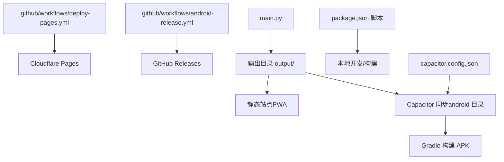
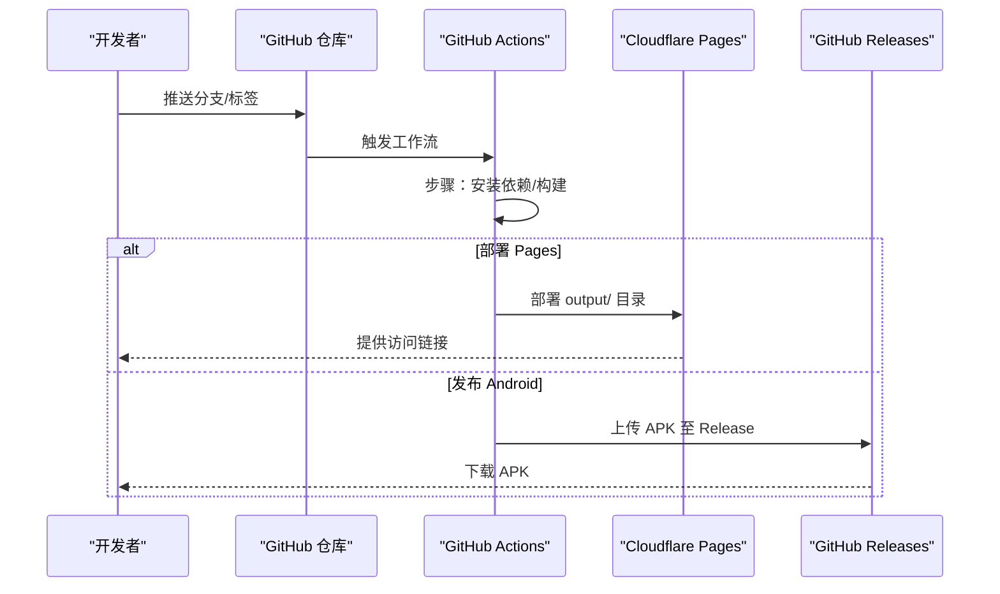
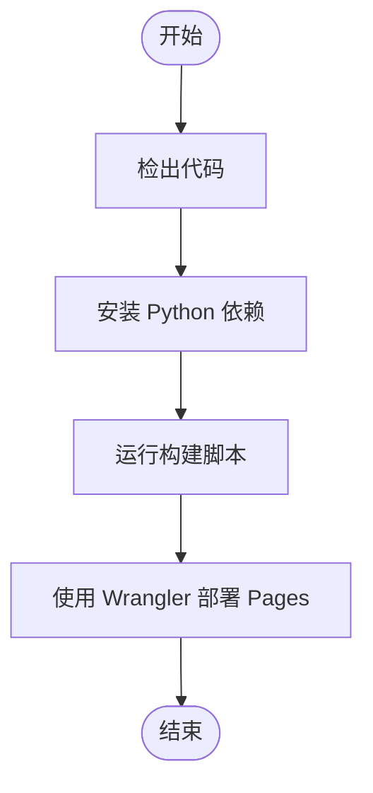
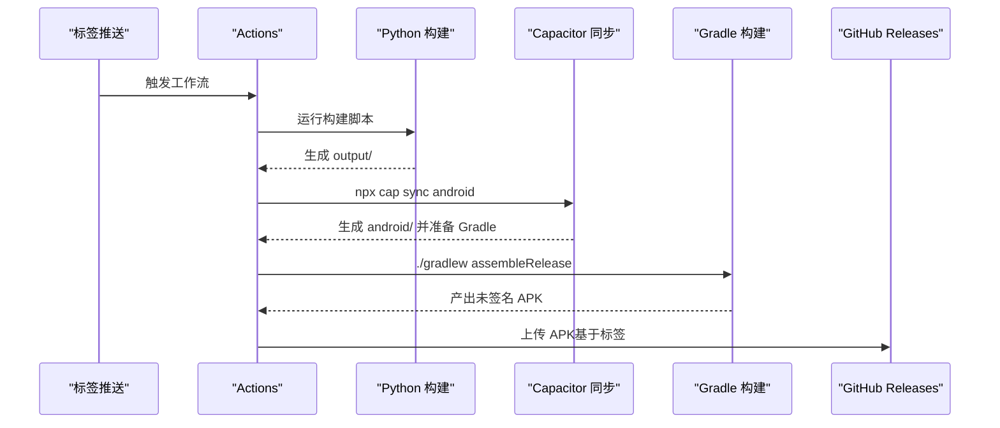
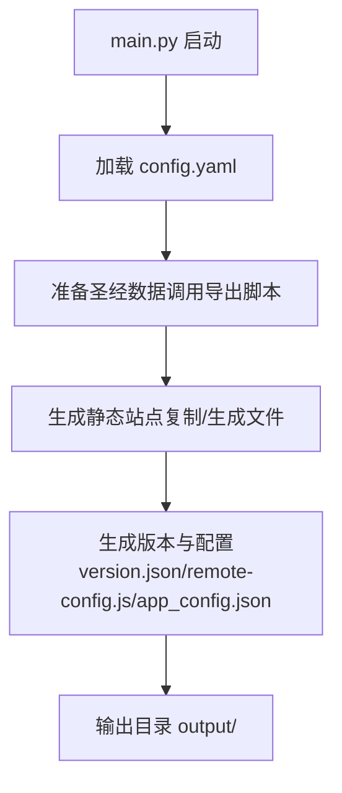
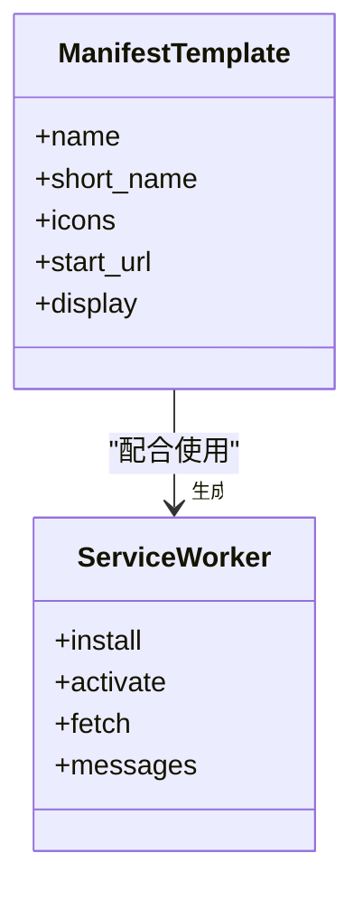
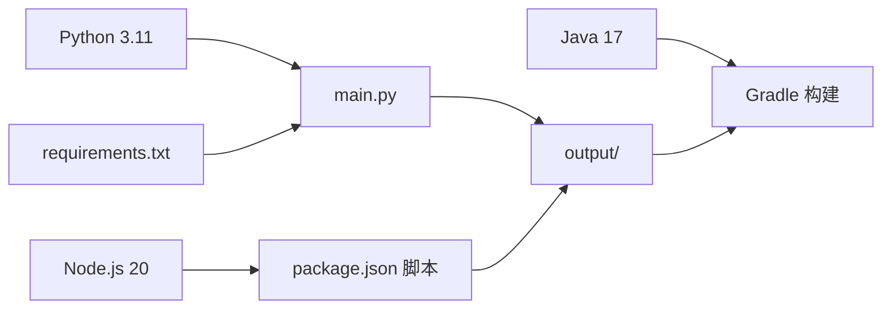

# 部署与发布

<cite>
**本文档引用的文件**
- [.github/workflows/android-release.yml](file://.github/workflows/android-release.yml)
- [.github/workflows/deploy-pages.yml](file://.github/workflows/deploy-pages.yml)
- [build.sh](file://build.sh)
- [package.json](file://package.json)
- [capacitor.config.json](file://capacitor.config.json)
- [main.py](file://main.py)
- [export_bible_sql_json.py](file://export_bible_sql_json.py)
- [config.yaml](file://config.yaml)
- [app_config.json](file://app_config.json)
- [requirements.txt](file://requirements.txt)
- [src/templates/main_manifest.json](file://src/templates/main_manifest.json)
- [src/templates/main_sw.js](file://src/templates/main_sw.js)
</cite>

## 目录
1. [简介](#简介)
2. [项目结构](#项目结构)
3. [核心组件](#核心组件)
4. [架构总览](#架构总览)
5. [详细组件分析](#详细组件分析)
6. [依赖关系分析](#依赖关系分析)
7. [性能考虑](#性能考虑)
8. [故障排查指南](#故障排查指南)
9. [结论](#结论)
10. [附录](#附录)

## 简介
本文件面向圣经阅读器的部署与发布流程，系统性说明以下内容：
- CI/CD 配置与 GitHub Actions 工作流的触发条件、步骤与执行流程
- 静态网站部署（Cloudflare Pages）的配置与自动化流程
- Android 应用发布流程（签名、版本管理、产物交付）
- 构建优化策略（代码压缩、资源优化、缓存配置）
- 多环境配置（测试、预发布、生产）
- 监控与日志收集建议
- 回滚策略与紧急修复流程

## 项目结构
该项目采用“Python 构建 + Capacitor/PWA 输出 + GitHub Actions 自动化”的整体架构。核心产出为静态站点（PWA）与 Android APK。



图表来源
- [.github/workflows/deploy-pages.yml:1-32](file://.github/workflows/deploy-pages.yml#L1-L32)
- [.github/workflows/android-release.yml:1-54](file://.github/workflows/android-release.yml#L1-L54)
- [main.py:36-76](file://main.py#L36-L76)
- [package.json:5-11](file://package.json#L5-L11)
- [capacitor.config.json:1-10](file://capacitor.config.json#L1-L10)

章节来源
- [.github/workflows/deploy-pages.yml:1-32](file://.github/workflows/deploy-pages.yml#L1-L32)
- [.github/workflows/android-release.yml:1-54](file://.github/workflows/android-release.yml#L1-L54)
- [main.py:36-76](file://main.py#L36-L76)
- [package.json:5-11](file://package.json#L5-L11)
- [capacitor.config.json:1-10](file://capacitor.config.json#L1-L10)

## 核心组件
- 构建脚本与数据导出
  - Python 主构建脚本负责三阶段构建：数据准备、静态站点生成、版本与配置注入
  - 数据导出脚本从 SQLite 数据库导出多类 JSON 并进行压缩
- 配置与模板
  - YAML 配置定义输出目录、静态资源目录、数据库位置、读经计划与远程服务器
  - PWA 清单与 Service Worker 模板用于生成 manifest.json 与 sw.js
- Capacitor 与 Android
  - Capacitor 配置指向输出目录，同步后在 android 目录使用 Gradle 构建 APK
- CI/CD 工作流
  - Pages 工作流：在推送到 main 或手动触发时，安装依赖、构建、部署至 Cloudflare Pages
  - Android 工作流：在打标签（v*）或手动触发时，安装依赖、构建 Web 资产、同步 Capacitor、构建 APK 并上传至 GitHub Releases

章节来源
- [main.py:36-76](file://main.py#L36-L76)
- [export_bible_sql_json.py:743-800](file://export_bible_sql_json.py#L743-L800)
- [config.yaml:1-12](file://config.yaml#L1-L12)
- [src/templates/main_manifest.json:1-26](file://src/templates/main_manifest.json#L1-L26)
- [src/templates/main_sw.js:1-270](file://src/templates/main_sw.js#L1-L270)
- [capacitor.config.json:1-10](file://capacitor.config.json#L1-L10)
- [.github/workflows/deploy-pages.yml:1-32](file://.github/workflows/deploy-pages.yml#L1-L32)
- [.github/workflows/android-release.yml:1-54](file://.github/workflows/android-release.yml#L1-L54)

## 架构总览
下图展示从代码提交到产物交付的关键路径与角色：



图表来源
- [.github/workflows/deploy-pages.yml:1-32](file://.github/workflows/deploy-pages.yml#L1-L32)
- [.github/workflows/android-release.yml:1-54](file://.github/workflows/android-release.yml#L1-L54)

## 详细组件分析

### Pages 工作流（Cloudflare Pages 自动化）
- 触发方式
  - 推送至 main 分支或手动触发
- 关键步骤
  - 安装 Python 依赖
  - 运行构建脚本生成静态站点
  - 使用 Wrangler Action 部署到 Pages（需要配置账户令牌与项目名）



图表来源
- [.github/workflows/deploy-pages.yml:13-31](file://.github/workflows/deploy-pages.yml#L13-L31)

章节来源
- [.github/workflows/deploy-pages.yml:1-32](file://.github/workflows/deploy-pages.yml#L1-L32)

### Android 发布工作流（APK 自动化）
- 触发方式
  - 推送标签（以 v 开头）或手动触发
- 关键步骤
  - 安装 Python 与 Node.js/Java 环境
  - 安装依赖并构建 Web 资产
  - Capacitor 同步 Android 平台
  - Gradle 构建 release APK
  - 将未签名 APK 上传至 GitHub Releases（若基于标签）



图表来源
- [.github/workflows/android-release.yml:13-53](file://.github/workflows/android-release.yml#L13-L53)

章节来源
- [.github/workflows/android-release.yml:1-54](file://.github/workflows/android-release.yml#L1-L54)

### 构建脚本与数据导出（main.py 与 export_bible_sql_json.py）
- 三阶段构建
  - 阶段 1：调用数据导出脚本，生成多类 JSON 并对关键文件进行去缩进压缩
  - 阶段 2：复制静态资源、生成清单与 Service Worker、复制重定向规则与变更日志
  - 阶段 3：生成版本信息与远程配置脚本，复制应用配置
- 配置来源
  - YAML 配置控制输出目录、静态目录、数据库路径、读经计划与远程服务器
  - 应用版本来自 app_config.json



图表来源
- [main.py:36-76](file://main.py#L36-L76)
- [export_bible_sql_json.py:743-800](file://export_bible_sql_json.py#L743-L800)
- [config.yaml:1-12](file://config.yaml#L1-L12)
- [app_config.json:1-6](file://app_config.json#L1-L6)

章节来源
- [main.py:36-76](file://main.py#L36-L76)
- [export_bible_sql_json.py:743-800](file://export_bible_sql_json.py#L743-L800)
- [config.yaml:1-12](file://config.yaml#L1-L12)
- [app_config.json:1-6](file://app_config.json#L1-L6)

### PWA 清单与 Service Worker（缓存与离线体验）
- 清单模板
  - 生成 manifest.json，包含名称、图标、启动路径等
- Service Worker
  - 预缓存核心资源
  - 缓存策略：圣经数据 cache-first、版本文件 network-first、其他资源 cache-first + network fallback
  - 支持离线提示页、批量缓存 66 卷数据、清理缓存等消息接口



图表来源
- [src/templates/main_manifest.json:1-26](file://src/templates/main_manifest.json#L1-L26)
- [src/templates/main_sw.js:1-270](file://src/templates/main_sw.js#L1-L270)

章节来源
- [src/templates/main_manifest.json:1-26](file://src/templates/main_manifest.json#L1-L26)
- [src/templates/main_sw.js:1-270](file://src/templates/main_sw.js#L1-L270)

### Capacitor 集成与 Android 构建
- 配置要点
  - webDir 指向输出目录
  - Android 选项允许混合内容与关闭调试
- 构建流程
  - 同步平台后使用 Gradle 构建 release APK
  - 产物为未签名 APK，需后续签名

```mermaid
sequenceDiagram
participant Build as "构建脚本"
participant Cap as "Capacitor CLI"
participant And as "Android 项目"
participant Gradle as "Gradle"
Build->>Cap : npx cap sync android
Cap-->>And : 更新 android/ 目录
And->>Gradle : ./gradlew assembleRelease
Gradle-->>Build : 产出未签名 APK
```

图表来源
- [capacitor.config.json:1-10](file://capacitor.config.json#L1-L10)
- [.github/workflows/android-release.yml:40-47](file://.github/workflows/android-release.yml#L40-L47)

章节来源
- [capacitor.config.json:1-10](file://capacitor.config.json#L1-L10)
- [.github/workflows/android-release.yml:40-47](file://.github/workflows/android-release.yml#L40-L47)

## 依赖关系分析
- 语言与工具链
  - Python 3.11、Node.js 20、Java 17（Android 构建）
- 依赖安装
  - Python 依赖：PyYAML
  - Node 依赖：Capacitor 生态与构建脚本
- 构建产物
  - output/：静态站点（PWA）
  - android/app/build/outputs/apk/release：APK（未签名）



图表来源
- [.github/workflows/android-release.yml:15-35](file://.github/workflows/android-release.yml#L15-L35)
- [requirements.txt:1-2](file://requirements.txt#L1-L2)
- [package.json:5-11](file://package.json#L5-L11)
- [main.py:36-76](file://main.py#L36-L76)

章节来源
- [.github/workflows/android-release.yml:15-35](file://.github/workflows/android-release.yml#L15-L35)
- [requirements.txt:1-2](file://requirements.txt#L1-L2)
- [package.json:5-11](file://package.json#L5-L11)
- [main.py:36-76](file://main.py#L36-L76)

## 性能考虑
- 资源压缩
  - 构建阶段对关键 JSON 去缩进，降低包体体积
- 缓存策略
  - Service Worker 对圣经分片数据采用 cache-first，提升离线可用性与加载速度
  - 版本文件采用 network-first，保证版本检测准确性
- 构建脚本
  - Cloudflare Pages 构建脚本集中安装依赖与生成静态文件，便于缓存与加速
- 建议优化
  - 对 JS/CSS 进一步启用压缩与 Tree Shaking（在本地构建时）
  - 对图片与字体进行压缩与格式优化
  - 在 CI 中缓存依赖（pip/node）以缩短构建时间

章节来源
- [main.py:107-116](file://main.py#L107-L116)
- [src/templates/main_sw.js:80-125](file://src/templates/main_sw.js#L80-L125)
- [build.sh:7-15](file://build.sh#L7-L15)

## 故障排查指南
- Pages 部署失败
  - 检查 Cloudflare API 令牌与账户 ID 是否正确配置为仓库密钥
  - 确认构建产物位于输出目录且包含必要文件
- Android 构建失败
  - 检查 Java 版本与 Android SDK 环境是否满足 Capacitor/Gradle 要求
  - 确认 Capacitor 同步是否成功生成 android 目录
  - 若签名问题，需在本地或 CI 中添加签名配置后再上传
- 构建异常
  - 确认 Python 依赖安装成功
  - 检查数据库路径与读经计划文件是否存在
- Service Worker 缓存问题
  - 可通过消息接口清理缓存或批量缓存圣经数据
  - 检查 fetch 拦截逻辑与缓存键规范化

章节来源
- [.github/workflows/deploy-pages.yml:26-31](file://.github/workflows/deploy-pages.yml#L26-L31)
- [.github/workflows/android-release.yml:40-53](file://.github/workflows/android-release.yml#L40-L53)
- [main.py:87-116](file://main.py#L87-L116)
- [src/templates/main_sw.js:176-238](file://src/templates/main_sw.js#L176-L238)

## 结论
本项目通过清晰的三阶段构建与成熟的 CI/CD 流程，实现了静态站点与 Android 应用的自动化交付。结合合理的缓存策略与资源压缩，可在保证功能完整性的同时提升用户体验。建议在现有基础上完善签名与密钥管理、引入更细粒度的环境变量与监控告警，以进一步增强可运维性与安全性。

## 附录

### 多环境配置方法
- 测试环境
  - 使用 Pages 的预览分支或独立项目名进行隔离
  - 在 config.yaml 中切换远程服务器地址与读经计划文件
- 预发布环境
  - 通过标签触发 Android 工作流生成预发布 APK
  - 在 Pages 工作流中增加预发布分支保护与审批流程
- 生产环境
  - 严格遵循标签命名规范（v*）触发发布
  - 在 Pages 中配置自定义域名与 HTTPS

章节来源
- [.github/workflows/android-release.yml:3-7](file://.github/workflows/android-release.yml#L3-L7)
- [.github/workflows/deploy-pages.yml:3-6](file://.github/workflows/deploy-pages.yml#L3-L6)
- [config.yaml:10-12](file://config.yaml#L10-L12)

### 监控与日志收集
- 建议
  - 在前端集成基础错误上报（如浏览器错误与网络异常）
  - 在 Service Worker 中记录缓存命中率与离线状态
  - 在 CI 日志中保留构建时长与产物摘要，便于审计

[本节为通用建议，无需特定文件引用]

### 回滚策略与紧急修复流程
- 回滚策略
  - Pages：回退到上一个稳定版本的 Pages 部署
  - Android：回退到上一个已签名 APK 版本
- 紧急修复
  - 快速修复后重新触发对应工作流
  - 在 Pages 中临时切换到热修复分支进行验证

[本节为通用建议，无需特定文件引用]