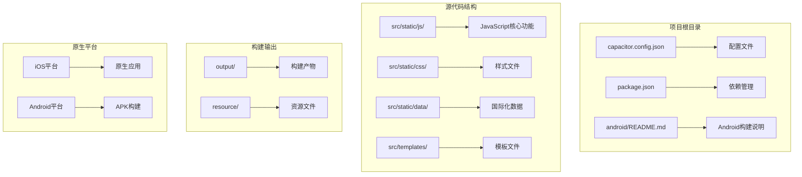
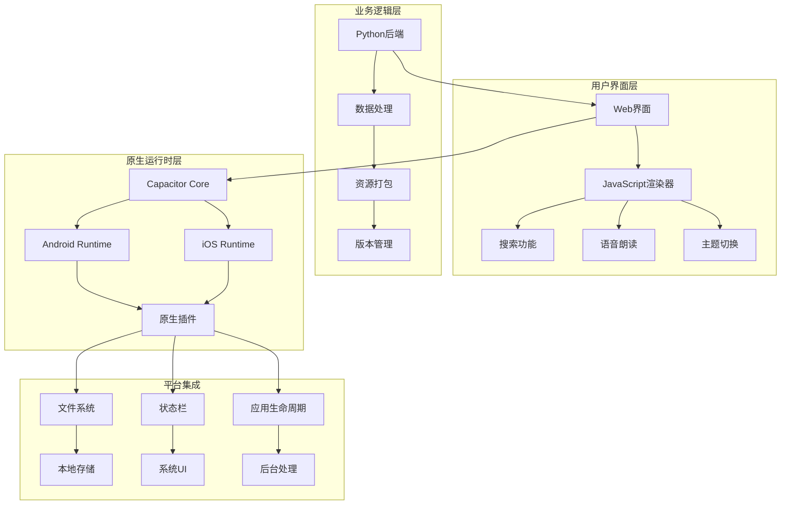
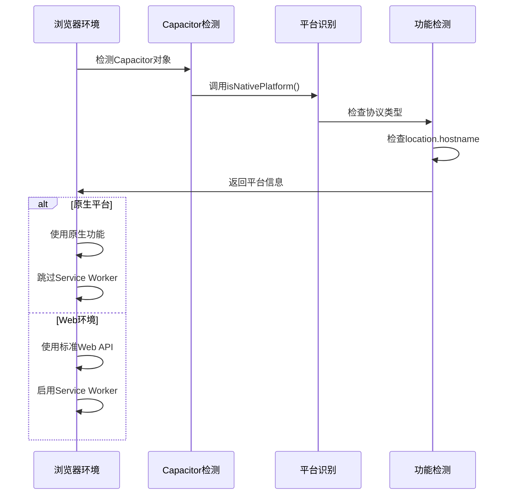
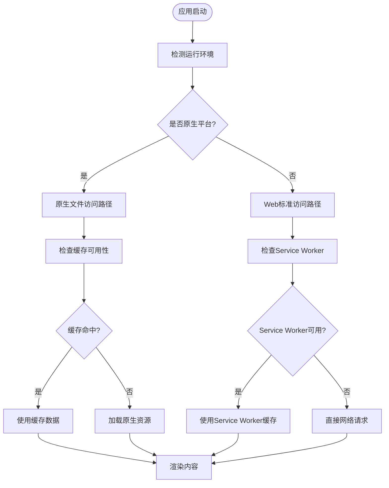
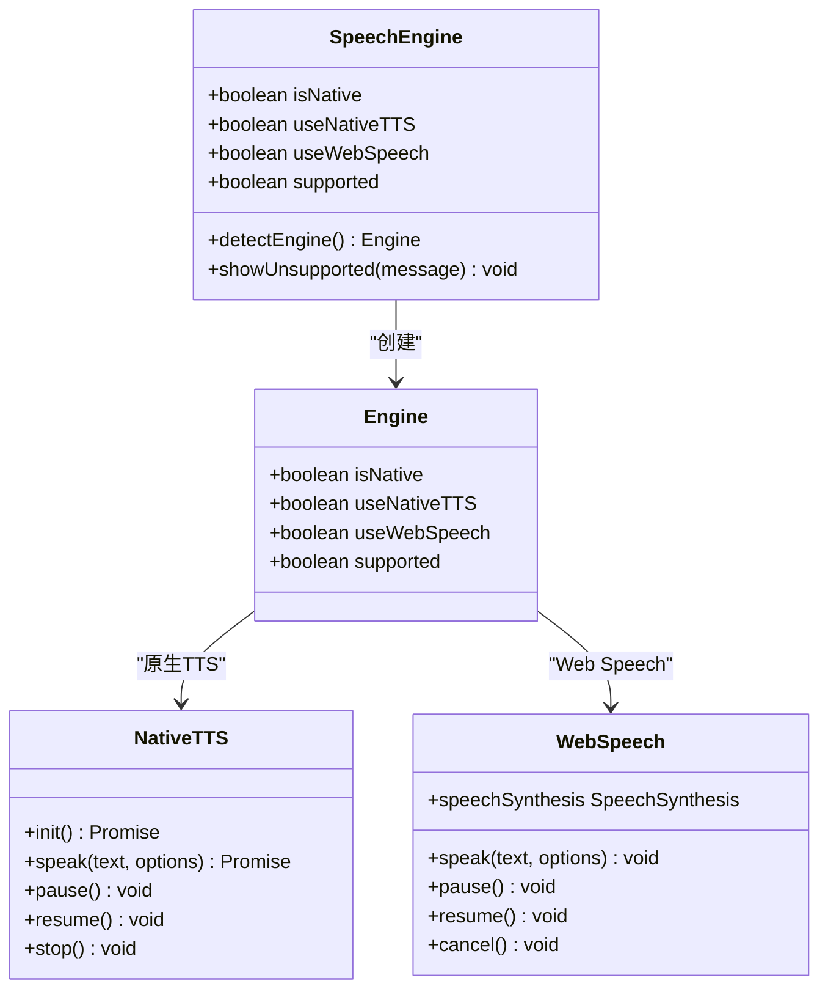
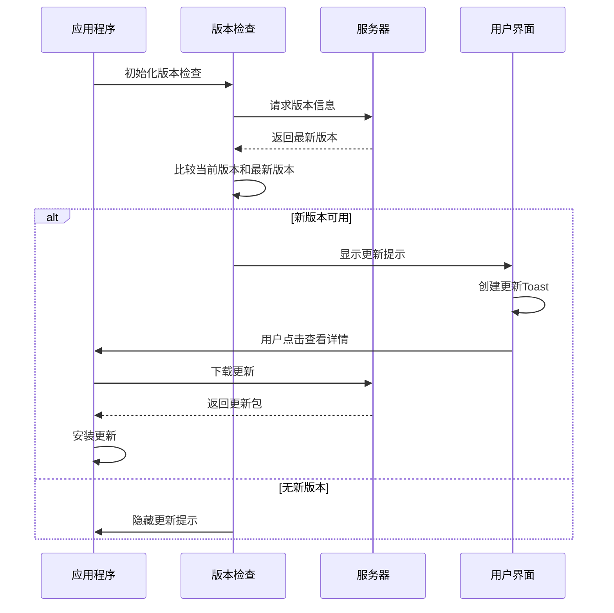

# Capacitor配置

<cite>
**本文档引用的文件**
- [capacitor.config.json](file://capacitor.config.json)
- [package.json](file://package.json)
- [android/README.md](file://android/README.md)
- [src/static/js/app-update.js](file://src/static/js/app-update.js)
- [src/static/js/search.js](file://src/static/js/search.js)
- [src/static/js/renderer.js](file://src/static/js/renderer.js)
- [src/static/js/speech.js](file://src/static/js/speech.js)
- [src/templates/main_manifest.json](file://src/templates/main_manifest.json)
</cite>

## 目录
1. [简介](#简介)
2. [项目结构](#项目结构)
3. [核心组件](#核心组件)
4. [架构概览](#架构概览)
5. [详细组件分析](#详细组件分析)
6. [依赖关系分析](#依赖关系分析)
7. [性能考虑](#性能考虑)
8. [故障排除指南](#故障排除指南)
9. [结论](#结论)

## 简介

本文档为圣经阅读器项目的Capacitor原生配置提供详细的技术文档。Capacitor是一个跨平台原生运行时，允许Web应用以原生应用的形式在iOS和Android平台上运行。本文档深入解释了capacitor.config.json中的原生平台配置参数，包括应用ID、文件名、目录结构等核心设置，并详细说明了iOS和Android平台的特定配置选项和平台差异。

该项目采用PWA + APK混合架构，通过Capacitor实现Web应用的原生化部署，支持多语言圣经阅读、注解和串珠功能。项目使用Python作为后端生成工具，结合JavaScript前端渲染引擎，实现了丰富的圣经学习体验。

## 项目结构

项目采用模块化的文件组织方式，主要包含以下关键目录和文件：



**图表来源**
- [capacitor.config.json:1-10](file://capacitor.config.json#L1-L10)
- [package.json:1-24](file://package.json#L1-L24)

项目的核心特点包括：
- **跨平台兼容性**：同时支持iOS和Android平台
- **PWA集成**：基于渐进式Web应用架构
- **原生功能增强**：通过Capacitor插件实现原生功能
- **模块化设计**：清晰的文件组织和职责分离

**章节来源**
- [capacitor.config.json:1-10](file://capacitor.config.json#L1-L10)
- [package.json:1-24](file://package.json#L1-L24)

## 核心组件

### Capacitor配置核心参数

Capacitor配置文件定义了应用的基本属性和平台特定设置：

| 配置参数 | 类型 | 描述 | 默认值 |
|---------|------|------|--------|
| appId | 字符串 | 应用程序的唯一标识符（反向域名格式） | 必需 |
| appName | 字符串 | 应用程序显示名称 | 必需 |
| webDir | 字符串 | 构建输出目录路径 | 必需 |
| bundledWebRuntime | 布尔值 | 是否包含捆绑的Web运行时 | false |

### 平台特定配置

#### Android平台配置
Android平台支持以下专用配置选项：

| 配置参数 | 类型 | 描述 | 示例值 |
|---------|------|------|--------|
| allowMixedContent | 布尔值 | 允许混合内容（HTTP和HTTPS混合） | true |
| webContentsDebuggingEnabled | 布尔值 | 启用WebView调试功能 | false |
| deepLinking | 布尔值 | 启用深度链接支持 | false |
| customHeaders | 对象 | 自定义HTTP头部 | {} |

#### iOS平台配置
iOS平台支持以下专用配置选项：

| 配置参数 | 类型 | 描述 | 示例值 |
|---------|------|------|--------|
| scheme | 字符串 | 自定义URL方案 | "bible" |
| hostname | 字符串 | 应用主机名 | "localhost" |
| deploymentTarget | 字符串 | iOS最低部署版本 | "13.0" |
| teamId | 字符串 | Apple开发者团队ID | "" |
| developmentTeamId | 字符串 | 开发者团队ID | "" |

**章节来源**
- [capacitor.config.json:1-10](file://capacitor.config.json#L1-L10)

## 架构概览

项目采用三层架构设计，结合Capacitor实现原生化：



**图表来源**
- [package.json:12-22](file://package.json#L12-L22)
- [src/static/js/app-update.js:1120-1227](file://src/static/js/app-update.js#L1120-L1227)

架构特点：
- **统一代码库**：共享JavaScript代码在多个平台上运行
- **原生插件系统**：通过Capacitor插件访问原生功能
- **渐进式增强**：根据平台能力动态调整功能
- **离线支持**：利用Service Worker和缓存策略

## 详细组件分析

### 原生平台检测机制

项目实现了智能的原生平台检测，通过多种方式判断当前运行环境：



**图表来源**
- [src/static/js/app-update.js:1204-1227](file://src/static/js/app-update.js#L1204-L1227)
- [src/static/js/search.js:249-253](file://src/static/js/search.js#L249-L253)

#### 检测逻辑实现

平台检测通过以下三个维度进行验证：

1. **Capacitor对象检测**：检查window.Capacitor是否存在
2. **协议类型检测**：验证location.protocol是否为'capacitor:'
3. **主机名检测**：确认location.hostname为'localhost'

**章节来源**
- [src/static/js/app-update.js:1120-1227](file://src/static/js/app-update.js#L1120-L1227)
- [src/static/js/search.js:249-253](file://src/static/js/search.js#L249-L253)

### 文件系统和缓存策略

原生应用与Web应用在文件访问和缓存机制上存在显著差异：



**图表来源**
- [src/static/js/renderer.js:62-103](file://src/static/js/renderer.js#L62-L103)
- [src/static/js/search.js:334-344](file://src/static/js/search.js#L334-L344)

#### 原生平台特殊处理

原生应用采用特殊的缓存和加载策略：

1. **时间戳参数绕过缓存**：使用_t=时间戳参数强制获取最新文件
2. **Cache Storage回退**：当fetch失败时尝试从Cache Storage获取
3. **多种URL格式支持**：支持绝对URL和相对路径两种格式

**章节来源**
- [src/static/js/renderer.js:62-103](file://src/static/js/renderer.js#L62-L103)
- [src/static/js/search.js:334-344](file://src/static/js/search.js#L334-L344)

### 语音朗读功能集成

项目实现了跨平台的语音朗读功能，支持原生TTS和Web Speech API：



**图表来源**
- [src/static/js/speech.js:320-332](file://src/static/js/speech.js#L320-L332)
- [src/static/js/speech.js:350-362](file://src/static/js/speech.js#L350-L362)

#### 引擎选择策略

语音引擎的选择遵循以下优先级：

1. **原生TTS优先**：在Android原生环境中优先使用原生TTS
2. **Web Speech降级**：当原生TTS不可用时使用Web Speech API
3. **功能检测**：动态检测平台支持的功能
4. **初始化等待**：原生环境下等待插件初始化完成

**章节来源**
- [src/static/js/speech.js:320-332](file://src/static/js/speech.js#L320-L332)
- [src/static/js/speech.js:350-362](file://src/static/js/speech.js#L350-L362)

### 版本管理和更新机制

项目实现了智能的版本检测和更新提醒功能：



**图表来源**
- [src/static/js/app-update.js:1120-1152](file://src/static/js/app-update.js#L1120-L1152)
- [src/static/js/app-update.js:1155-1194](file://src/static/js/app-update.js#L1155-L1194)

#### 更新策略差异

不同平台采用不同的更新策略：

1. **Capacitor平台**：使用专门的更新对话框
2. **PWA Standalone**：使用version.json进行版本检查
3. **自动检查**：支持静默更新检查和手动触发

**章节来源**
- [src/static/js/app-update.js:1120-1152](file://src/static/js/app-update.js#L1120-L1152)
- [src/static/js/app-update.js:1155-1194](file://src/static/js/app-update.js#L1155-L1194)

## 依赖关系分析

### 核心依赖关系

项目使用Capacitor 6.x版本，包含以下关键依赖：

```mermaid
graph TB
subgraph "运行时依赖"
A[@capacitor/core] --> B[核心运行时]
C[@capacitor/app] --> D[应用生命周期]
E[@capacitor/status-bar] --> F[状态栏控制]
G[@capacitor/filesystem] --> H[文件系统访问]
end
subgraph "社区插件"
I[@capacitor-community/text-to-speech] --> J[文本转语音]
end
subgraph "开发依赖"
K[@capacitor/android] --> L[Android平台]
M[@capacitor/cli] --> N[命令行工具]
end
subgraph "构建脚本"
O[npm scripts] --> P[构建流程]
Q[cap:sync] --> R[同步原生项目]
S[cap:open] --> T[打开原生IDE]
U[android:build] --> V[构建APK]
end
A --> O
I --> O
K --> O
M --> O
```

**图表来源**
- [package.json:12-22](file://package.json#L12-L22)
- [package.json:5-11](file://package.json#L5-L11)

### 插件功能映射

每个Capacitor插件都映射到特定的原生功能：

| 插件名称 | 功能描述 | 平台支持 | 配置要求 |
|---------|----------|----------|----------|
| @capacitor/app | 应用生命周期管理 | 所有平台 | 无 |
| @capacitor/status-bar | 状态栏样式控制 | iOS/Android | 可选配置 |
| @capacitor/filesystem | 文件系统访问 | iOS/Android | 权限配置 |
| @capacitor-community/text-to-speech | 文本转语音 | Android/iOS | 语言包 |

**章节来源**
- [package.json:12-22](file://package.json#L12-L22)

## 性能考虑

### 原生平台优化策略

针对不同平台的性能优化措施：

#### Android平台优化
- **混合内容处理**：允许HTTP和HTTPS混合内容，减少重定向开销
- **调试功能控制**：生产环境禁用WebView调试，提升性能
- **资源缓存策略**：原生应用使用更高效的缓存机制

#### iOS平台优化
- **URL Scheme配置**：自定义URL方案提升深度链接性能
- **部署目标管理**：合理设置最低iOS版本，平衡兼容性和性能
- **原生UI集成**：充分利用iOS原生控件的性能优势

### 缓存和加载优化

项目实现了多层次的缓存策略：

1. **内存缓存**：JavaScript对象缓存
2. **IndexedDB缓存**：浏览器存储缓存
3. **Service Worker缓存**：网络资源缓存
4. **原生缓存**：APK内置资源缓存

**章节来源**
- [capacitor.config.json:5-8](file://capacitor.config.json#L5-L8)
- [src/static/js/renderer.js:62-103](file://src/static/js/renderer.js#L62-L103)

## 故障排除指南

### 常见配置问题

#### Android构建问题
1. **Gradle构建失败**
   - 检查Android SDK版本兼容性
   - 确认Java版本符合要求
   - 验证签名证书配置

2. **混淆配置问题**
   - 确保Capacitor相关类不被混淆
   - 检查ProGuard规则配置

#### iOS构建问题
1. **签名配置错误**
   - 验证开发者账号配置
   - 检查Bundle Identifier设置
   - 确认Entitlements配置

2. **模拟器兼容性**
   - 验证最低部署版本设置
   - 检查架构支持配置

### 运行时问题诊断

#### 平台检测失败
1. **检查Capacitor对象**
   ```javascript
   console.log('Capacitor对象:', window.Capacitor);
   console.log('平台检测:', window.Capacitor.isNativePlatform());
   ```

2. **验证配置文件**
   - 确认capacitor.config.json格式正确
   - 检查应用ID和应用名称配置

#### 功能访问问题
1. **权限检查**
   - 验证所需权限已在配置中声明
   - 检查平台特定权限配置

2. **插件初始化**
   - 确认插件已正确安装和注册
   - 验证插件版本兼容性

**章节来源**
- [android/README.md:1-13](file://android/README.md#L1-L13)
- [src/static/js/app-update.js:1204-1227](file://src/static/js/app-update.js#L1204-L1227)

## 结论

本项目成功实现了基于Capacitor的跨平台原生应用架构，通过精心设计的配置和优化策略，在保持代码复用的同时充分利用了各平台的原生特性。

### 主要成就

1. **统一的用户体验**：通过Capacitor实现了iOS和Android平台的一致体验
2. **灵活的功能扩展**：通过插件系统轻松集成原生功能
3. **高效的性能表现**：针对不同平台优化了缓存和加载策略
4. **完善的开发工具链**：提供了完整的构建和发布流程

### 技术亮点

- **智能平台检测**：自动识别运行环境并调整功能行为
- **多层缓存策略**：最大化利用各种缓存机制提升性能
- **渐进式增强**：根据平台能力动态启用高级功能
- **无缝更新机制**：支持热更新和静默升级

### 未来发展方向

1. **持续性能优化**：进一步优化原生平台的性能表现
2. **功能扩展**：集成更多Capacitor插件增强原生功能
3. **开发工具改进**：完善自动化测试和构建流程
4. **用户体验提升**：持续改进界面交互和响应速度

通过本文档提供的详细配置说明和最佳实践指导，开发者可以更好地理解和维护这个基于Capacitor的跨平台应用项目。