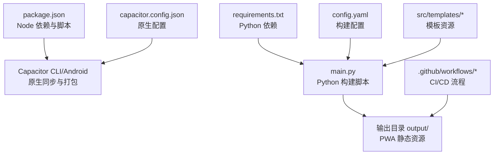
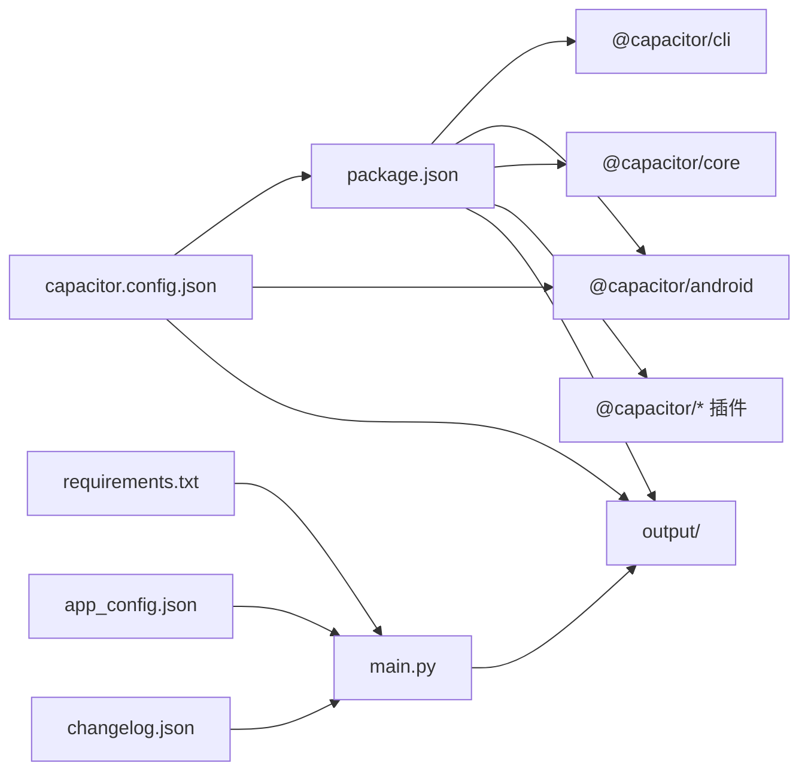

# 包管理配置

<cite>
**本文引用的文件**
- [package.json](file://package.json)
- [capacitor.config.json](file://capacitor.config.json)
- [build.sh](file://build.sh)
- [requirements.txt](file://requirements.txt)
- [config.yaml](file://config.yaml)
- [main.py](file://main.py)
- [changelog.json](file://changelog.json)
- [src/templates/main_manifest.json](file://src/templates/main_manifest.json)
- [src/templates/main_sw.js](file://src/templates/main_sw.js)
- [app_config.json](file://app_config.json)
- [.github/workflows/deploy-pages.yml](file://.github/workflows/deploy-pages.yml)
- [.github/workflows/android-release.yml](file://.github/workflows/android-release.yml)
</cite>

## 目录
1. [简介](#简介)
2. [项目结构](#项目结构)
3. [核心组件](#核心组件)
4. [架构总览](#架构总览)
5. [详细组件分析](#详细组件分析)
6. [依赖关系分析](#依赖关系分析)
7. [性能考量](#性能考量)
8. [故障排查指南](#故障排查指南)
9. [结论](#结论)
10. [附录](#附录)

## 简介
本文件聚焦于圣经阅读器项目的包管理配置与构建体系，系统性解析 package.json 中的依赖管理、脚本命令与版本控制策略，并结合实际构建脚本与 CI/CD 流程，说明 Node.js 与 Python 双栈依赖的安装与管理机制。文档还提供依赖升级与版本管理的最佳实践，以及安全与性能优化建议，帮助开发者在保持构建稳定性的同时提升效率。

## 项目结构
该仓库采用“前端静态产物 + Capacitor 原生桥接”的混合架构：
- Web 层：由 Python 脚本生成静态 PWA 资产（HTML/CSS/JS/数据），并生成 Service Worker 与清单文件。
- 原生层：通过 Capacitor 将 Web 资产同步至 Android 并打包为 APK。
- CI/CD：使用 GitHub Actions 在云端完成 PWA 部署与 APK 构建发布。



图表来源
- [package.json:1-24](file://package.json#L1-L24)
- [capacitor.config.json:1-10](file://capacitor.config.json#L1-L10)
- [main.py:1-361](file://main.py#L1-L361)
- [config.yaml:1-12](file://config.yaml#L1-L12)
- [requirements.txt:1-2](file://requirements.txt#L1-L2)
- [.github/workflows/deploy-pages.yml:1-32](file://.github/workflows/deploy-pages.yml#L1-L32)
- [.github/workflows/android-release.yml:1-54](file://.github/workflows/android-release.yml#L1-L54)

章节来源
- [package.json:1-24](file://package.json#L1-L24)
- [capacitor.config.json:1-10](file://capacitor.config.json#L1-L10)
- [main.py:1-361](file://main.py#L1-L361)
- [config.yaml:1-12](file://config.yaml#L1-L12)
- [requirements.txt:1-2](file://requirements.txt#L1-L2)
- [.github/workflows/deploy-pages.yml:1-32](file://.github/workflows/deploy-pages.yml#L1-L32)
- [.github/workflows/android-release.yml:1-54](file://.github/workflows/android-release.yml#L1-L54)

## 核心组件
- 依赖分类与作用
  - 生产依赖（dependencies）：运行期所需的 Capacitor 插件与核心库，用于在浏览器或 WebView 中提供应用功能。
  - 开发依赖（devDependencies）：仅在开发与构建阶段使用的工具链，如 Capacitor Android 平台与 CLI。
- 脚本命令
  - build：调用 Python 主脚本生成静态资源。
  - cap:sync：同步 Web 资产到原生平台。
  - cap:open：打开原生 IDE 进行调试。
  - android:build：完整构建 APK（先构建 Web 资产，再同步并编译 Android）。
  - android:dev：开发模式快捷命令（同步后打开原生 IDE）。
- 版本控制
  - 应用版本来自 app_config.json；构建时间与 APK 版本由 Python 脚本注入到输出目录的 version.json。

章节来源
- [package.json:5-22](file://package.json#L5-L22)
- [app_config.json:1-6](file://app_config.json#L1-L6)
- [main.py:288-321](file://main.py#L288-L321)

## 架构总览
下图展示从本地开发到云端部署与 APK 构建的关键流程，以及各配置文件之间的协作关系。

```mermaid
sequenceDiagram
participant Dev as "开发者"
participant NPM as "npm 脚本"
participant PY as "Python 构建脚本"
participant CAP as "Capacitor"
participant AND as "Android Gradle"
participant GH as "GitHub Actions"
participant CF as "Cloudflare Pages"
Dev->>NPM : 执行 build/cap : sync/cap : open
NPM->>PY : 调用 python main.py
PY-->>NPM : 生成 output/ 静态资源
NPM->>CAP : npx cap sync
CAP-->>Dev : 同步到 android/
Dev->>AND : ./gradlew assembleRelease
AND-->>Dev : 产出 APK
GH->>PY : 自动执行构建
PY-->>GH : 生成 output/
GH->>CF : 部署 output/ 目录
```

图表来源
- [package.json:5-11](file://package.json#L5-L11)
- [main.py:36-76](file://main.py#L36-L76)
- [.github/workflows/deploy-pages.yml:20-31](file://.github/workflows/deploy-pages.yml#L20-L31)
- [.github/workflows/android-release.yml:34-47](file://.github/workflows/android-release.yml#L34-L47)

## 详细组件分析

### package.json 依赖与脚本
- 依赖管理
  - 生产依赖：包含 Capacitor 核心与若干插件，用于应用运行期能力（如文本朗读、文件系统、状态栏等）。
  - 开发依赖：包含 Capacitor Android 平台与 CLI，用于在本地或 CI 中同步与构建原生工程。
- 脚本命令
  - build：委托给 Python 主脚本，负责生成静态资源与配置文件。
  - cap:sync：调用 Capacitor CLI 同步 Web 资产到原生工程。
  - cap:open：打开原生 IDE（Android Studio）进行调试。
  - android:build：串联构建 Web 资产、同步原生工程并编译 APK。
  - android:dev：开发调试快捷方式。
- 版本控制
  - 应用版本号来源于 app_config.json；构建时间与 APK 版本写入 version.json，供前端与原生侧识别。

章节来源
- [package.json:12-22](file://package.json#L12-L22)
- [package.json:5-11](file://package.json#L5-L11)
- [app_config.json:1-6](file://app_config.json#L1-L6)
- [main.py:288-321](file://main.py#L288-L321)

### Capacitor 配置
- 关键字段
  - appId/appName：应用标识与显示名。
  - webDir：Web 资产输出目录（与 Python 脚本输出一致）。
  - android.allowMixedContent：允许混合内容（HTTP/HTTPS 混合）。
  - android.webContentsDebuggingEnabled：WebView 调试开关。
- 影响范围
  - 与 npm 脚本配合，决定 Capacitor 同步目标与调试体验。

章节来源
- [capacitor.config.json:1-10](file://capacitor.config.json#L1-L10)

### Python 构建脚本与依赖
- 依赖安装
  - requirements.txt：声明 Python 依赖（如 PyYAML）。
  - build.sh：在云构建环境中安装依赖并执行主脚本。
- 构建流程（三阶段）
  - 阶段 1：导出圣经数据到 output/data/，并对部分 JSON 做无缩进压缩以减小体积。
  - 阶段 2：复制静态资源（HTML/CSS/JS/图标/第三方库），生成 manifest.json 与 sw.js，并复制模板文件与变更日志。
  - 阶段 3：生成 version.json、remote-config.js（含远程服务器地址的 base64 编码），并复制 app_config.json。
- 输出目录
  - 输出目录由 config.yaml 控制，默认为 output/，与 Capacitor 配置一致。

章节来源
- [requirements.txt:1-2](file://requirements.txt#L1-L2)
- [build.sh:7-15](file://build.sh#L7-L15)
- [main.py:36-76](file://main.py#L36-L76)
- [main.py:87-117](file://main.py#L87-L117)
- [main.py:121-161](file://main.py#L121-L161)
- [main.py:288-356](file://main.py#L288-L356)
- [config.yaml:1-12](file://config.yaml#L1-L12)

### Service Worker 与清单文件
- 清单（manifest.json）
  - 来源于模板文件，构建时替换名称与描述，定义 PWA 行为与图标。
- Service Worker（sw.js）
  - 预缓存核心资源，按策略对不同类型资源采用 cache-first 或 network-first。
  - 提供缓存查询、清理与批量缓存等消息接口，支持离线体验与性能优化。

章节来源
- [src/templates/main_manifest.json:1-26](file://src/templates/main_manifest.json#L1-L26)
- [src/templates/main_sw.js:1-270](file://src/templates/main_sw.js#L1-L270)
- [main.py:248-277](file://main.py#L248-L277)

### CI/CD 流程
- 部署到 Cloudflare Pages
  - 步骤：检出代码、设置 Python、安装依赖、构建、部署。
- 构建 Android APK
  - 步骤：检出代码、设置 Python/Node.js/Java、安装依赖、构建 Web 资产、Capacitor 同步、Gradle 编译、上传发布。

章节来源
- [.github/workflows/deploy-pages.yml:1-32](file://.github/workflows/deploy-pages.yml#L1-L32)
- [.github/workflows/android-release.yml:1-54](file://.github/workflows/android-release.yml#L1-L54)

## 依赖关系分析
- Node.js 与 Capacitor
  - package.json 的 devDependencies 为 Capacitor Android 平台与 CLI，用于在本地或 CI 中同步 Web 资产并构建原生工程。
  - npm 脚本通过 npx cap sync/open 与原生工程交互。
- Python 与构建
  - requirements.txt 约束 Python 依赖；build.sh 与 CI 工作流统一安装依赖并执行主脚本。
  - main.py 依据 config.yaml 生成静态资源，输出目录与 Capacitor 配置一致。
- 版本与配置
  - app_config.json 提供版本号；main.py 生成 version.json 与 remote-config.js，供前端与原生侧使用。



图表来源
- [package.json:12-22](file://package.json#L12-L22)
- [capacitor.config.json:1-10](file://capacitor.config.json#L1-L10)
- [requirements.txt:1-2](file://requirements.txt#L1-L2)
- [main.py:288-356](file://main.py#L288-L356)
- [app_config.json:1-6](file://app_config.json#L1-L6)
- [changelog.json:1-10](file://changelog.json#L1-L10)

章节来源
- [package.json:12-22](file://package.json#L12-L22)
- [capacitor.config.json:1-10](file://capacitor.config.json#L1-L10)
- [requirements.txt:1-2](file://requirements.txt#L1-L2)
- [main.py:288-356](file://main.py#L288-L356)
- [app_config.json:1-6](file://app_config.json#L1-L6)
- [changelog.json:1-10](file://changelog.json#L1-L10)

## 性能考量
- 资源体积优化
  - 对导出的 JSON 数据进行无缩进压缩，降低传输与存储开销。
  - 通过 Service Worker 的缓存策略，优先缓存不变的圣经数据，提高离线可用性与加载速度。
- 构建效率
  - CI/CD 中并行设置 Python/Node.js/Java 环境，缩短流水线时间。
  - 仅复制必要静态资源，排除训练相关脚本，减少输出体积。
- 缓存策略
  - 预缓存核心资源，针对版本文件采用网络优先策略，确保更新及时性。
  - 提供批量缓存与缓存清理接口，便于维护与调试。

章节来源
- [main.py:107-116](file://main.py#L107-L116)
- [src/templates/main_sw.js:88-166](file://src/templates/main_sw.js#L88-L166)
- [.github/workflows/android-release.yml:20-35](file://.github/workflows/android-release.yml#L20-L35)

## 故障排查指南
- 依赖安装问题
  - Python 依赖未安装：检查 requirements.txt 是否正确，确认 CI/CD 或本地环境已执行安装步骤。
  - Node 依赖未安装：在 CI 中执行 npm install，确保 Capacitor CLI 可用。
- 构建失败
  - 数据库缺失：确保资源目录中存在圣经数据库文件，否则构建会提前退出。
  - 输出目录不一致：确认 config.yaml 的 output_dir 与 capacitor.config.json 的 webDir 一致。
- 原生同步失败
  - 检查 Capacitor CLI 版本与平台版本是否匹配，确保 npx cap sync 成功。
- Service Worker 缓存异常
  - 使用消息接口查询缓存状态，必要时清理缓存并重新批量缓存。

章节来源
- [requirements.txt:1-2](file://requirements.txt#L1-L2)
- [main.py:93-96](file://main.py#L93-L96)
- [config.yaml:1-12](file://config.yaml#L1-L12)
- [capacitor.config.json:4](file://capacitor.config.json#L4)
- [src/templates/main_sw.js:176-270](file://src/templates/main_sw.js#L176-L270)

## 结论
本项目通过清晰的双栈依赖管理（Node.js 与 Python）与标准化的 CI/CD 流程，实现了从静态 PWA 到 Android APK 的一体化交付。package.json 中的脚本与依赖划分明确，capacitor.config.json 与 config.yaml 提供了稳定的构建与原生配置基础。遵循本文的依赖升级与版本管理最佳实践，可进一步提升安全性与可维护性。

## 附录

### 依赖升级与版本管理最佳实践
- Node.js 与 Capacitor
  - 使用语义化版本范围（^）锁定次要版本，定期审阅官方更新日志，逐步升级 major 版本。
  - 在 CI 中固定 Node.js 版本，避免因版本差异导致构建不一致。
- Python
  - 在 requirements.txt 中使用 >= 约束最低版本，同时在 CI 中固定 Python 版本。
  - 使用虚拟环境隔离依赖，避免污染全局环境。
- 版本号同步
  - 统一由 app_config.json 管理版本号，构建脚本自动生成 version.json，避免多处分散维护。
- 安全加固
  - 定期扫描依赖漏洞，优先修复高危风险。
  - 在 CI 中启用依赖缓存与完整性校验，防止中间人攻击。
- 性能优化
  - 通过 Service Worker 策略与资源压缩减少首屏加载时间。
  - 在 CI 中并行化多任务，缩短构建与发布周期。

章节来源
- [package.json:12-22](file://package.json#L12-L22)
- [app_config.json:1-6](file://app_config.json#L1-L6)
- [main.py:288-321](file://main.py#L288-L321)
- [.github/workflows/deploy-pages.yml:15-21](file://.github/workflows/deploy-pages.yml#L15-L21)
- [.github/workflows/android-release.yml:20-35](file://.github/workflows/android-release.yml#L20-L35)