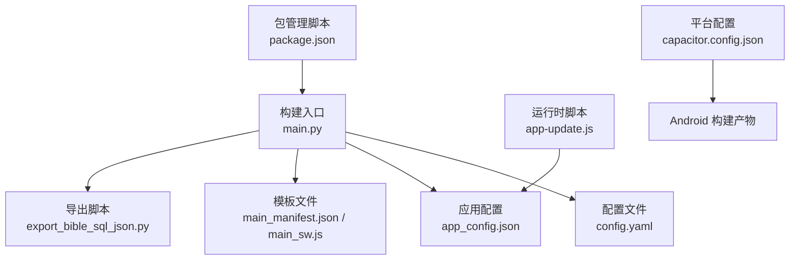
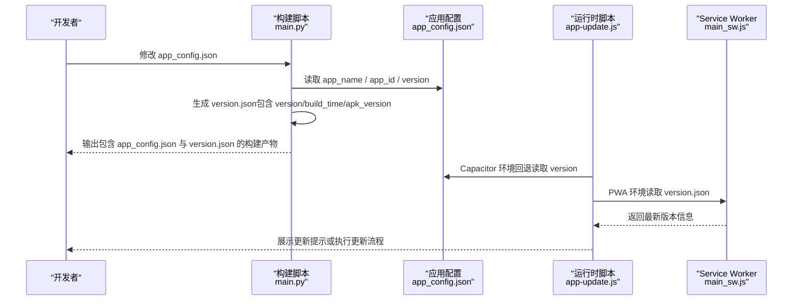
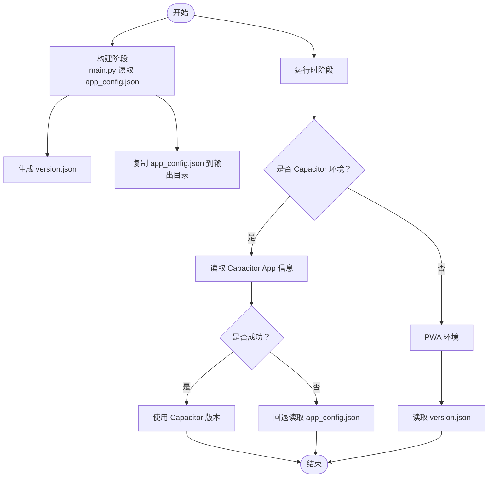
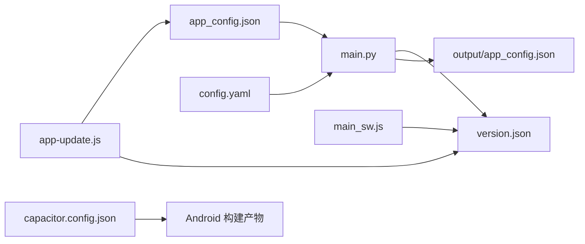

# 应用配置

<cite>
**本文档引用的文件**
- [app_config.json](file://app_config.json)
- [capacitor.config.json](file://capacitor.config.json)
- [package.json](file://package.json)
- [config.yaml](file://config.yaml)
- [main.py](file://main.py)
- [app-update.js](file://src/static/js/app-update.js)
- [main_manifest.json](file://src/templates/main_manifest.json)
- [main_sw.js](file://src/templates/main_sw.js)
- [export_bible_sql_json.py](file://export_bible_sql_json.py)
</cite>

## 目录
1. [简介](#简介)
2. [项目结构](#项目结构)
3. [核心组件](#核心组件)
4. [架构总览](#架构总览)
5. [详细组件分析](#详细组件分析)
6. [依赖分析](#依赖分析)
7. [性能考虑](#性能考虑)
8. [故障排查指南](#故障排查指南)
9. [结论](#结论)
10. [附录](#附录)

## 简介
本文件聚焦于圣经阅读器项目的应用配置，系统性解析 app_config.json 的字段语义、加载与优先级、最佳实践与命名规范，并说明如何在不破坏其他功能模块的前提下修改应用基本信息。同时给出配置验证规则与错误处理机制，帮助开发者安全地维护与扩展配置。

## 项目结构
该仓库采用“构建脚本 + 多种配置文件 + 模板”的组织方式：
- 构建入口：Python 主脚本负责读取 YAML 配置、导出圣经数据、生成静态站点与版本配置。
- 应用配置：app_config.json 提供应用基础元数据（名称、标识、版本），用于构建产物中的版本号与运行时更新检测。
- 平台配置：capacitor.config.json 用于 Capacitor 构建 Android 包时的应用标识与名称等。
- 包管理与脚本：package.json 定义构建脚本与依赖，配合 main.py 实现一键构建。
- 运行时配置：app-update.js 在运行时读取 app_config.json 的版本号进行更新检测；Service Worker 通过 version.json 进行 PWA 更新检测。

图表来源
- [main.py:78-321](file://main.py#L78-L321)
- [app_config.json:1-6](file://app_config.json#L1-L6)
- [config.yaml:1-12](file://config.yaml#L1-L12)
- [app-update.js:210-232](file://src/static/js/app-update.js#L210-L232)
- [main_manifest.json:1-26](file://src/templates/main_manifest.json#L1-L26)
- [main_sw.js:14-16](file://src/templates/main_sw.js#L14-L16)

章节来源
- [main.py:78-321](file://main.py#L78-L321)
- [app_config.json:1-6](file://app_config.json#L1-L6)
- [config.yaml:1-12](file://config.yaml#L1-L12)
- [package.json:1-24](file://package.json#L1-L24)
- [capacitor.config.json:1-10](file://capacitor.config.json#L1-L10)

## 核心组件
本节聚焦 app_config.json 的三个核心字段及其作用与交互：

- app_name（应用名称）
  - 用途：描述应用的显示名称，便于用户识别。
  - 读取位置：构建阶段由 main.py 读取并用于生成版本信息与运行时更新检测。
  - 运行时使用：app-update.js 在 Capacitor 环境下优先从 Capacitor App 信息获取当前版本，回退时读取 app_config.json 的 version 字段。
  - 注意：app_name 与 Capacitor 配置中的 appName 可能不同，两者分别服务于构建产物与平台打包。

- app_id（应用标识符）
  - 用途：唯一标识应用，常用于平台（如 Android）包名或构建产物标识。
  - 读取位置：capacitor.config.json 中的 appId 与 app_config.json 的 app_id 建议保持一致，以避免混淆。
  - 平台一致性：Android 包名需遵循反向域名规则，且与 Capacitor 配置一致。

- version（版本号）
  - 用途：控制构建版本与运行时更新检测。
  - 生成逻辑：main.py 读取 app_config.json 的 version 作为构建版本，并写入 output/version.json。
  - 运行时检测：
    - Capacitor 环境：优先从 Capacitor App.getInfo() 获取当前版本，若失败则回退读取 app_config.json 的 version。
    - PWA 环境：通过读取 output/version.json 进行更新检测。
  - 命名规范：建议采用语义化版本（SemVer），例如 x.y.z。

章节来源
- [app_config.json:1-6](file://app_config.json#L1-L6)
- [main.py:288-321](file://main.py#L288-L321)
- [app-update.js:210-232](file://src/static/js/app-update.js#L210-L232)
- [main_sw.js:14-16](file://src/templates/main_sw.js#L14-L16)

## 架构总览
下图展示 app_config.json 在构建与运行时的关键交互路径：

图表来源
- [main.py:288-321](file://main.py#L288-L321)
- [app_config.json:1-6](file://app_config.json#L1-L6)
- [app-update.js:210-232](file://src/static/js/app-update.js#L210-L232)
- [main_sw.js:14-16](file://src/templates/main_sw.js#L14-L16)

## 详细组件分析

### app_config.json 字段详解
- app_name
  - 类型：字符串
  - 必填：否（但建议提供）
  - 默认值：无（若缺失，构建脚本会使用默认值）
  - 作用：用于构建产物中的版本信息与运行时回退检测
  - 建议：与产品定位一致，简洁易懂

- app_id
  - 类型：字符串
  - 必填：是（尤其对 Android 打包）
  - 默认值：无
  - 作用：平台包名与构建标识
  - 建议：遵循反向域名规范，避免与现有应用冲突

- version
  - 类型：字符串
  - 必填：是（建议 SemVer）
  - 默认值：1.0.0
  - 作用：构建版本与运行时更新检测
  - 建议：每次发布递增，遵循语义化版本规则

章节来源
- [app_config.json:1-6](file://app_config.json#L1-L6)
- [main.py:291-298](file://main.py#L291-L298)

### 加载顺序与优先级
- 构建阶段
  - main.py 读取 app_config.json，提取 version 并写入 output/version.json。
  - app_config.json 作为构建产物的一部分被复制到 output/。
- 运行时阶段
  - Capacitor 环境：优先从 Capacitor App.getInfo() 获取当前版本；若失败则回退读取 app_config.json 的 version。
  - PWA 环境：直接读取 output/version.json 进行比较。

图表来源
- [main.py:288-321](file://main.py#L288-L321)
- [app_update.js:210-232](file://src/static/js/app-update.js#L210-L232)
- [main_sw.js:14-16](file://src/templates/main_sw.js#L14-L16)

章节来源
- [main.py:288-321](file://main.py#L288-L321)
- [app-update.js:210-232](file://src/static/js/app-update.js#L210-L232)

### 最佳实践与命名规范
- 字段命名
  - 使用小写加下划线风格（如 app_name、app_id、version），保持一致性。
- 版本管理
  - 采用 SemVer（主.次.修订），每次发布递增。
  - 构建产物中的 apk_version 与 version 保持一致或按需区分。
- 平台一致性
  - app_id 与 Capacitor 配置中的 appId 保持一致，避免混淆。
- 可读性
  - app_name 与实际产品名称一致，便于用户识别。
- 安全性
  - 不在配置中存放敏感信息；如需远程配置，使用加密或安全传输。

章节来源
- [app_config.json:1-6](file://app_config.json#L1-L6)
- [capacitor.config.json:1-10](file://capacitor.config.json#L1-L10)

### 如何修改应用基本信息而不影响其他模块
- 修改步骤
  - 更新 app_config.json 的 app_name、app_id、version。
  - 若需要平台包名变更，同步修改 capacitor.config.json 的 appId。
  - 重新运行构建脚本，确保生成新的 version.json 与 app_config.json。
- 影响范围
  - 仅影响版本检测与运行时回退逻辑；不会改变静态资源、模板或数据导出流程。
- 验证方法
  - 检查 output/version.json 是否包含新的 version。
  - 在 Capacitor 环境下确认回退读取 app_config.json 生效。

章节来源
- [main.py:288-321](file://main.py#L288-L321)
- [app-update.js:210-232](file://src/static/js/app-update.js#L210-L232)

### 配置验证规则与错误处理
- 验证规则
  - app_id 必须存在且符合平台包名规范。
  - version 必须为有效字符串，建议 SemVer。
  - app_name 可选，但建议提供以提升用户体验。
- 错误处理
  - 构建阶段：若 app_config.json 缺失，使用默认版本号继续构建。
  - 运行时阶段：Capacitor 环境回退到 app_config.json；PWA 环境读取 version.json；均失败时不中断应用，仅跳过更新提示。
- 建议
  - 在 CI 中增加配置校验步骤，确保字段完整性与格式正确。

章节来源
- [main.py:291-298](file://main.py#L291-L298)
- [app-update.js:210-232](file://src/static/js/app-update.js#L210-L232)

## 依赖分析
- 构建链路依赖
  - main.py 依赖 app_config.json 与 config.yaml，生成 version.json 与 app_config.json 的输出副本。
  - app-update.js 依赖 app_config.json（回退）与 version.json（PWA）。
  - main_sw.js 依赖 version.json 进行网络优先更新检测。
- 平台依赖
  - Capacitor 配置与 app_id 保持一致，确保 Android 打包与运行时一致。

图表来源
- [main.py:288-321](file://main.py#L288-L321)
- [app_update.js:210-232](file://src/static/js/app-update.js#L210-L232)
- [main_sw.js:14-16](file://src/templates/main_sw.js#L14-L16)
- [capacitor.config.json:1-10](file://capacitor.config.json#L1-L10)

章节来源
- [main.py:288-321](file://main.py#L288-L321)
- [app_update.js:210-232](file://src/static/js/app-update.js#L210-L232)
- [main_sw.js:14-16](file://src/templates/main_sw.js#L14-L16)
- [capacitor.config.json:1-10](file://capacitor.config.json#L1-L10)

## 性能考虑
- 版本检测开销
  - 运行时仅在必要时机发起请求（如首次进入或定时检查），避免频繁网络请求。
- 缓存策略
  - PWA 环境通过 Service Worker 缓存静态资源，version.json 网络优先，降低离线风险。
- 构建效率
  - app_config.json 仅在构建阶段读取，对运行时性能影响极小。

## 故障排查指南
- 构建失败
  - 现象：找不到 app_config.json 或读取异常。
  - 排查：确认文件存在且 JSON 格式正确；检查 main.py 的读取逻辑与默认值。
- 运行时版本不一致
  - 现象：Capacitor 环境显示版本与 app_config.json 不一致。
  - 排查：确认 Capacitor App 信息是否可获取；若失败，检查 app_config.json 的 version 字段。
- PWA 更新检测无效
  - 现象：PWA 环境未提示更新。
  - 排查：确认 output/version.json 是否存在且包含有效版本；检查 main_sw.js 的网络优先策略。

章节来源
- [main.py:291-298](file://main.py#L291-L298)
- [app_update.js:210-232](file://src/static/js/app-update.js#L210-L232)
- [main_sw.js:14-16](file://src/templates/main_sw.js#L14-L16)

## 结论
app_config.json 是应用配置的核心入口，主要承载应用名称、标识与版本号。通过明确的加载顺序与优先级设计，既能满足构建期的版本管理，也能保障运行时的更新检测。遵循本文的最佳实践与验证规则，可在不破坏其他模块的前提下安全地调整应用基本信息。

## 附录
- 相关文件路径
  - app_config.json：应用基础配置
  - config.yaml：构建与资源路径配置
  - capacitor.config.json：平台打包配置
  - package.json：包管理与脚本定义
  - main.py：构建主流程
  - app-update.js：运行时更新检测
  - main_manifest.json：PWA 清单模板
  - main_sw.js：Service Worker 模板
  - export_bible_sql_json.py：数据导出脚本