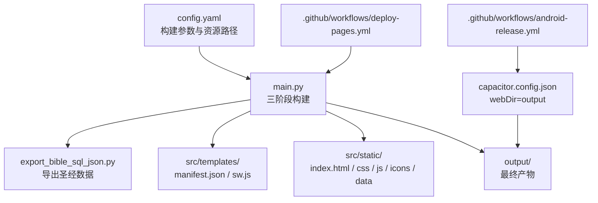
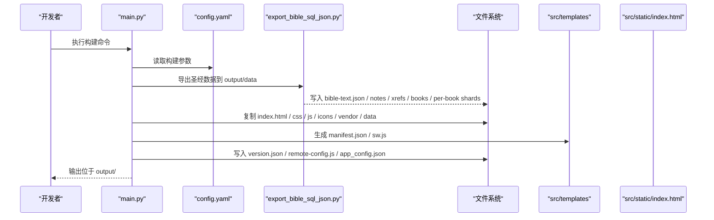
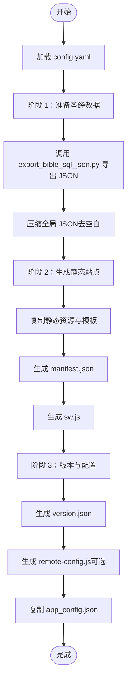
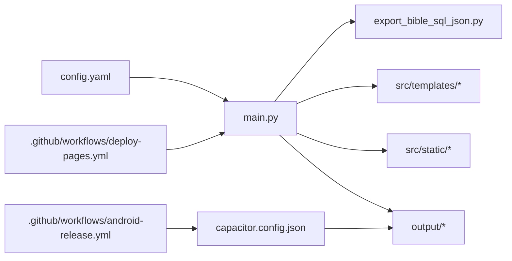

# 构建配置

<cite>
**本文档引用的文件**
- [config.yaml](file://config.yaml)
- [main.py](file://main.py)
- [export_bible_sql_json.py](file://export_bible_sql_json.py)
- [build.sh](file://build.sh)
- [package.json](file://package.json)
- [capacitor.config.json](file://capacitor.config.json)
- [app_config.json](file://app_config.json)
- [.github/workflows/deploy-pages.yml](file://.github/workflows/deploy-pages.yml)
- [.github/workflows/android-release.yml](file://.github/workflows/android-release.yml)
- [src/templates/main_manifest.json](file://src/templates/main_manifest.json)
- [src/templates/main_sw.js](file://src/templates/main_sw.js)
- [src/static/index.html](file://src/static/index.html)
- [src/static/data/book-names-i18n.json](file://src/static/data/book-names-i18n.json)
- [changelog.json](file://changelog.json)
</cite>

## 目录
1. [简介](#简介)
2. [项目结构](#项目结构)
3. [核心组件](#核心组件)
4. [架构总览](#架构总览)
5. [详细组件分析](#详细组件分析)
6. [依赖分析](#依赖分析)
7. [性能考虑](#性能考虑)
8. [故障排查指南](#故障排查指南)
9. [结论](#结论)
10. [附录](#附录)

## 简介
本文件面向“圣经阅读器”项目的构建配置，系统性解读 config.yaml 中的构建参数与配置项，阐明资源路径、输出目录、构建流程与阶段之间的依赖关系，并给出开发与生产环境的配置差异、自定义构建流程与新增任务的方法、构建优化建议以及配置验证与常见错误的解决方案。

## 项目结构
该项目采用“Python 构建脚本 + 静态资源模板 + CI 工作流”的组合方式：
- 构建入口：Python 脚本负责三阶段构建（数据准备、静态站点生成、版本与配置）
- 配置中心：config.yaml 提供资源路径与远程服务配置
- 模板与静态资源：src/templates 与 src/static 下的 manifest、sw、HTML、CSS、JS、图标与数据
- 平台集成：Capacitor 配置将输出目录作为 WebDir
- 自动化：GitHub Actions 在云端执行构建与部署

图表来源
- [config.yaml:1-12](file://config.yaml#L1-L12)
- [main.py:36-76](file://main.py#L36-L76)
- [export_bible_sql_json.py:743-800](file://export_bible_sql_json.py#L743-L800)
- [capacitor.config.json:1-10](file://capacitor.config.json#L1-L10)
- [.github/workflows/deploy-pages.yml:1-32](file://.github/workflows/deploy-pages.yml#L1-L32)
- [.github/workflows/android-release.yml:1-54](file://.github/workflows/android-release.yml#L1-L54)

章节来源
- [config.yaml:1-12](file://config.yaml#L1-L12)
- [main.py:36-76](file://main.py#L36-L76)
- [capacitor.config.json:1-10](file://capacitor.config.json#L1-L10)
- [.github/workflows/deploy-pages.yml:1-32](file://.github/workflows/deploy-pages.yml#L1-L32)
- [.github/workflows/android-release.yml:1-54](file://.github/workflows/android-release.yml#L1-L54)

## 核心组件
- 构建参数与资源路径
  - 输出目录 output_dir：决定最终产物存放位置
  - 资源基础目录 resource_base_dir：资源文件所在根目录
  - 静态资源目录 static_dir：前端静态资源根目录
  - 圣经数据库 bible_db：SQLite 数据库路径
  - 读经计划 reading_plans：多个 JSON 计划文件列表
  - 远程服务器 remote_servers：包含 GitHub API 等远程地址配置
- 构建脚本 main.py
  - 三阶段构建：准备圣经数据、生成静态站点、生成版本与配置
  - 读取 config.yaml 并据此复制/生成文件
- 导出脚本 export_bible_sql_json.py
  - 从 CG.db 导出多类 JSON（全局文本、注解、串珠、书卷映射、按书卷分片、读经计划）
- 模板与静态资源
  - manifest.json 与 sw.js 由模板生成
  - index.html 引用输出目录下的资源
- 平台配置
  - Capacitor 将 output 设为 webDir，用于 APK 构建
- 自动化工作流
  - Cloudflare Pages 部署工作流
  - Android APK 构建与发布工作流

章节来源
- [config.yaml:1-12](file://config.yaml#L1-L12)
- [main.py:78-361](file://main.py#L78-L361)
- [export_bible_sql_json.py:1-835](file://export_bible_sql_json.py#L1-L835)
- [src/templates/main_manifest.json:1-26](file://src/templates/main_manifest.json#L1-L26)
- [src/templates/main_sw.js:1-270](file://src/templates/main_sw.js#L1-L270)
- [src/static/index.html:1-687](file://src/static/index.html#L1-L687)
- [capacitor.config.json:1-10](file://capacitor.config.json#L1-L10)
- [.github/workflows/deploy-pages.yml:1-32](file://.github/workflows/deploy-pages.yml#L1-L32)
- [.github/workflows/android-release.yml:1-54](file://.github/workflows/android-release.yml#L1-L54)

## 架构总览
下图展示从配置到产物的端到端构建链路，包括三个核心阶段与关键依赖：

图表来源
- [main.py:36-76](file://main.py#L36-L76)
- [main.py:87-117](file://main.py#L87-L117)
- [main.py:121-161](file://main.py#L121-L161)
- [main.py:288-321](file://main.py#L288-L321)
- [export_bible_sql_json.py:743-800](file://export_bible_sql_json.py#L743-L800)

章节来源
- [main.py:36-76](file://main.py#L36-L76)
- [main.py:87-117](file://main.py#L87-L117)
- [main.py:121-161](file://main.py#L121-L161)
- [main.py:288-321](file://main.py#L288-L321)
- [export_bible_sql_json.py:743-800](file://export_bible_sql_json.py#L743-L800)

## 详细组件分析

### 配置文件 config.yaml 解析
- output_dir
  - 作用：指定最终构建产物输出目录
  - 默认值：output
  - 使用位置：main.py 中作为输出根目录
- resource_base_dir
  - 作用：资源文件的基础路径（与相对路径拼接）
  - 默认值：resource
  - 使用位置：与 reading_plans 中的相对路径组合
- static_dir
  - 作用：前端静态资源根目录
  - 默认值：src/static
  - 使用位置：main.py 阶段 2 中复制 CSS、JS、icons、vendor、data
- bible_db
  - 作用：SQLite 圣经数据库路径
  - 默认值：resource/CG.db
  - 使用位置：main.py 阶段 1 导出数据前校验与读取
- reading_plans
  - 作用：读经计划 JSON 文件列表
  - 默认值：多个资源文件
  - 使用位置：export_bible_sql_json.py 导出读经计划
- remote_servers
  - 作用：远程服务器配置（如 GitHub API）
  - 字段示例：github_api
  - 使用位置：main.py 生成 remote-config.js（运行时 atob 解码）

章节来源
- [config.yaml:1-12](file://config.yaml#L1-L12)
- [main.py:57-57](file://main.py#L57-L57)
- [main.py:89-89](file://main.py#L89-L89)
- [main.py:123-123](file://main.py#L123-L123)
- [main.py:313-315](file://main.py#L313-L315)

### 构建阶段与流程
- 阶段 1：圣经数据准备
  - 依据 config.yaml 的 bible_db 与 reading_plans
  - 调用 export_bible_sql_json.py 导出多类 JSON
  - 对部分全局 JSON 进行压缩（去除多余空白）
- 阶段 2：静态站点生成
  - 复制 index.html、CSS、JS（排除训练相关）、icons、vendor、静态 data
  - 生成 manifest.json（替换名称与描述）
  - 生成 sw.js（Service Worker）
  - 复制 _redirects 与 changelog.json（如存在）
  - 创建 .nojekyll
- 阶段 3：版本与配置
  - 读取 app_config.json 获取版本号，生成 version.json
  - 若存在 remote_servers，则生成 remote-config.js（URL 以 base64 存储）
  - 复制 app_config.json 到输出目录

图表来源
- [main.py:36-76](file://main.py#L36-L76)
- [main.py:87-117](file://main.py#L87-L117)
- [main.py:121-161](file://main.py#L121-L161)
- [main.py:288-321](file://main.py#L288-L321)
- [export_bible_sql_json.py:743-800](file://export_bible_sql_json.py#L743-L800)

章节来源
- [main.py:36-76](file://main.py#L36-L76)
- [main.py:87-117](file://main.py#L87-L117)
- [main.py:121-161](file://main.py#L121-L161)
- [main.py:288-321](file://main.py#L288-L321)
- [export_bible_sql_json.py:743-800](file://export_bible_sql_json.py#L743-L800)

### 开发环境与生产环境差异
- 开发环境
  - 使用 npm 脚本进行本地构建与同步：npm run build、npm run cap:sync、npm run cap:open
  - Capacitor 配置允许混合内容与调试（开发场景）
- 生产环境
  - Cloudflare Pages 工作流：安装依赖、执行 Python 构建、部署到 Pages
  - Android APK 工作流：安装 Python/Node/Java、构建 Web 资产、Capacitor 同步、Gradle 打包并上传发布
- 配置差异要点
  - webDir 指向 output（Capacitor）
  - remote_servers 在生产中用于生成 remote-config.js，便于运行时动态选择镜像或 API

章节来源
- [package.json:5-11](file://package.json#L5-L11)
- [capacitor.config.json:1-10](file://capacitor.config.json#L1-L10)
- [.github/workflows/deploy-pages.yml:1-32](file://.github/workflows/deploy-pages.yml#L1-L32)
- [.github/workflows/android-release.yml:1-54](file://.github/workflows/android-release.yml#L1-L54)
- [main.py:313-356](file://main.py#L313-L356)

### 自定义构建流程与新增任务
- 新增自定义任务
  - 在 main.py 中扩展新函数并在主流程中调用
  - 在 config.yaml 中新增字段（如新的资源路径或远程服务），在 main.py 中读取并使用
- 添加新的构建阶段
  - 在 main.py 的主流程中插入新阶段的调用点
  - 在对应阶段函数中实现复制/生成逻辑
- 构建优化
  - 控制 JS 文件复制范围（EXCLUDED_JS_FILES 已过滤训练相关文件）
  - 对全局 JSON 进行压缩以减小体积
  - Service Worker 缓存策略针对圣经分片数据采用 cache-first，提升离线体验

章节来源
- [main.py:27-33](file://main.py#L27-L33)
- [main.py:108-116](file://main.py#L108-L116)
- [src/templates/main_sw.js:80-125](file://src/templates/main_sw.js#L80-L125)

### 构建配置验证方法
- 配置文件校验
  - 使用 YAML 解析器验证 config.yaml 语法
  - 在 main.py 中打印加载结果与路径解析情况
- 资源存在性检查
  - bible_db 存在性检查（不存在则退出）
  - reading_plans 中文件存在性检查（不存在则告警）
- 产物完整性检查
  - 检查 output 目录是否存在关键文件（manifest.json、sw.js、version.json、核心 JS/CSS）
  - Service Worker 缓存核心 URL（通过 index.html 中的 __cxCoreUrls 列表）

章节来源
- [main.py:93-96](file://main.py#L93-L96)
- [main.py:154-157](file://main.py#L154-L157)
- [src/static/index.html:206-219](file://src/static/index.html#L206-L219)

## 依赖分析
- 配置到脚本的依赖
  - main.py 依赖 config.yaml 的键值（output_dir、static_dir、bible_db、reading_plans、remote_servers）
  - export_bible_sql_json.py 依赖 CG.db 与 reading_plans 中的计划文件
- 脚本到模板与静态资源的依赖
  - main.py 依赖 src/templates 下的 manifest 与 sw 模板
  - main.py 依赖 src/static 下的 index.html、CSS、JS、icons、vendor、data
- 平台集成依赖
  - Capacitor 将 output 作为 webDir，用于 APK 构建
- CI 工作流依赖
  - deploy-pages.yml 依赖 requirements.txt 与 main.py
  - android-release.yml 依赖 Node/Java/Gradle 与 Capacitor CLI

图表来源
- [config.yaml:1-12](file://config.yaml#L1-L12)
- [main.py:36-76](file://main.py#L36-L76)
- [export_bible_sql_json.py:743-800](file://export_bible_sql_json.py#L743-L800)
- [capacitor.config.json:1-10](file://capacitor.config.json#L1-L10)
- [.github/workflows/deploy-pages.yml:1-32](file://.github/workflows/deploy-pages.yml#L1-L32)
- [.github/workflows/android-release.yml:1-54](file://.github/workflows/android-release.yml#L1-L54)

章节来源
- [config.yaml:1-12](file://config.yaml#L1-L12)
- [main.py:36-76](file://main.py#L36-L76)
- [export_bible_sql_json.py:743-800](file://export_bible_sql_json.py#L743-L800)
- [capacitor.config.json:1-10](file://capacitor.config.json#L1-L10)
- [.github/workflows/deploy-pages.yml:1-32](file://.github/workflows/deploy-pages.yml#L1-L32)
- [.github/workflows/android-release.yml:1-54](file://.github/workflows/android-release.yml#L1-L54)

## 性能考虑
- 资源体积优化
  - 压缩全局 JSON（bible-text.json、bible-notes.json、bible-xrefs.json）以减少体积
  - 排除不必要的 JS 文件（训练相关文件）
- 缓存策略
  - Service Worker 对圣经分片数据采用 cache-first，提高离线可用性
  - 版本文件采用 network-first，保证更新及时
- 构建时间
  - 通过控制导出范围与模板生成步骤，减少重复 IO
  - CI 中并行安装依赖与构建，缩短流水线时间

章节来源
- [main.py:108-116](file://main.py#L108-L116)
- [main.py:198-203](file://main.py#L198-L203)
- [src/templates/main_sw.js:80-125](file://src/templates/main_sw.js#L80-L125)

## 故障排查指南
- 常见问题与解决
  - 圣经数据库不存在：检查 config.yaml 中 bible_db 路径是否正确
  - 读经计划文件缺失：确认 reading_plans 中的文件路径存在
  - 依赖安装失败：确保 requirements.txt 正确，且 Python 版本满足需求
  - Capacitor 同步失败：确认 Capacitor CLI 与平台配置正确
  - Service Worker 缓存异常：检查 sw.js 生成与注册逻辑，核对核心 URL 列表
- 验证步骤
  - 构建后检查 output 目录是否包含 manifest.json、sw.js、version.json、核心 JS/CSS
  - 在浏览器中打开 index.html，查看控制台是否有资源加载错误
  - 使用 Service Worker 工具检查缓存命中情况

章节来源
- [main.py:93-96](file://main.py#L93-L96)
- [main.py:154-157](file://main.py#L154-L157)
- [src/static/index.html:206-219](file://src/static/index.html#L206-L219)
- [src/templates/main_sw.js:25-40](file://src/templates/main_sw.js#L25-L40)

## 结论
本项目的构建配置以 config.yaml 为核心，配合 main.py 的三阶段构建与 export_bible_sql_json.py 的数据导出，形成完整的静态站点与 APK 构建链路。通过合理的资源路径定义、模板化生成与缓存策略，既满足 PWA 的离线体验，也支持 Capacitor 的原生集成。建议在团队协作中统一配置规范与 CI 流程，持续优化构建体积与速度。

## 附录
- 关键文件与用途速览
  - config.yaml：构建参数与资源路径
  - main.py：三阶段构建主流程
  - export_bible_sql_json.py：从 CG.db 导出 JSON
  - src/templates/main_manifest.json：PWA 清单模板
  - src/templates/main_sw.js：Service Worker 模板
  - src/static/index.html：入口 HTML
  - src/static/data/book-names-i18n.json：书卷名称国际化数据
  - changelog.json：变更记录
  - capacitor.config.json：Capacitor WebDir 配置
  - package.json：npm 脚本与依赖
  - .github/workflows/deploy-pages.yml：Pages 部署工作流
  - .github/workflows/android-release.yml：Android APK 工作流

章节来源
- [config.yaml:1-12](file://config.yaml#L1-L12)
- [main.py:36-76](file://main.py#L36-L76)
- [export_bible_sql_json.py:743-800](file://export_bible_sql_json.py#L743-L800)
- [src/templates/main_manifest.json:1-26](file://src/templates/main_manifest.json#L1-L26)
- [src/templates/main_sw.js:1-270](file://src/templates/main_sw.js#L1-L270)
- [src/static/index.html:1-687](file://src/static/index.html#L1-L687)
- [src/static/data/book-names-i18n.json:1-139](file://src/static/data/book-names-i18n.json#L1-L139)
- [changelog.json:1-10](file://changelog.json#L1-L10)
- [capacitor.config.json:1-10](file://capacitor.config.json#L1-L10)
- [package.json:1-24](file://package.json#L1-L24)
- [.github/workflows/deploy-pages.yml:1-32](file://.github/workflows/deploy-pages.yml#L1-L32)
- [.github/workflows/android-release.yml:1-54](file://.github/workflows/android-release.yml#L1-L54)