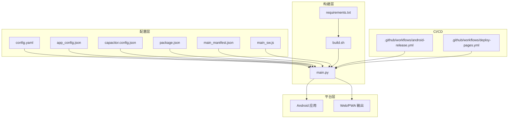
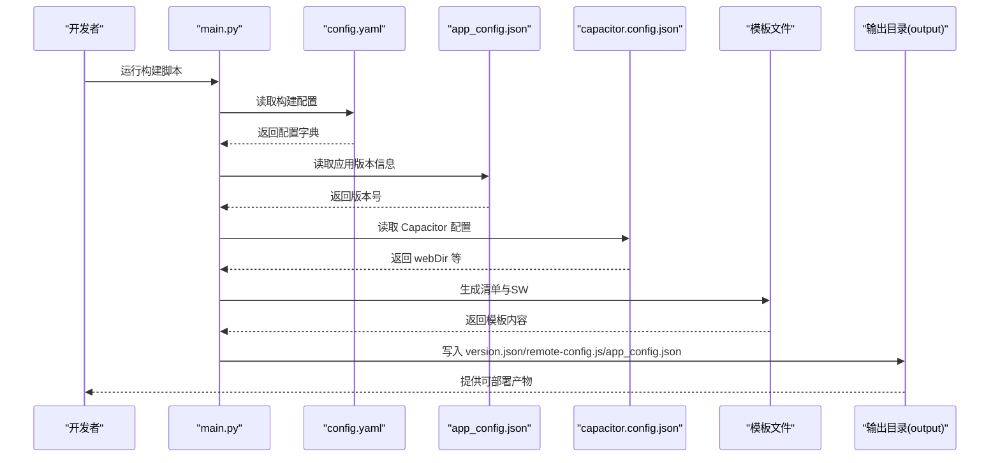
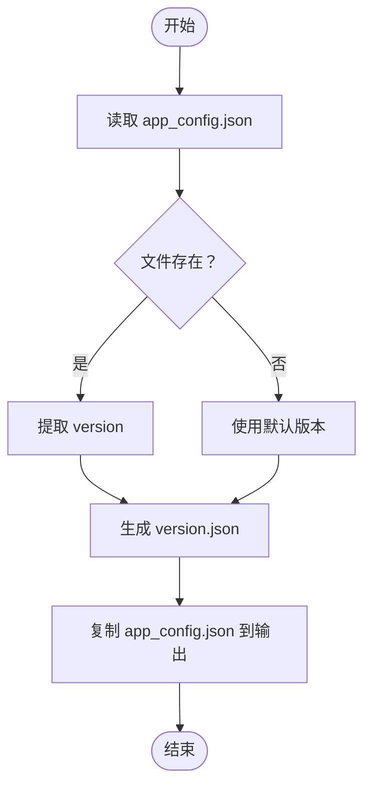
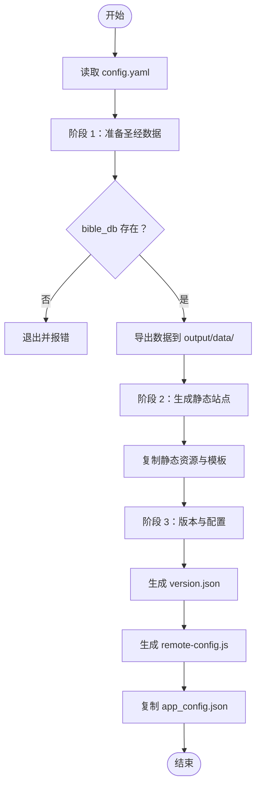
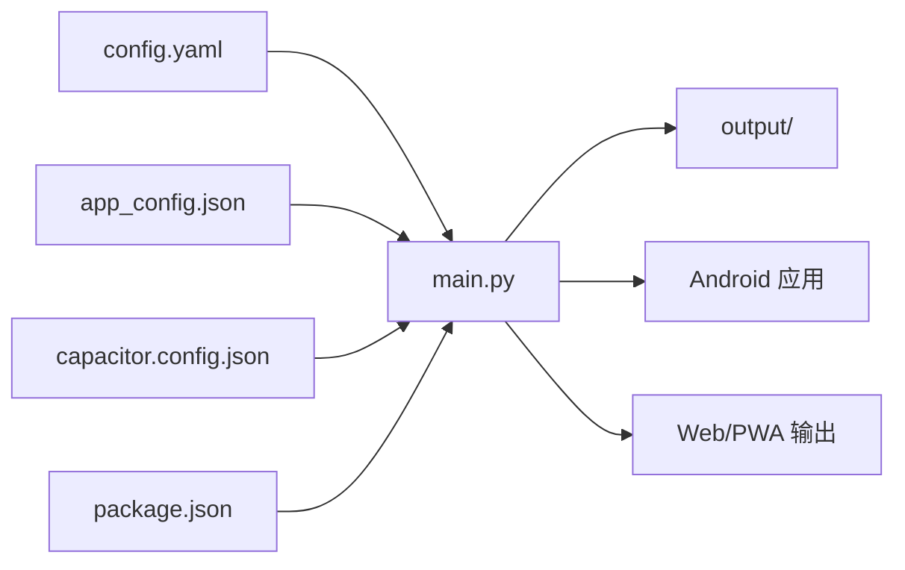

# 配置管理

<cite>
**本文引用的文件**
- [app_config.json](file://app_config.json)
- [config.yaml](file://config.yaml)
- [package.json](file://package.json)
- [capacitor.config.json](file://capacitor.config.json)
- [main.py](file://main.py)
- [build.sh](file://build.sh)
- [requirements.txt](file://requirements.txt)
- [.github/workflows/android-release.yml](file://.github/workflows/android-release.yml)
- [.github/workflows/deploy-pages.yml](file://.github/workflows/deploy-pages.yml)
- [src/templates/main_manifest.json](file://src/templates/main_manifest.json)
- [src/templates/main_sw.js](file://src/templates/main_sw.js)
</cite>

## 目录
1. [简介](#简介)
2. [项目结构](#项目结构)
3. [核心组件](#核心组件)
4. [架构总览](#架构总览)
5. [详细组件分析](#详细组件分析)
6. [依赖关系分析](#依赖关系分析)
7. [性能考量](#性能考量)
8. [故障排查指南](#故障排查指南)
9. [结论](#结论)
10. [附录](#附录)

## 简介
本文件系统性梳理圣经阅读器的配置管理体系，覆盖以下配置文件及其作用：
- app_config.json：应用基础信息与版本
- config.yaml：构建配置与资源路径
- package.json：NPM 脚本与依赖
- capacitor.config.json：Capacitor 原生平台配置
- GitHub Actions 工作流：CI/CD 环境配置
- 模板文件：PWA 清单与 Service Worker

文档重点说明各配置参数的含义、默认值、可选范围、文件间依赖关系与优先级、不同环境的配置策略、自定义与扩展方式、以及配置验证与错误处理机制。

## 项目结构
该仓库采用“配置驱动 + Python 构建”的模式：
- 配置层：YAML/JSON/模板文件集中定义构建参数与运行时配置
- 构建层：Python 脚本按阶段读取配置，生成静态站点与版本信息
- 平台层：Capacitor 将 Web 输出打包为原生应用
- CI/CD 层：GitHub Actions 在云端执行构建与发布



图表来源
- [main.py:78-83](file://main.py#L78-L83)
- [config.yaml:1-12](file://config.yaml#L1-L12)
- [app_config.json:1-6](file://app_config.json#L1-L6)
- [capacitor.config.json:1-10](file://capacitor.config.json#L1-L10)
- [package.json:1-24](file://package.json#L1-L24)
- [build.sh:1-16](file://build.sh#L1-L16)
- [requirements.txt:1-2](file://requirements.txt#L1-L2)
- [.github/workflows/android-release.yml:1-54](file://.github/workflows/android-release.yml#L1-L54)
- [.github/workflows/deploy-pages.yml:1-32](file://.github/workflows/deploy-pages.yml#L1-L32)

章节来源
- [main.py:36-76](file://main.py#L36-L76)
- [config.yaml:1-12](file://config.yaml#L1-L12)
- [app_config.json:1-6](file://app_config.json#L1-L6)
- [capacitor.config.json:1-10](file://capacitor.config.json#L1-L10)
- [package.json:1-24](file://package.json#L1-L24)
- [build.sh:1-16](file://build.sh#L1-L16)
- [requirements.txt:1-2](file://requirements.txt#L1-L2)
- [.github/workflows/android-release.yml:1-54](file://.github/workflows/android-release.yml#L1-L54)
- [.github/workflows/deploy-pages.yml:1-32](file://.github/workflows/deploy-pages.yml#L1-L32)

## 核心组件
本节对每个配置文件进行逐项解析，明确参数含义、默认值、可选范围与使用场景。

- app_config.json
  - 字段
    - app_name：应用显示名称（字符串）
    - app_id：应用标识符（字符串）
    - version：应用版本号（字符串）
  - 默认值：无默认值，需在项目中提供
  - 可选范围：遵循语义化版本规范；包名/标识符建议符合平台命名约定
  - 用途：构建阶段用于生成 version.json 与 remote-config.js，并复制到输出目录
  - 关键实现位置
    - 读取与生成 version.json：[main.py:291-310](file://main.py#L291-L310)
    - 生成 remote-config.js：[main.py:323-356](file://main.py#L323-L356)
    - 复制 app_config.json：[main.py:317-321](file://main.py#L317-L321)

- config.yaml
  - 字段
    - output_dir：构建输出目录（字符串，默认 output）
    - resource_base_dir：资源基目录（字符串，默认 resource）
    - static_dir：静态资源目录（字符串，默认 src/static）
    - bible_db：圣经数据库路径（字符串，默认 resource/CG.db）
    - reading_plans：阅读计划 JSON 列表（数组）
    - remote_servers：远程服务器配置对象
      - github_api：GitHub 最新发布接口（字符串）
  - 默认值：若字段缺失，脚本会使用硬编码默认值
  - 可选范围：路径需存在于项目中；reading_plans 为绝对或相对路径列表
  - 用途：作为构建脚本的唯一配置源，驱动数据准备、静态站点生成与版本配置
  - 关键实现位置
    - 加载配置：[main.py:78-83](file://main.py#L78-L83)
    - 数据准备阶段使用 bible_db：[main.py](file://main.py#L89)
    - 静态站点生成阶段使用 static_dir：[main.py](file://main.py#L122)
    - 版本与配置阶段使用 remote_servers：[main.py:313-315](file://main.py#L313-L315)

- package.json
  - 字段
    - scripts：构建与开发脚本
      - build：调用 Python 主脚本
      - cap:sync：同步 Capacitor 原生平台
      - cap:open：打开 Android 开发环境
      - android:build：构建 APK 流程（先构建 Web 资产，再同步 Capacitor，最后 Gradle 打包）
      - android:dev：开发调试流程
    - dependencies：运行时依赖（Capacitor 生态）
    - devDependencies：开发期依赖（Capacitor CLI/Android 平台）
  - 默认值：无
  - 可选范围：脚本命令可自定义，但需与 Capacitor/Gradle 环境一致
  - 用途：统一 NPM 脚本入口，简化本地开发与 CI/CD 流程
  - 关键实现位置
    - 脚本定义：[package.json:5-11](file://package.json#L5-L11)
    - CI/CD 使用：[android-release.yml:37-47](file://.github/workflows/android-release.yml#L37-L47)，[deploy-pages.yml:23-24](file://.github/workflows/deploy-pages.yml#L23-L24)

- capacitor.config.json
  - 字段
    - appId：原生应用 ID（字符串）
    - appName：原生应用名称（字符串）
    - webDir：Web 输出目录（字符串，默认 output）
    - android.allowMixedContent：允许混合内容（布尔）
    - android.webContentsDebuggingEnabled：启用 WebView 调试（布尔）
  - 默认值：webDir 默认 output；android.allowMixedContent 默认 false（此处为 true）
  - 可选范围：appId/appName 符合平台命名；布尔值仅接受 true/false
  - 用途：控制 Capacitor 将 Web 输出打包为 Android 应用的行为
  - 关键实现位置
    - 配置读取与使用：[main.py](file://main.py#L57)（输出目录）、[main.py](file://main.py#L123)（静态站点生成）

- GitHub Actions 工作流
  - android-release.yml
    - 触发：推送标签（v*）或手动触发
    - 步骤：Python/Node/Java 环境设置、安装依赖、构建 Web 资产、Capacitor 同步、Gradle 打包、上传发布
  - deploy-pages.yml
    - 触发：推送到 main 分支或手动触发
    - 步骤：Python 环境设置、安装依赖、构建、部署到 Cloudflare Pages
  - 关键实现位置
    - Android 构建步骤：[android-release.yml:37-47](file://.github/workflows/android-release.yml#L37-L47)
    - Pages 部署步骤：[deploy-pages.yml:23-31](file://.github/workflows/deploy-pages.yml#L23-L31)

- 模板文件
  - main_manifest.json：PWA 清单模板，构建时会被替换名称后写入输出目录
    - 关键实现位置：[main.py:248-267](file://main.py#L248-L267)
  - main_sw.js：Service Worker 模板，包含缓存策略、消息通道与离线提示
    - 关键实现位置：[main.py:269-284](file://main.py#L269-L284)

章节来源
- [app_config.json:1-6](file://app_config.json#L1-L6)
- [config.yaml:1-12](file://config.yaml#L1-L12)
- [package.json:1-24](file://package.json#L1-L24)
- [capacitor.config.json:1-10](file://capacitor.config.json#L1-L10)
- [main.py:78-83](file://main.py#L78-L83)
- [main.py:291-356](file://main.py#L291-L356)
- [main.py:248-284](file://main.py#L248-L284)
- [.github/workflows/android-release.yml:1-54](file://.github/workflows/android-release.yml#L1-L54)
- [.github/workflows/deploy-pages.yml:1-32](file://.github/workflows/deploy-pages.yml#L1-L32)

## 架构总览
下图展示配置文件在构建流程中的依赖关系与优先级顺序（从上到下为读取顺序）：



图表来源
- [main.py:78-83](file://main.py#L78-L83)
- [main.py:291-321](file://main.py#L291-L321)
- [main.py:248-284](file://main.py#L248-L284)
- [config.yaml:1-12](file://config.yaml#L1-L12)
- [app_config.json:1-6](file://app_config.json#L1-L6)
- [capacitor.config.json:1-10](file://capacitor.config.json#L1-L10)

## 详细组件分析

### app_config.json 组件分析
- 参数说明
  - app_name：用于 UI 显示的应用名称
  - app_id：应用包名或标识符
  - version：应用版本号，用于生成 version.json
- 默认值与可选范围
  - 无默认值，必须提供
  - 版本号建议遵循语义化版本
- 依赖关系
  - 被 main.py 在阶段 3 读取并写入 version.json
  - remote-config.js 依赖此版本号进行构建时间戳记录
- 错误处理
  - 若文件不存在，脚本仍会生成默认版本信息，但不会覆盖 app_config.json



图表来源
- [main.py:291-321](file://main.py#L291-L321)

章节来源
- [app_config.json:1-6](file://app_config.json#L1-L6)
- [main.py:291-321](file://main.py#L291-L321)

### config.yaml 组件分析
- 参数说明
  - output_dir：构建输出目录（默认 output）
  - resource_base_dir：资源基目录（默认 resource）
  - static_dir：静态资源目录（默认 src/static）
  - bible_db：圣经数据库路径（默认 resource/CG.db）
  - reading_plans：阅读计划 JSON 列表
  - remote_servers.github_api：GitHub 最新发布接口
- 默认值与可选范围
  - 字段缺失时使用脚本内硬编码默认值
  - 路径需存在于项目中，否则构建阶段会报错
- 依赖关系
  - 被 main.py 作为唯一配置源，贯穿三个阶段
- 错误处理
  - bible_db 不存在时直接退出构建



图表来源
- [main.py:78-83](file://main.py#L78-L83)
- [main.py:87-117](file://main.py#L87-L117)
- [main.py:121-161](file://main.py#L121-L161)
- [main.py:288-321](file://main.py#L288-L321)

章节来源
- [config.yaml:1-12](file://config.yaml#L1-L12)
- [main.py:78-117](file://main.py#L78-L117)
- [main.py:121-161](file://main.py#L121-L161)
- [main.py:288-321](file://main.py#L288-L321)

### package.json 组件分析
- 参数说明
  - scripts：统一的构建与开发脚本入口
  - dependencies/devDependencies：Capacitor 生态依赖
- 默认值与可选范围
  - 脚本命令可自定义，但需与 Capacitor/Gradle 环境一致
- 依赖关系
  - CI/CD 工作流直接调用这些脚本
- 错误处理
  - 若依赖缺失，NPM 安装阶段会报错

```mermaid
sequenceDiagram
participant Dev as "开发者"
participant NPM as "NPM 脚本"
participant PY as "main.py"
participant CAP as "Capacitor"
participant AND as "Android Gradle"
Dev->>NPM : npm run android : build
NPM->>PY : 调用构建脚本
PY-->>NPM : 生成 output/
NPM->>CAP : npx cap sync
CAP-->>NPM : 同步完成
NPM->>AND : ./gradlew assembleRelease
AND-->>Dev : 产出 APK
```

图表来源
- [package.json:5-11](file://package.json#L5-L11)
- [main.py:36-76](file://main.py#L36-L76)
- [.github/workflows/android-release.yml:37-47](file://.github/workflows/android-release.yml#L37-L47)

章节来源
- [package.json:1-24](file://package.json#L1-L24)
- [.github/workflows/android-release.yml:1-54](file://.github/workflows/android-release.yml#L1-L54)

### capacitor.config.json 组件分析
- 参数说明
  - appId/appName：原生应用标识与显示名称
  - webDir：Web 输出目录（默认 output）
  - android.allowMixedContent/webContentsDebuggingEnabled：Android 平台安全与调试开关
- 默认值与可选范围
  - webDir 默认 output；android.allowMixedContent 默认 false（此处为 true）
- 依赖关系
  - Capacitor 同步与打包过程读取该配置
- 错误处理
  - 若 webDir 与实际输出不一致，可能导致同步失败

章节来源
- [capacitor.config.json:1-10](file://capacitor.config.json#L1-L10)
- [main.py](file://main.py#L57)
- [main.py](file://main.py#L123)

### GitHub Actions 工作流组件分析
- android-release.yml
  - 触发：标签推送或手动触发
  - 步骤：环境准备、依赖安装、构建、Capacitor 同步、Gradle 打包、上传发布
- deploy-pages.yml
  - 触发：分支推送或手动触发
  - 步骤：环境准备、依赖安装、构建、部署到 Cloudflare Pages
- 依赖关系
  - 与 package.json 脚本配合，形成端到端自动化

章节来源
- [.github/workflows/android-release.yml:1-54](file://.github/workflows/android-release.yml#L1-L54)
- [.github/workflows/deploy-pages.yml:1-32](file://.github/workflows/deploy-pages.yml#L1-L32)

## 依赖关系分析
- 配置文件间的依赖
  - config.yaml 是构建的唯一配置源，被 main.py 全流程读取
  - app_config.json 在阶段 3 被读取，生成 version.json 与 remote-config.js
  - capacitor.config.json 影响 Capacitor 同步与打包行为
  - package.json 为脚本入口，连接本地与 CI/CD
- 优先级
  - config.yaml > app_config.json > capacitor.config.json（在构建逻辑中体现）
- 潜在循环依赖
  - 无直接循环依赖，但 CI/CD 依赖本地脚本与配置



图表来源
- [main.py:78-83](file://main.py#L78-L83)
- [main.py:291-321](file://main.py#L291-L321)
- [config.yaml:1-12](file://config.yaml#L1-L12)
- [app_config.json:1-6](file://app_config.json#L1-L6)
- [capacitor.config.json:1-10](file://capacitor.config.json#L1-L10)
- [package.json:1-24](file://package.json#L1-L24)

章节来源
- [main.py:78-83](file://main.py#L78-L83)
- [main.py:291-321](file://main.py#L291-L321)
- [config.yaml:1-12](file://config.yaml#L1-L12)
- [app_config.json:1-6](file://app_config.json#L1-L6)
- [capacitor.config.json:1-10](file://capacitor.config.json#L1-L10)
- [package.json:1-24](file://package.json#L1-L24)

## 性能考量
- 构建阶段
  - 压缩全局 JSON（去除空白字符）减少体积：[main.py:108-115](file://main.py#L108-L115)
  - 预缓存关键资源（首页、清单、版本、书卷索引）提升首开速度：[src/templates/main_sw.js:14-19](file://src/templates/main_sw.js#L14-L19)
- 缓存策略
  - 圣经数据 cache-first，版本文件 network-first，其他 cache-first + network fallback：[src/templates/main_sw.js:88-125](file://src/templates/main_sw.js#L88-L125)
- 离线体验
  - 导航请求失败时返回离线提示 HTML：[src/templates/main_sw.js:172-174](file://src/templates/main_sw.js#L172-L174)

章节来源
- [main.py:108-115](file://main.py#L108-L115)
- [src/templates/main_sw.js:14-125](file://src/templates/main_sw.js#L14-L125)
- [src/templates/main_sw.js:172-174](file://src/templates/main_sw.js#L172-L174)

## 故障排查指南
- 构建失败（数据库不存在）
  - 现象：阶段 1 报错并退出
  - 排查：确认 bible_db 路径存在且可访问
  - 参考位置：[main.py:93-96](file://main.py#L93-L96)
- 输出目录不匹配
  - 现象：Capacitor 同步失败或找不到 Web 资产
  - 排查：检查 capacitor.config.json 的 webDir 与实际输出目录一致
  - 参考位置：[main.py](file://main.py#L57)
- 远程服务器配置为空
  - 现象：remote-config.js 未生成
  - 排查：在 config.yaml 中补充 remote_servers 字段
  - 参考位置：[main.py:313-315](file://main.py#L313-L315)
- NPM 脚本执行失败
  - 现象：CI/CD 或本地执行报错
  - 排查：确认依赖安装、Node/Python/Java 环境版本满足要求
  - 参考位置：[package.json:5-11](file://package.json#L5-L11)，[requirements.txt:1-2](file://requirements.txt#L1-L2)，[build.sh:8-9](file://build.sh#L8-L9)

章节来源
- [main.py:93-96](file://main.py#L93-L96)
- [main.py](file://main.py#L57)
- [main.py:313-315](file://main.py#L313-L315)
- [package.json:5-11](file://package.json#L5-L11)
- [requirements.txt:1-2](file://requirements.txt#L1-L2)
- [build.sh:8-9](file://build.sh#L8-L9)

## 结论
本配置体系以 YAML/JSON 为核心，通过 Python 脚本串联数据准备、静态站点生成与版本配置三大阶段，并借助 Capacitor 与 GitHub Actions 实现跨平台打包与自动化部署。建议在团队协作中：
- 统一配置命名与路径约定
- 在 CI/CD 中固定环境版本
- 对关键配置（如数据库路径、远程服务器地址）进行校验与回退策略设计

## 附录

### 不同环境下的配置策略
- 开发环境
  - 使用较小的资源集与本地服务器地址
  - 启用调试选项（如 Capacitor WebView 调试）
- 测试环境
  - 使用测试数据库与测试服务器地址
  - 启用更严格的缓存策略与日志输出
- 生产环境
  - 使用正式数据库与生产服务器地址
  - 关闭调试选项，启用混合内容策略与安全头

### 自定义配置参数与添加新配置项
- 新增配置项
  - 在 config.yaml 中添加字段并在 main.py 中读取
  - 如需生成新文件（如 remote-config.js），在对应阶段追加生成逻辑
- 配置热重载
  - 当前实现未内置热重载机制，可通过外部工具或 CI/CD 触发重新构建

### 配置验证与错误处理机制
- 配置验证
  - 必填字段缺失时使用默认值或抛出错误
  - 路径存在性检查（如数据库文件）
- 错误处理
  - 构建阶段遇到致命错误时立即退出
  - Service Worker 中对导航请求失败返回离线提示

章节来源
- [main.py:78-83](file://main.py#L78-L83)
- [main.py:93-96](file://main.py#L93-L96)
- [src/templates/main_sw.js:172-174](file://src/templates/main_sw.js#L172-L174)