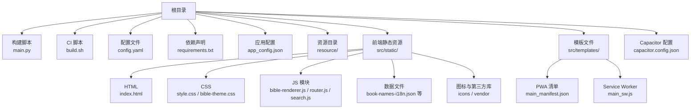
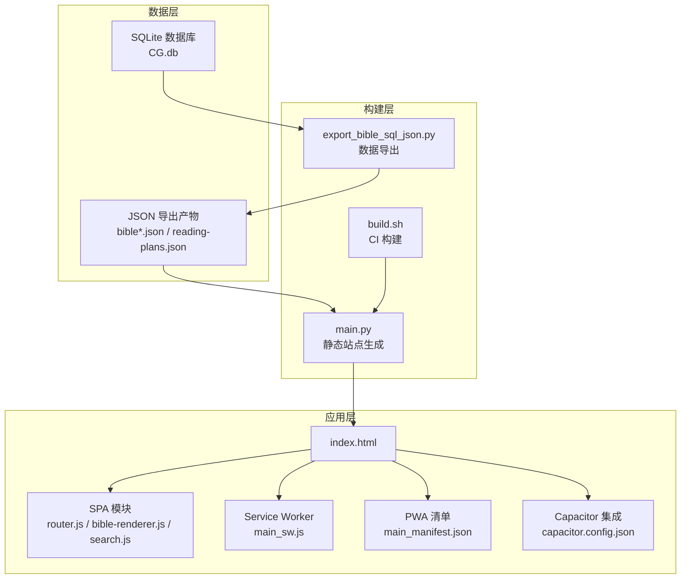
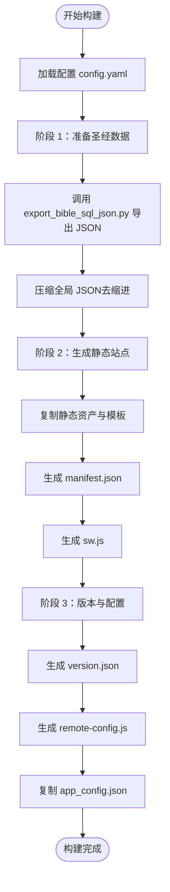
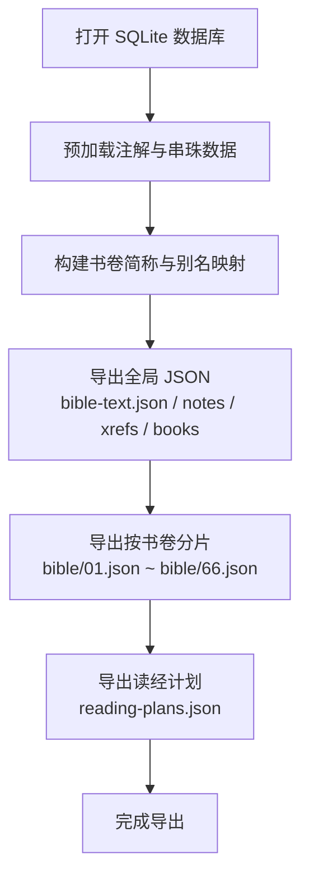
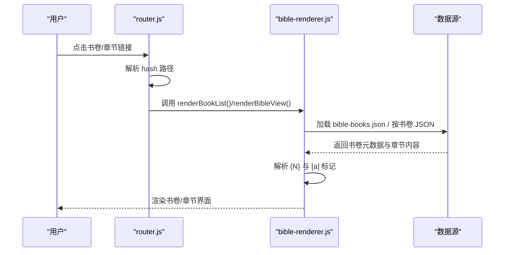
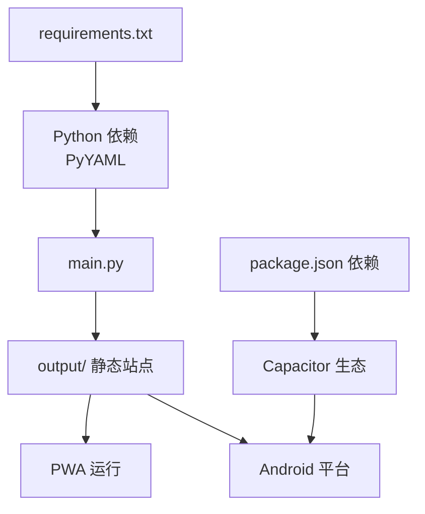

# 项目概述

<cite>
**本文档引用的文件**
- [main.py](file://main.py)
- [export_bible_sql_json.py](file://export_bible_sql_json.py)
- [build.sh](file://build.sh)
- [package.json](file://package.json)
- [requirements.txt](file://requirements.txt)
- [capacitor.config.json](file://capacitor.config.json)
- [config.yaml](file://config.yaml)
- [app_config.json](file://app_config.json)
- [src/templates/main_manifest.json](file://src/templates/main_manifest.json)
- [src/templates/main_sw.js](file://src/templates/main_sw.js)
- [src/static/index.html](file://src/static/index.html)
- [src/static/js/bible-renderer.js](file://src/static/js/bible-renderer.js)
- [src/static/js/router.js](file://src/static/js/router.js)
- [src/static/js/search.js](file://src/static/js/search.js)
</cite>

## 目录
1. [简介](#简介)
2. [项目结构](#项目结构)
3. [核心组件](#核心组件)
4. [架构总览](#架构总览)
5. [详细组件分析](#详细组件分析)
6. [依赖关系分析](#依赖关系分析)
7. [性能考虑](#性能考虑)
8. [故障排除指南](#故障排除指南)
9. [结论](#结论)

## 简介
本项目是一个多语言圣经阅读应用，支持注解、串珠交叉引用、离线阅读等核心功能。项目采用双部署模式：既可作为 PWA 在浏览器端离线使用，也可通过 Capacitor 构建为 Android APK 应用。整体技术栈以 Python 为主构建系统，配合 JavaScript 前端与 SQLite 数据存储，形成三层构建流程：数据准备、静态站点生成、版本与配置。

- 项目目标：提供跨平台、离线可用、具备注解与串珠功能的圣经阅读体验
- 核心功能：多语言圣经阅读、注解展示、串珠交叉引用、离线缓存、搜索、主题切换、页面记忆
- 技术架构：Python 构建脚本 + JavaScript 前端 + SQLite 数据库 + PWA/Android 双部署

## 项目结构
项目采用模块化组织方式，核心目录与文件职责如下：
- 根目录构建与配置：main.py（构建入口）、build.sh（CI 构建脚本）、config.yaml（构建配置）、requirements.txt（Python 依赖）
- 资源与数据：resource/（包含 CG.db 与读经计划 JSON）、app_config.json（应用基础配置）
- 前端静态资源：src/static/（HTML/CSS/JS/Icons/数据）、src/templates/（PWA 清单与 Service Worker 模板）
- Capacitor 集成：capacitor.config.json（应用标识与 Web 目录）

**图表来源**
- [main.py:36-76](file://main.py#L36-L76)
- [build.sh:1-16](file://build.sh#L1-L16)
- [config.yaml:1-12](file://config.yaml#L1-L12)
- [requirements.txt:1-2](file://requirements.txt#L1-L2)
- [capacitor.config.json:1-10](file://capacitor.config.json#L1-L10)
- [src/templates/main_manifest.json:1-26](file://src/templates/main_manifest.json#L1-L26)
- [src/templates/main_sw.js:1-270](file://src/templates/main_sw.js#L1-L270)
- [src/static/index.html:1-687](file://src/static/index.html#L1-L687)

**章节来源**
- [main.py:36-76](file://main.py#L36-L76)
- [build.sh:1-16](file://build.sh#L1-L16)
- [config.yaml:1-12](file://config.yaml#L1-L12)
- [requirements.txt:1-2](file://requirements.txt#L1-L2)
- [capacitor.config.json:1-10](file://capacitor.config.json#L1-L10)

## 核心组件
- 构建系统（Python）
  - 数据准备：export_bible_sql_json.py 将 SQLite 数据库导出为多类 JSON（经文、注解、串珠、书卷映射、按书卷分片、读经计划）
  - 静态站点生成：main.py 复制静态资源、生成清单与 Service Worker、复制版本与配置
  - CI 构建：build.sh 安装依赖并执行构建
- 前端渲染（JavaScript）
  - 路由系统：router.js 实现 SPA hash 路由，支持书卷/章节导航与历史记录
  - 渲染引擎：bible-renderer.js 负责书卷列表、章节内容渲染、注解与串珠标记解析
  - 搜索系统：search.js 提供全文搜索、索引懒加载与结果高亮
- PWA 与离线缓存
  - 清单与图标：main_manifest.json 定义 PWA 属性与图标
  - Service Worker：main_sw.js 实现缓存策略（核心资源 network-first，圣经数据 cache-first）
- 双部署集成（Capacitor）
  - 配置：capacitor.config.json 指定 webDir=output，适配 PWA 输出目录
  - 包装：package.json 定义 npm 脚本，支持同步与打开 Android 项目

**章节来源**
- [export_bible_sql_json.py:1-835](file://export_bible_sql_json.py#L1-L835)
- [main.py:87-357](file://main.py#L87-L357)
- [build.sh:1-16](file://build.sh#L1-L16)
- [src/static/js/router.js:1-287](file://src/static/js/router.js#L1-L287)
- [src/static/js/bible-renderer.js:1-880](file://src/static/js/bible-renderer.js#L1-L880)
- [src/static/js/search.js:1-1086](file://src/static/js/search.js#L1-L1086)
- [src/templates/main_manifest.json:1-26](file://src/templates/main_manifest.json#L1-L26)
- [src/templates/main_sw.js:1-270](file://src/templates/main_sw.js#L1-L270)
- [capacitor.config.json:1-10](file://capacitor.config.json#L1-L10)
- [package.json:1-24](file://package.json#L1-L24)

## 架构总览
项目采用三层构建流程与前后端分离架构：
- 数据层：SQLite 数据库（CG.db）与 JSON 导出产物（bible-text.json、bible-notes.json、bible-xrefs.json、bible-books.json、按书卷分片）
- 构建层：Python 脚本负责数据导出与静态站点生成，生成 output/ 目录
- 应用层：前端 SPA 通过路由与渲染器加载数据，Service Worker 提供离线缓存；Capacitor 将静态站点包装为 Android APK

**图表来源**
- [export_bible_sql_json.py:743-800](file://export_bible_sql_json.py#L743-L800)
- [main.py:87-357](file://main.py#L87-L357)
- [build.sh:1-16](file://build.sh#L1-L16)
- [src/static/index.html:1-687](file://src/static/index.html#L1-L687)
- [src/templates/main_sw.js:1-270](file://src/templates/main_sw.js#L1-L270)
- [src/templates/main_manifest.json:1-26](file://src/templates/main_manifest.json#L1-L26)
- [capacitor.config.json:1-10](file://capacitor.config.json#L1-L10)

## 详细组件分析

### 构建系统（Python）
- 三层构建流程
  - 阶段 1：准备圣经数据（调用 export_bible_sql_json.py 导出 JSON 并压缩）
  - 阶段 2：生成静态站点（复制 HTML/CSS/JS/Icons/Vendor/Data，生成 manifest.json 与 sw.js）
  - 阶段 3：版本与配置（生成 version.json、remote-config.js，复制 app_config.json）
- 关键特性
  - 排除训练相关 JS 文件，适配圣经项目需求
  - 生成 base64 编码的远程服务器配置，运行时解码
  - 输出目录可配置，便于 CI 与本地开发

**图表来源**
- [main.py:36-76](file://main.py#L36-L76)
- [main.py:87-117](file://main.py#L87-L117)
- [main.py:121-162](file://main.py#L121-L162)
- [main.py:288-357](file://main.py#L288-L357)

**章节来源**
- [main.py:36-76](file://main.py#L36-L76)
- [main.py:87-117](file://main.py#L87-L117)
- [main.py:121-162](file://main.py#L121-L162)
- [main.py:288-357](file://main.py#L288-L357)

### 数据导出（export_bible_sql_json.py）
- 功能概述
  - 从 SQLite 导出经文、注解、串珠、书卷映射、按书卷分片与读经计划
  - 支持中文书卷简称与别名归一化，统一串珠格式
- 关键流程
  - 预加载：读取 footnote 与 bead，按 flag 合并
  - 导出：生成全局 JSON 与按书卷分片，写入输出目录
  - 读经计划：合并 resource/ 目录下的计划 JSON

**图表来源**
- [export_bible_sql_json.py:743-800](file://export_bible_sql_json.py#L743-L800)
- [export_bible_sql_json.py:459-530](file://export_bible_sql_json.py#L459-L530)
- [export_bible_sql_json.py:553-596](file://export_bible_sql_json.py#L553-L596)
- [export_bible_sql_json.py:704-724](file://export_bible_sql_json.py#L704-L724)

**章节来源**
- [export_bible_sql_json.py:1-835](file://export_bible_sql_json.py#L1-L835)

### 前端路由与渲染（router.js / bible-renderer.js）
- 路由系统
  - hash 路由：支持主页、圣经阅读、图表、读经计划、设置等路径
  - 同书卷章节切换优化：使用 replaceState 避免历史膨胀
- 渲染引擎
  - 书卷导航：双栏布局，支持旧约/新约分页与搜索
  - 章节渲染：解析经文中的 {N} 注解标记与 [a] 串珠标记
  - 历史与收藏：本地存储浏览历史与收藏项

**图表来源**
- [src/static/js/router.js:27-82](file://src/static/js/router.js#L27-L82)
- [src/static/js/bible-renderer.js:143-200](file://src/static/js/bible-renderer.js#L143-L200)
- [src/static/js/bible-renderer.js:85-106](file://src/static/js/bible-renderer.js#L85-L106)

**章节来源**
- [src/static/js/router.js:1-287](file://src/static/js/router.js#L1-L287)
- [src/static/js/bible-renderer.js:1-880](file://src/static/js/bible-renderer.js#L1-L880)

### 搜索系统（search.js）
- 特性
  - 全文搜索：对训练内容进行索引与检索
  - 懒加载：按需加载训练数据，提升首屏性能
  - 结果高亮：段落级定位与高亮显示
- 数据来源
  - 从 training.json 提取内容，构建 entries 索引
  - 支持本地缓存（localforage）与版本控制

**章节来源**
- [src/static/js/search.js:1-1086](file://src/static/js/search.js#L1-L1086)

### PWA 与离线缓存（main_sw.js / main_manifest.json）
- Service Worker
  - 缓存策略：核心资源 network-first，圣经分片 cache-first
  - 生命周期：install 预缓存、activate claim、fetch 拦截与写缓存
  - 工具消息：支持批量缓存、查询缓存状态、清理缓存
- 清单配置
  - 应用名称、图标、显示模式、主题色等属性定义

**章节来源**
- [src/templates/main_sw.js:1-270](file://src/templates/main_sw.js#L1-L270)
- [src/templates/main_manifest.json:1-26](file://src/templates/main_manifest.json#L1-L26)

### 双部署模式（PWA 与 Android APK）
- PWA 模式
  - 通过 main.py 生成 output/ 静态站点，Service Worker 提供离线缓存
  - index.html 中根据环境动态加载更新脚本与安装提示
- Android APK 模式
  - Capacitor 配置 webDir=output，构建后通过 Gradle 打包
  - package.json 提供同步与打开 Android 项目的脚本

**章节来源**
- [src/static/index.html:190-199](file://src/static/index.html#L190-L199)
- [capacitor.config.json:1-10](file://capacitor.config.json#L1-L10)
- [package.json:5-11](file://package.json#L5-L11)

## 依赖关系分析
- Python 依赖
  - PyYAML：解析 YAML 配置文件
- 前端依赖（Capacitor 生态）
  - @capacitor/core、@capacitor/app、@capacitor/filesystem、@capacitor/status-bar、@capacitor-community/text-to-speech
  - CLI 与 Android 平台支持

**图表来源**
- [requirements.txt:1-2](file://requirements.txt#L1-L2)
- [package.json:12-22](file://package.json#L12-L22)
- [main.py:36-76](file://main.py#L36-L76)

**章节来源**
- [requirements.txt:1-2](file://requirements.txt#L1-L2)
- [package.json:12-22](file://package.json#L12-L22)

## 性能考虑
- 数据加载优化
  - 按书卷分片加载，避免一次性加载全量 JSON
  - 书卷元数据与章节内容缓存，减少重复请求
- 离线缓存策略
  - 核心资源与圣经分片采用不同缓存策略，兼顾更新与离线可用性
  - 支持批量缓存与状态查询，便于用户主动管理
- 构建优化
  - 压缩全局 JSON，减小包体
  - 排除训练相关 JS 文件，降低 APK/PWA 体积

[本节为通用性能建议，无需特定文件引用]

## 故障排除指南
- 构建失败
  - 确认 requirements.txt 依赖已安装
  - 检查 config.yaml 中路径配置（bible_db、output_dir、static_dir）
  - 确保 CG.db 存在且可读
- PWA 缓存问题
  - 使用 Service Worker 提供的清理与查询接口
  - 检查 version.json 与 sw.js 是否正确生成
- APK 更新
  - 通过 Capacitor 同步与打开 Android 项目
  - 确认 app_config.json 版本号与构建时间

**章节来源**
- [main.py:87-117](file://main.py#L87-L117)
- [main.py:288-357](file://main.py#L288-L357)
- [src/templates/main_sw.js:176-270](file://src/templates/main_sw.js#L176-L270)
- [package.json:5-11](file://package.json#L5-L11)

## 结论
本项目通过 Python 构建系统与 JavaScript 前端实现了多语言圣经阅读应用的完整闭环：从 SQLite 数据导出到静态站点生成，再到 PWA 与 Android APK 的双部署。其三层构建流程清晰、数据与前端分离设计合理，结合 Service Worker 的离线缓存策略，能够满足跨平台、离线可用的阅读需求。同时，Capacitor 的集成使得原生应用的发布与更新更加便捷。